# Design Spec

**Project:** friendly-octo-spork ("Spork")
**Status:** Draft v0.1 — pre-implementation
**Author:** william@barrulemedical.im (with Claude)
**Last updated:** 2026-08-11

> **Naming note:** the repo name is the GitHub-generated placeholder. This
> spec adopts a working product name, **Spork**, purely so the two
> executables and package can have concrete names (`sporkd`, `spork`).
> Rename freely before the first release — nothing below depends on the
> name itself.

## 1. Overview

Spork is a personal email-triage tool for a Fastmail (JMAP) mailbox. It
listens for new mail, runs each message through a tiered classification
pipeline — cheap/deterministic first, LLM only when warranted — and takes
mailbox actions (file, tag, draft a reply) or raises an alert for the human
to handle. It is built to run continuously as a per-user background service,
with a companion CLI for status, configuration, and rule management.

This document specifies the architecture, components, data formats, and
key design decisions. See `ROADMAP.md` for phasing.

## 2. Goals

- Near-real-time triage of a single Fastmail account via JMAP push.
- A tiered pipeline that spends LLM tokens only on ambiguous/important mail.
- Deterministic, auditable rules for anything that runs unattended.
- Safe defaults: nothing is auto-sent or irreversibly destroyed without
  either high confidence or human confirmation.
- A daemon that survives logout/login cycles via systemd user services,
  plus a CLI that a human actually wants to run.
- Secrets declared, not scattered across `.env` files.

## 3. Non-goals (v1)

- Multi-account / multi-tenant support. One JMAP account, one user.
- A web UI. CLI + local notifications only.
- Fleet/admin JMAP APIs — irrelevant for a single personal mailbox.
- Full natural-language rule authoring in v1 (see roadmap — planned, not
  blocking).
- Auto-send of LLM-drafted replies. Draft-and-hold only, indefinitely,
  unless a future explicit opt-in is added per-rule.

## 4. Terminology

| Term | Meaning |
|---|---|
| **Tier 0** | Sieve rules running server-side on Fastmail; no Spork process involved. |
| **Tier 1** | Cheap local classification (rules/heuristics, no LLM call). |
| **Tier 2** | LLM escalation (Claude API call) for ambiguous/important mail. |
| **Tier 3** | Human review — surfaced via alert, no automatic action taken. |
| **Rule** | A user-authored condition → action mapping, evaluated at Tier 1. |
| **Action** | A mailbox mutation: move, tag (add/remove mailbox), draft, notify, no-op. |
| **Verdict** | The structured output of a Tier 1 or Tier 2 classification pass. |
| **Trigger** | Decides *when* to fetch — a push connection, a timer, an immediate no-op for tests. |
| **ContentFetcher** | Decides *what* to fetch, given a trigger fired — knows nothing about timing. |
| **Source** | A Trigger + ContentFetcher pair (sometimes fused, sometimes composed) that yields `NormalizedMessage` batches. |
| **Dispatch target** | A named `TextClassifier` backend a message can be fanned out to. |
| **Combiner** | Reduces N dispatch targets' results to the single `ClassificationResult` a decision acts on. |
| **Provider** | The daemon's whole relationship to one remote mail backend (JMAP, IMAP, ...): both read (`build_source`) and write (`build_action_applier`); loaded dynamically by spec string, never hardcoded. |
| **ActionApplier** | A provider's write side — applies one rule/verdict `Action` to a message on the remote backend. |

## 5. Architecture

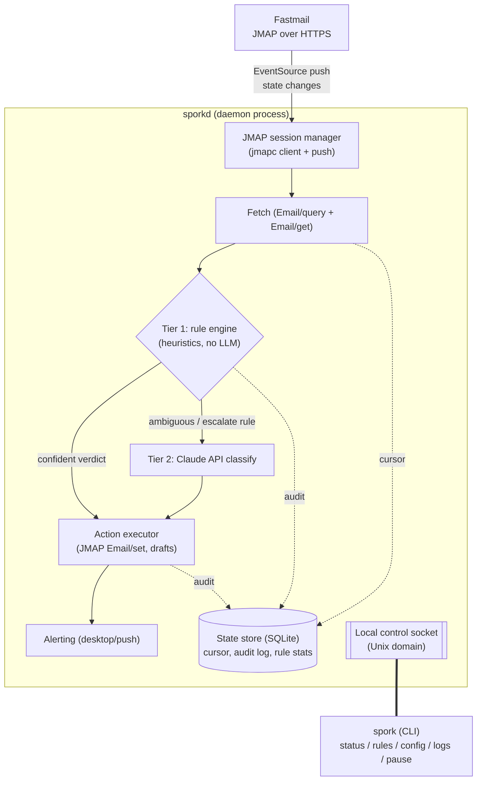
```mermaid
flowchart TD
    fastmail[Fastmail<br/>JMAP over HTTPS]
    fastmail -->|EventSource push<br/>state changes| session

    subgraph sporkd["sporkd (daemon process)"]
        direction TB
        session["JMAP session manager<br/>(jmapc client + push)"]
        fetch["Fetch (Email/query + Email/get)"]
        tier1{"Tier 1: rule engine<br/>(heuristics, no LLM)"}
        tier2["Tier 2: Claude API classify"]
        exec_["Action executor<br/>(JMAP Email/set, drafts)"]
        alert["Alerting (desktop/push)"]
        state[("State store (SQLite)<br/>cursor, audit log, rule stats")]
        socket[["Local control socket<br/>(Unix domain)"]]

        session --> fetch --> tier1
        tier1 -->|confident verdict| exec_
        tier1 -->|"ambiguous / escalate rule"| tier2
        tier2 --> exec_
        exec_ --> alert
        fetch -.->|cursor| state
        exec_ -.->|audit| state
        tier1 -.->|audit| state
    end

    socket === cli["spork (CLI)<br/>status / rules / config / logs / pause"]
```

Two OS processes, one shared library:

- **`sporkd`** — long-running daemon, owns the JMAP connection, the state
  DB, and the rule engine. Started by a systemd user unit at login.
- **`spork`** — short-lived CLI, talks to `sporkd` over a local control
  channel (Unix domain socket) for anything live (status, pause/resume,
  "classify this message now"), and reads/writes config + rules files
  directly for anything that's just editing state on disk.
- **`spork.core`** — shared library: JMAP client wrapper, rule schema,
  Tier 1 evaluator, Claude client wrapper, action executor, state DB
  models. Both executables import it; there is no logic duplicated
  between them.

## 6. Components

### 6.1 Core library (`spork.core`)

Solid boxes are built and tested today; dashed boxes are planned
layout for a milestone that hasn't landed yet (a future real
desktop-notification `Alerter` backend
alongside M4's `alerts/log.py`). `config/`, `ipc/`, and
`cli/commands/config.py` are all real as of M5's work on them — no
longer dashed boxes. `systemd/` (core) and
`cli/commands/install_service.py` land with M6 — no longer dashed
either. `logging_setup.py` and `pipeline/tracing.py` land with M7 —
also no longer dashed. This is layout orientation
only — see §6.4 for what each built module's classes actually look
like.

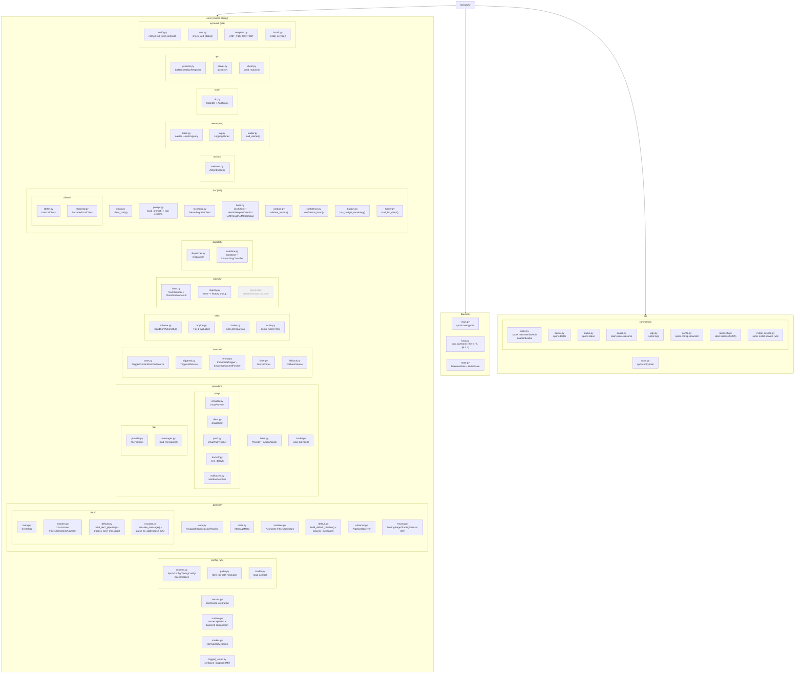
```mermaid
flowchart TD
    src["src/spork/"] --> core & daemon_pkg & cli_pkg

    subgraph core["core/ (shared library)"]
        subgraph config_pkg["config/ (M5)"]
            config_schema["schema.py<br/>SporkConfig/TieringConfig/<br/>BackendSpec"]
            config_paths["paths.py<br/>XDG tier-path resolution"]
            config_loader["loader.py<br/>load_config()"]
        end
        secrets_mod["secrets.py<br/>secretspec integration"]
        runtime_mod["runtime.py<br/>secret injection +<br/>backend composition"]
        models_mod["models.py<br/>NormalizedMessage"]
        logging_setup_mod["logging_setup.py<br/>configure_logging() (M7)"]

        subgraph pipeline["pipeline/"]
            pipeline_core["core.py<br/>Payload/Filter/Selector/Pipeline"]
            pipeline_meta["meta.py<br/>MessageMeta"]
            pipeline_modules["modules.py<br/>7 concrete Filters/Selectors"]
            pipeline_default["default.py<br/>build_default_pipeline() +<br/>process_message()"]
            pipeline_observer["observer.py<br/>PipelineObserver"]
            pipeline_tracing["tracing.py<br/>TracingStage/TracingSelector (M7)"]
            subgraph pipeline_tier2["tier2/"]
                tier2_meta["meta.py<br/>Tier2Meta"]
                tier2_modules["modules.py<br/>13 concrete Filters/Selectors/Augment"]
                tier2_default["default.py<br/>build_tier2_pipeline() +<br/>process_tier2_message()"]
                tier2_escalate["escalate.py<br/>escalate_message() +<br/>parse_to_addresses() (M5)"]
            end
        end

        subgraph providers["providers/"]
            providers_base["base.py<br/>Provider + ActionApplier"]
            providers_loader["loader.py<br/>load_provider()"]
            subgraph jmap["jmap/"]
                jmap_provider["provider.py<br/>JmapProvider"]
                jmap_client["client.py<br/>JmapClient"]
                jmap_push["push.py<br/>JmapPushTrigger"]
                jmap_backoff["backoff.py<br/>next_delay()"]
                jmap_mailboxes["mailboxes.py<br/>MailboxResolver"]
            end
            subgraph file_["file/"]
                file_provider["provider.py<br/>FileProvider"]
                file_messages["messages.py<br/>load_messages()"]
            end
        end

        subgraph sources["sources/"]
            sources_base["base.py<br/>Trigger/ContentFetcher/Source"]
            sources_triggered["triggered.py<br/>TriggeredSource"]
            sources_replay["replay.py<br/>ImmediateTrigger +<br/>SequenceContentFetcher"]
            sources_timer["timer.py<br/>IntervalTimer"]
            sources_fallback["fallback.py<br/>FallbackSource"]
        end

        subgraph rules["rules/"]
            rules_schema["schema.py<br/>Condition/Action/Rule"]
            rules_engine["engine.py<br/>Tier 1 evaluate()"]
            rules_loader["loader.py<br/>rules.toml parsing"]
            rules_writer["writer.py<br/>dump_rules() (M5)"]
        end

        subgraph classify["classify/"]
            classify_base["base.py<br/>TextClassifier +<br/>ClassificationResult"]
            classify_registry["registry.py<br/>name -> factory lookup"]
            classify_keyword["keyword.py<br/>default heuristic backend"]:::planned
        end

        subgraph dispatch["dispatch/"]
            dispatch_dispatcher["dispatcher.py<br/>Dispatcher"]
            dispatch_combine["combine.py<br/>Combiner +<br/>DispatchingClassifier"]
        end

        subgraph llm["llm/ (M3)"]
            llm_clean["clean.py<br/>clean_body()"]
            llm_prompt["prompt.py<br/>build_prompt() + tool schema"]
            llm_recording["recording.py<br/>RecordingLLMClient"]
            llm_base["base.py<br/>LLMClient +<br/>VerdictRequest/Verdict/<br/>LLMResult/LLMCallUsage"]
            llm_validate["validate.py<br/>validate_verdict()"]
            llm_confidence["confidence.py<br/>confidence_band()"]
            llm_budget["budget.py<br/>has_budget_remaining()"]
            llm_loader["loader.py<br/>load_llm_client()"]
            subgraph llm_clients["clients/"]
                llm_litellm["litellm.py<br/>LiteLLMClient"]
                llm_recorded["recorded.py<br/>RecordedLLMClient"]
            end
        end

        subgraph actions["actions/"]
            actions_executor["executor.py<br/>ActionExecutor"]
        end

        subgraph alerts["alerts/ (M4)"]
            alerts_base["base.py<br/>Alerter + AlertUrgency"]
            alerts_log["log.py<br/>LoggingAlerter"]
            alerts_loader["loader.py<br/>load_alerter()"]
        end

        subgraph state["state/"]
            state_db["db.py<br/>StateDB + AuditEntry"]
        end

        subgraph ipc["ipc/"]
            ipc_protocol["protocol.py<br/>IpcRequest/IpcResponse"]
            ipc_server["server.py<br/>IpcServer"]
            ipc_client["client.py<br/>send_request()"]
        end

        subgraph systemd_pkg["systemd/ (M6)"]
            systemd_notify["notify.py<br/>notify() (sd_notify protocol)"]
            systemd_unit["unit.py<br/>check_unit_status()"]
            systemd_template["template.py<br/>UNIT_FILE_CONTENT"]
            systemd_install["install.py<br/>install_service()"]
        end
    end

    subgraph daemon_pkg["daemon/"]
        daemon_main["main.py<br/>sporkd entrypoint"]
        daemon_loop["loop.py<br/>run_daemon() (Tier 1+2, §6.2.1)"]
        daemon_state["state.py<br/>DaemonState + RulesState"]
    end

    subgraph cli_pkg["cli/"]
        cli_main["main.py<br/>spork entrypoint"]
        subgraph cli_commands["commands/"]
            cli_rules["rules.py<br/>spork rules test/list/edit/<br/>enable/disable"]
            cli_doctor["doctor.py<br/>spork doctor"]
            cli_status["status.py<br/>spork status"]
            cli_pause["pause.py<br/>spork pause/resume"]
            cli_logs["logs.py<br/>spork logs"]
            cli_config["config.py<br/>spork config show/edit"]
            cli_reclassify["reclassify.py<br/>spork reclassify (M5)"]
            cli_install_service["install_service.py<br/>spork install-service (M6)"]
        end
    end

    classDef planned stroke-dasharray: 4 3,opacity:0.65
```

### 6.2 Daemon (`sporkd`)

Single-process, asyncio event loop:

1. Load config + secrets at startup; fail fast with a clear error if
   required secrets are missing (`secretspec check` semantics).
2. Open a JMAP session, resolve mailbox IDs/roles once, cache them.
3. Start the EventSource push listener. On reconnect/backoff, fall back
   to a periodic `Email/query` poll (interval configurable) so the tool
   degrades gracefully instead of going silent.
4. On a push notification (or poll tick): fetch new `Email` objects in
   one batched JMAP call (`Email/query` + `Email/get` via result
   references), skipping IDs already in the state DB.
5. Run each message through the Tier 1 rule engine.
6. If a rule matches with an action, or explicitly resolves to "no
   action", apply it and stop.
7. If a rule marks the message for escalation, or no rule matches and the
   default policy is "escalate unknowns", send it to Tier 2 (Claude).
8. Apply the resulting Verdict via the action executor; anything at or
   above the configured alert threshold also fires an alert.
9. Record an audit entry (message ID, tier reached, verdict, action
   taken, latency, token cost if Tier 2) in the state DB.
10. Serve the local control socket concurrently for CLI requests
    (status, pause, "reclassify message X", "reload rules").

**Structured application logging (M7):** `main()` calls
`spork.core.logging_setup.configure_logging(level)` before
`run_daemon()` starts — `level` is `--log-level` if given, else
`config.log_level` (`SporkConfig`'s own field, default `"INFO"`),
never both silently merged. This configures the `"spork"` logger
namespace (every module's `logging.getLogger("spork.xxx")` call is a
child of it, including `PipelineObserver`'s existing
`"spork.pipeline"`) with one `StreamHandler` to stderr — journald
captures a systemd unit's stderr line-by-line automatically (§14), so
no `systemd.journal.JournalHandler`/extra dependency is needed, the
same "no new dependency for something this small" call
`spork.core.systemd.notify`'s hand-rolled `sd_notify` made. Distinct
from `audit_log` (§7.4): this is an operational log stream (what the
daemon is *doing*, at whatever verbosity `--log-level` asks for),
`audit_log` is a permanent, structured per-decision/per-change record
— turning logging up or down never changes what lands in `audit_log`.

#### 6.2.1 Bridging synchronous I/O into the asyncio loop

Every I/O dependency this daemon actually has is synchronous:
[`jmapc`](https://github.com/smkent/jmapc) is built on `requests` (no
`async def` anywhere in it), and its push mechanism (`Client.events`)
is a **blocking generator** wrapping `sseclient` — `for event in
client.events:` blocks the calling thread on each iteration, with no
async alternative and no built-in reconnect/backoff (confirmed against
the library directly, not assumed — which is exactly why this
codebase already built its own `backoff.next_delay()` rather than
relying on one). `Source.poll()`/`Trigger.wait()`/`ContentFetcher.fetch()`
(§9.2) are all plain `def` for the same reason: they were designed as
a synchronous contract from the start, deliberately compatible with a
library that offers nothing else.

"Asyncio event loop" therefore never means "jmapc yields control to
the loop" — it can't. It means: the loop's *structure* (task
lifecycle, cancellation, one coordinated shutdown, concurrent IPC
serving once that lands) is asyncio-native, and every blocking call —
`source.poll()`, and the entire `process_message()` call (which itself
may block on a live `ActionApplier`'s JMAP write) — runs via
`asyncio.to_thread()`. This needs no persistent listener thread or
hand-off queue: `Source.poll()` already embodies "block until there's
something" (`Trigger.wait()` then `ContentFetcher.fetch()`), so
wrapping each `poll()` call in `to_thread` *is* the bridge — the
default thread pool executor recycles a worker between calls since
nothing here runs concurrently with itself.

Three consequences worth stating rather than discovering later:

- **Graceful shutdown latency is bounded by whatever `source.poll()`
  call is currently in flight**, not instant. Cancelling a
  `to_thread`-wrapped `asyncio.Task` stops the *coroutine* from
  awaiting it, but the underlying OS thread keeps running — Python
  can't forcibly kill a thread. `IntervalTimer.wait()` sleeps via
  plain `time.sleep()` (uninterruptible mid-sleep); a real
  `JmapPushTrigger` would need its own SSE connection closed to unblock
  its generator. A short poll interval keeps this bound small in
  practice; true instant interruption would mean teaching `Trigger`
  implementations to accept a cancellation signal, a bigger change not
  taken on here.
- **A source that's caught up needs an explicit idle delay, not a
  busy-loop.** `FileProvider`'s `Source` (`ImmediateTrigger` + an
  exhausted `SequenceContentFetcher`) returns immediately with `[]`
  forever once its fixed batch is consumed — correct for its stated
  "replay a fixture once" purpose (§9.3), but it means the daemon loop
  itself, not any particular `Source`, is responsible for not spinning
  a CPU core on an empty result: `await asyncio.sleep(...)` (a real,
  cancellable asyncio sleep, unlike the thread-wrapped `poll()`) after
  an empty batch.
- **`StateDB`'s SQLite connection needs `check_same_thread=False`.**
  Python's `sqlite3` module refuses to use a connection from any
  thread but the one that created it by default — and here, the
  connection is created on the event loop's thread but every
  `process_message()` call touching it runs inside `to_thread()`, on
  whichever worker thread the pool hands out (not necessarily the same
  one twice). This is safe specifically because the loop never awaits
  two `to_thread(process_message, ...)` calls concurrently — one
  message's full pipeline run completes (including every `StateDB`
  write) before the next begins, so two threads never touch the
  connection at the same instant, only in sequence. `check_same_thread=False`
  turns off a guard rail Python's own docs describe as unnecessary
  exactly under that condition; it does not change SQLite's own
  locking behavior.

**Scope history:** the loop composed **Tier 1 only** through the first
part of M5. Chaining a freshly-escalated message straight into
`process_tier2_message()` in the same poll cycle looked initially like
free extra scope (no live-JMAP blocker prevents it —
`RecordedLLMClient`/`LoggingAlerter` are both fully real), but
`Tier2Meta`'s `to_addresses`/`thread_prior_subject`/
`thread_user_has_replied`/`available_mailboxes` are caller-supplied by
design (§10.7) and nothing resolved them at the time: `NormalizedMessage`
has no `to` field, and `Provider` exposed no thread-history or
mailbox-listing method — inventing placeholder values for either would
be exactly the "fake data standing in for the real thing" this project
has repeatedly refused to do elsewhere (§13's `spork rules test`,
`FileProvider`'s own docstring). That gap is closed now: `Provider`
gained `build_thread_history_reader()`/`build_mailbox_lister()` (§9.3),
real against `FileProvider`, `NotImplementedError` against
`JmapProvider` pending a live account, same split as every other JMAP
leaf. `to_addresses` comes from parsing `NormalizedMessage.headers["To"]`
(comma-split, whitespace-stripped — a real `To:` header, not invented).

`_run_message_loop()` now escalates in the same poll cycle:
`process_message()` (still its own `to_thread`-wrapped call, unchanged)
returns a `RuleVerdict`; when `verdict.action.type == "escalate"`, the
loop immediately `await`s a second, separate `asyncio.to_thread()` call
wrapping `process_tier2_message()` — passing `to_addresses` (parsed
from headers), the `ThreadContext` from
`provider.build_thread_history_reader().get_thread_context(message)`,
and `provider.build_mailbox_lister().list_mailboxes()`. Two `to_thread`
calls, not one, but still strictly sequential — the loop fully awaits
Tier 1's call (and every `StateDB` write inside it) before Tier 2's
call ever starts, so `StateDB`'s sequential-access condition (above)
still holds regardless of how many `to_thread` calls one message's
processing takes: what matters is that two worker-thread calls are
never in flight at once, not that they share one `to_thread` wrapper.
`run_daemon()` now also constructs an `LLMClient` (`config.llm.spec`
via `load_llm_client()`, same loader pattern as `provider`/`alerts`)
and a `DraftCreator` (`provider.build_draft_creator()`) up front,
threaded into `_run_message_loop()` alongside the Tier-1 dependencies
it already had.

#### 6.2.2 The IPC protocol

Newline-delimited JSON over the Unix domain control socket — settled
when M5 was first scoped (docs/ROADMAP.md): no new dependency
(stdlib `json`), human-inspectable with `nc`/`socat` while debugging,
and §15 already establishes filesystem permissions (0600, owned by
the invoking user) as the only access control v1 needs, so nothing
fancier is warranted. One request per connection — the CLI opens a
socket, writes one `IpcRequest` line, reads one `IpcResponse` line,
closes:

```python
class IpcRequest(BaseModel):
    command: str
    params: dict[str, Any] = {}


class IpcResponse(BaseModel):
    ok: bool
    data: dict[str, Any] = {}
    error: str | None = None
```

`IpcServer.serve()` runs alongside `_run_message_loop()` inside
`run_daemon()`'s `asyncio.TaskGroup()` (§6.2.1) — `asyncio.start_unix_server()`,
stdlib, no new dependency there either. It removes any stale socket
file at the same path before binding (a leftover from a killed-not-
stopped prior run would otherwise block startup) and dispatches each
connection's one request to a handler registered by command name;
an unhandled exception in a handler becomes `IpcResponse(ok=False,
error=str(exc))`, never a raw traceback back to the CLI. The client
side (`spork.core.ipc.client.send_request()`) is plain synchronous
`socket` — the CLI is a short-lived process, not another asyncio
loop — and a connection failure (no socket file, or one nobody's
listening on) is the "daemon not running" case §6.3 already commits
to messaging clearly rather than silently doing nothing.

**`DaemonState`** (`spork.daemon.state`) is the small piece of
mutable state `IpcServer` handlers and `_run_message_loop()` share —
today `paused: bool` and `started_at: str` (set once, never mutated
after construction). Deliberately **not** a place to cache anything
derived from `StateDB`: both fields are only ever read/written from
coroutine code (the message loop's own control flow, an `IpcServer`
handler) — never from inside a `to_thread()`-wrapped call — so
asyncio's single-thread-at-a-time coroutine scheduling makes them safe
with no lock, by construction, not by convention. `StateDB` access
stays exactly where §6.2.1 already put it: sequential, inside
`to_thread(process_message, ...)` calls only. An `IpcServer` handler
reading `StateDB` directly (an earlier draft of this design did, for
`spork status`'s LLM-spend field) would run on the event-loop thread
*concurrently* with an in-flight `to_thread(process_message, ...)` on
a worker thread — exactly the concurrent access §6.2.1's
`check_same_thread=False` note says is unsafe. Caught before writing
any code, not after: `spork status` doesn't report LLM spend this
round (see below) rather than accepting that risk.

**`pause`/`resume` writing a control-plane audit entry (M7, §7.4) hits
this exact hazard too — and a first-draft fix (make the handler
`async def`, `await asyncio.to_thread(state_db.write_control_plane_audit_entry,
...)` directly from it) turns out not to actually solve it: `to_thread()`
only moves *that one call* off the event-loop thread, it doesn't
serialize it against a *different*, already-in-flight
`to_thread(process_message, ...)` call from `_run_message_loop()` — two
independent `to_thread()` calls from two different coroutines can
still run concurrently, on two different worker threads, against the
same `state_db` connection object, which is exactly the hazard this
whole section exists to avoid. A correct fix needs either a new
`asyncio.Lock` serializing *every* `to_thread(state_db...)` call site
(the message loop's included) or avoiding a second call site
entirely — the latter is what's actually built: `DaemonState` gains
`pending_control_plane_events: list[PendingAuditEvent]` (a small
frozen dataclass: `event: str`, `detail_json: Optional[str]`).
`_pause`/`_resume` stay plain, synchronous handlers — `daemon_state.paused`
flips immediately, and `daemon_state.pending_control_plane_events.append(...)`
is a second in-memory, event-loop-thread-only mutation, no different in
kind from the first. `_run_message_loop()` — the one code path that
already safely, sequentially owns every `to_thread(state_db...)` call —
drains that list once per iteration (before `poll()`, so a pause takes
effect for writes too, not just reads), writing each pending event via
its own existing `to_thread()` mechanism, then clears it. The one
honest tradeoff: a pause/resume audit entry lands on the *next*
message-loop iteration, not synchronously with the IPC response
(bounded by `idle_delay_seconds`, ~1s in production) — stated
plainly rather than hidden, the same way this section already states
`spork status`'s LLM-spend gap rather than working around it unsafely.

**`RulesState`** (`spork.daemon.state`, alongside `DaemonState`) is
the same pattern applied to a different problem: `spork rules edit`/
`enable`/`disable` (§7.5, §13) write a new `rules.toml`, and a running
`sporkd` needs to notice without a restart. A new `reload` `IpcServer`
handler re-runs `load_rules(rules_path)` and, on success, assigns the
result to `rules_state.rules` — a single reference reassignment, not
an in-place mutation of the list `_run_message_loop()` is reading. That
distinction is what makes it safe without a lock: `_run_message_loop()`
reads `rules_state.rules` fresh at the top of every poll iteration
(never captured once at loop start), and CPython's GIL makes one
attribute assignment atomic — a `to_thread(process_message, ...)` call
already in flight received its own list reference as an ordinary
argument before the reassignment, so it finishes against the rules it
started with; the *next* iteration picks up the new list. No
`RulesLoadError` from a bad hand-edit ever reaches the daemon's own
control flow — the `reload` handler catches it and returns
`IpcResponse(ok=False, error=...)`, leaving `rules_state.rules`
untouched, so a running daemon keeps evaluating its last-known-good
rules rather than crashing or silently going ruleless.

Pause semantics, stated honestly rather than glossed over:
`Source.poll()` fuses "wait" and "fetch" into one call (§9.2), so
there's no way yet to "stay connected but not fetch" the way §13's
`spork pause` comment ("push stays connected") implies for a real push
backend — while paused, `_run_message_loop()` skips `poll()` entirely
and just sleeps, re-checking `paused` each idle cycle. A backend that
reports "new since last successful check" will catch up its backlog
correctly on resume; one that doesn't (a stream that must stay
attached to avoid missing events) would need `Trigger`/`Source` split
further before pause could mean what the CLI comment currently
implies. Not solved here — stated as a real, current limitation of the
abstraction, not silently assumed away.

**`spork status`'s fields are honest about what's actually tracked**:
`paused` and `started_at`, both from `DaemonState`. "Push connection
state" and "queue depth" from §13's original comment still aren't
reported (nothing tracks either yet). **LLM spend vs. `daily_call_budget`
is still deferred**, now for a narrower reason: Tier 2 is wired into
the loop (§6.2.1) and genuinely accumulates `llm_usage` rows, but
nothing yet copies that into `DaemonState` for an `IpcServer` handler
to read safely — an `IpcServer` handler calling `StateDB.get_llm_usage()`
directly would still run on the event-loop thread concurrently with an
in-flight `to_thread(process_tier2_message, ...)` on a worker thread,
the same unsafe access §6.2.1's `check_same_thread=False` note warns
against. The fix is mechanical once someone needs it — `_run_message_loop()`
is back on the event-loop thread the instant its `to_thread()` call
returns, a natural synchronization point, so it could copy that day's
`LLMUsage` into a new `DaemonState` field there with no lock needed —
just not built this round.

**`spork logs`** doesn't touch the socket at all — `audit_log` is a
`StateDB` table, readable directly whether or not `sporkd` is running,
the same reasoning that already lets rules/config file edits work
with the daemon stopped (§6.3). `--since`/`--tail`/`--message-id`
filtering happens client-side in the CLI command after
`get_audit_entries()` returns everything (`jmap_id=` already filters
storage-side for `--message-id`) — no new SQL query surface added to
`StateDB` for a first pass, acceptable at a single mailbox's real
scale.

### 6.3 CLI (`spork`)

Talks to the daemon over the Unix socket when the daemon is up; falls
back to "daemon not running" messaging (with the systemd unit name to
start it) rather than silently doing nothing. Config/rules subcommands
that only touch files on disk work even with the daemon stopped, and
push a "reload" request to the daemon if it's running so changes take
effect without a restart.

See §13 for the full command reference.

**CLI framework: [Typer](https://typer.tiangolo.com/).** Chosen over
plain Click for the same reason the rest of this codebase leans on
type hints rather than docstring conventions or manual validation
(docs/TEST_COVERAGE.md, the `Protocol`-based modularity in §9.1/§9.2):
Typer derives each command's arguments/options/help text from type
hints and `typer.Option`/`typer.Argument` annotations, so a command's
signature *is* its CLI contract — no separate argparse/click
boilerplate to keep in sync with it by hand. It's built directly on
Click (so anything Click can do is still reachable if a future command
needs it) and gets `--install-completion` and Rich-formatted help for
free. `spork` is a Typer command **group** (`typer.Typer()` with
`@app.callback()` — the full §13 subcommand surface landed with M5);
`sporkd` is a single-command app (`typer.run(main)`) since the daemon
never has subcommands, just flags.

### 6.4 Module UML diagrams

One `classDiagram` per built module, in §6.1's component-tree order.
Protocols are stereotyped `<<Protocol>>`; a Protocol implementation is
drawn with a realization arrow labeled "structurally satisfies," never
plain inheritance, per this project's Protocol-based DI convention —
nothing here actually subclasses anything it implements. A free
function is drawn as a box stereotyped `<<function>>` so its
dependencies/raises are visible in the same diagram as the classes it
works with; it isn't a claim that the function is a class. A type
referenced from another module (e.g. `Source` inside
`providers.base`'s own diagram) is drawn as an empty box with just its
stereotype — the full definition lives in that other type's own
diagram, not duplicated here. Modules with no classes yet
(`ipc/`, most of `cli/commands/`) don't get a
diagram until they have something to diagram, same as the component
tree in §6.1. (This list used to also say `alerts/` and `config.py` —
stale by the time M4 gave `alerts/` real diagrams; `config/` follows
the same "settle the shape at design time" precedent below, before any
of it is actually built.)

#### `spork.core.config`

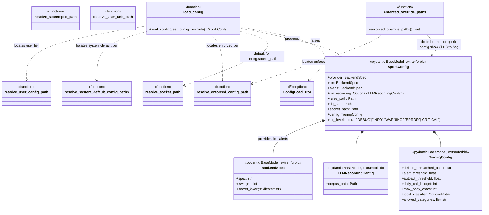
```mermaid
classDiagram
    class BackendSpec {
        <<pydantic BaseModel, extra=forbid>>
        +spec: str
        +kwargs: dict
        +secret_kwargs: dict~str,str~
    }
    class LLMRecordingConfig {
        <<pydantic BaseModel, extra=forbid>>
        +corpus_path: Path
    }
    class TieringConfig {
        <<pydantic BaseModel, extra=forbid>>
        +default_unmatched_action: str
        +alert_threshold: float
        +autoact_threshold: float
        +daily_call_budget: int
        +max_body_chars: int
        +local_classifier: Optional~str~
        +allowed_categories: list~str~
    }
    class SporkConfig {
        <<pydantic BaseModel, extra=forbid>>
        +provider: BackendSpec
        +llm: BackendSpec
        +alerts: BackendSpec
        +llm_recording: Optional~LLMRecordingConfig~
        +rules_path: Path
        +db_path: Path
        +socket_path: Path
        +tiering: TieringConfig
        +log_level: Literal["DEBUG"|"INFO"|"WARNING"|"ERROR"|"CRITICAL"]
    }
    class ConfigLoadError { <<Exception>> }

    SporkConfig *-- BackendSpec : provider, llm, alerts
    SporkConfig *-- LLMRecordingConfig
    SporkConfig *-- TieringConfig

    class resolve_user_config_path { <<function>> }
    class resolve_system_default_config_paths { <<function>> }
    class resolve_enforced_config_path { <<function>> }
    class resolve_socket_path { <<function>> }
    class resolve_secretspec_path { <<function>> }
    class resolve_user_unit_path { <<function>> }

    class load_config {
        <<function>>
        +load_config(user_config_override) SporkConfig
    }
    class enforced_override_paths {
        <<function>>
        +enforced_override_paths() set
    }
    load_config ..> resolve_user_config_path : locates user tier
    load_config ..> resolve_system_default_config_paths : locates system-default tier
    load_config ..> resolve_enforced_config_path : locates enforced tier
    load_config ..> resolve_socket_path : default for tiering.socket_path
    load_config ..> SporkConfig : produces
    load_config ..> ConfigLoadError : raises
    enforced_override_paths ..> resolve_enforced_config_path : locates enforced tier
    enforced_override_paths ..> SporkConfig : dotted paths, for spork config show (§13) to flag
```

`paths.py` (`resolve_user_config_path`/`resolve_system_default_config_paths`/
`resolve_enforced_config_path`/`resolve_socket_path`/
`resolve_secretspec_path`/`resolve_user_unit_path`) is deliberately
free functions, not methods on `SporkConfig` — pure path-resolution
logic against environment variables, testable in total isolation from
TOML parsing or pydantic validation (§7.2 settles exactly what each
one does). `resolve_secretspec_path`/`resolve_user_unit_path` are M6
additions, not part of `load_config()`'s own merge — they resolve
where `secretspec.toml` and the installed systemd unit file live,
respectively, both colocated with `config.toml` under the same
`$XDG_CONFIG_HOME`-rooted convention (§7.3, §14) rather than inventing
a new one. `load_config()` is the only thing that calls the first
four:
locates each of the three tier files that actually exist, deep-merges
their raw dicts in ascending precedence (system-default, then user,
then enforced — each later merge's keys win), and validates the fully
merged dict against `SporkConfig` once. `ConfigLoadError` wraps every
failure mode (malformed TOML in any tier, a merged dict that fails
`SporkConfig` validation, an unreadable file) — one catchable type per
module boundary, the same convention as `RulesLoadError`/
`ProviderLoadError`/`AlerterLoadError`. Built as M5's first item, real
and 100%-covered — this diagram settled the shape before any of it
was implemented, same as `spork.core.alerts`' had.

#### `spork.core.runtime`

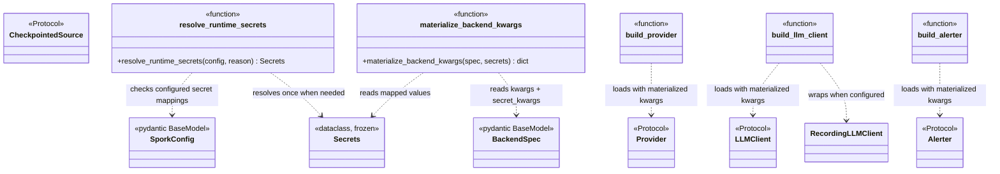
```mermaid
classDiagram
    class BackendSpec { <<pydantic BaseModel>> }
    class SporkConfig { <<pydantic BaseModel>> }
    class Secrets { <<dataclass, frozen>> }
    class Provider { <<Protocol>> }
    class CheckpointedSource { <<Protocol>> }
    class LLMClient { <<Protocol>> }
    class Alerter { <<Protocol>> }
    class RecordingLLMClient
    class resolve_runtime_secrets {
        <<function>>
        +resolve_runtime_secrets(config, reason) Secrets
    }
    class materialize_backend_kwargs {
        <<function>>
        +materialize_backend_kwargs(spec, secrets) dict
    }
    class build_provider { <<function>> }
    class build_llm_client { <<function>> }
    class build_alerter { <<function>> }

    resolve_runtime_secrets ..> SporkConfig : checks configured secret mappings
    resolve_runtime_secrets ..> Secrets : resolves once when needed
    materialize_backend_kwargs ..> BackendSpec : reads kwargs + secret_kwargs
    materialize_backend_kwargs ..> Secrets : reads mapped values
    build_provider ..> Provider : loads with materialized kwargs
    build_llm_client ..> LLMClient : loads with materialized kwargs
    build_llm_client ..> RecordingLLMClient : wraps when configured
    build_alerter ..> Alerter : loads with materialized kwargs
```

`BackendSpec.secret_kwargs` maps a constructor argument to a SecretSpec
name, for example `api_token = "JMAP_API_TOKEN"`. It contains names,
never values, so `spork config show` may display it without exposing a
credential. A constructor key cannot appear in both `kwargs` and
`secret_kwargs`; config validation rejects that ambiguity rather than
silently choosing one. `resolve_runtime_secrets()` calls SecretSpec at
most once per command invocation and only when at least one configured
backend has a secret mapping. `build_provider()`/`build_llm_client()`/
`build_alerter()` are the shared composition path used by `sporkd`,
`spork doctor`, and `spork reclassify`.

An optional top-level `[llm_recording]` table wraps the configured live
or recorded client in `RecordingLLMClient` after construction. Its
`corpus_path` is configuration, not a backend constructor argument;
there is no nested dynamic-client specification and no secret value in
the corpus configuration.

#### `spork.core.models`

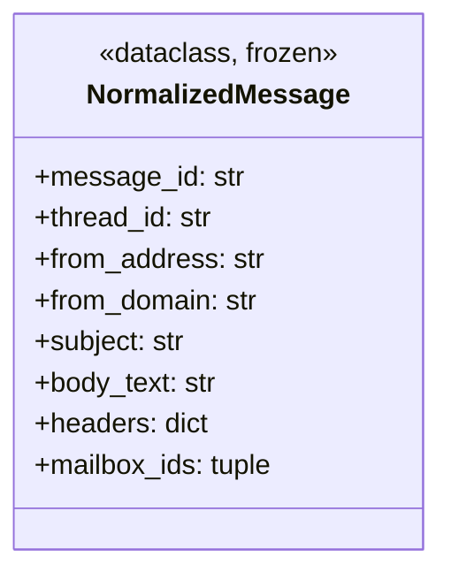
```mermaid
classDiagram
    class NormalizedMessage {
        <<dataclass, frozen>>
        +message_id: str
        +thread_id: str
        +from_address: str
        +from_domain: str
        +subject: str
        +body_text: str
        +headers: dict
        +mailbox_ids: tuple
    }
```

The one type nearly every other module below depends on — consumers
aren't re-drawn on every diagram that just takes a `NormalizedMessage`
parameter, only where it's genuinely part of the module's own shape.

#### `spork.core.providers.base`

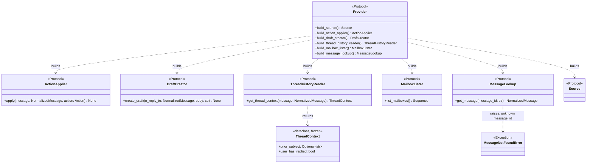
```mermaid
classDiagram
    class ActionApplier {
        <<Protocol>>
        +apply(message: NormalizedMessage, action: Action) None
    }
    class DraftCreator {
        <<Protocol>>
        +create_draft(in_reply_to: NormalizedMessage, body: str) None
    }
    class ThreadContext {
        <<dataclass, frozen>>
        +prior_subject: Optional~str~
        +user_has_replied: bool
    }
    class ThreadHistoryReader {
        <<Protocol>>
        +get_thread_context(message: NormalizedMessage) ThreadContext
    }
    class MailboxLister {
        <<Protocol>>
        +list_mailboxes() Sequence
    }
    class MessageNotFoundError { <<Exception>> }
    class MessageLookup {
        <<Protocol>>
        +get_message(message_id: str) NormalizedMessage
    }
    class Provider {
        <<Protocol>>
        +build_source() Source
        +build_action_applier() ActionApplier
        +build_draft_creator() DraftCreator
        +build_thread_history_reader() ThreadHistoryReader
        +build_mailbox_lister() MailboxLister
        +build_message_lookup() MessageLookup
    }
    class Source { <<Protocol>> }

    Provider ..> Source : builds
    Provider ..> ActionApplier : builds
    Provider ..> DraftCreator : builds
    Provider ..> ThreadHistoryReader : builds
    Provider ..> MailboxLister : builds
    Provider ..> MessageLookup : builds
    ThreadHistoryReader ..> ThreadContext : returns
    MessageLookup ..> MessageNotFoundError : raises, unknown message_id
```

`Source` is fully defined in `spork.core.sources`' own diagram below;
`Action` is fully defined in `spork.core.rules`'.

#### `spork.core.providers.loader`

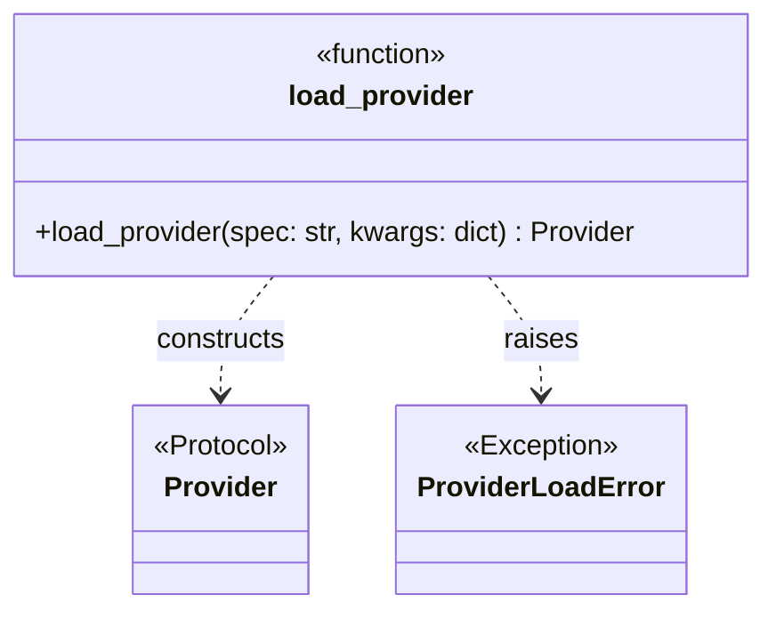
```mermaid
classDiagram
    class ProviderLoadError {
        <<Exception>>
    }
    class load_provider {
        <<function>>
        +load_provider(spec: str, kwargs: dict) Provider
    }
    class Provider { <<Protocol>> }

    load_provider ..> Provider : constructs
    load_provider ..> ProviderLoadError : raises
```

#### `spork.core.providers.jmap`


```mermaid
classDiagram
    class Trigger { <<Protocol>> }
    class ContentFetcher { <<Protocol>> }
    class Source { <<Protocol>> }
    class ActionApplier { <<Protocol>> }
    class DraftCreator { <<Protocol>> }
    class ThreadHistoryReader { <<Protocol>> }
    class MailboxLister { <<Protocol>> }
    class ThreadContext { <<dataclass, frozen>> }
    class Provider { <<Protocol>> }
    class CheckpointedProvider { <<Protocol>> }

    class JmapClient {
        -host: str
        -api_token: str
        +connect() None
        +account_id: str
        +fetch_new_messages(since_cursor: Optional~str~) JmapFetchResult
        +apply_action(message: NormalizedMessage, action: Action) None
        +create_draft(message: NormalizedMessage, body: str) None
        +get_thread_context(message: NormalizedMessage) ThreadContext
        +list_mailboxes() Sequence
    }
    class JmapFetchResult {
        <<dataclass, frozen>>
        +messages: tuple~NormalizedMessage~
        +cursor: str
    }
    class JmapError { <<Exception>> }
    class JmapPushTrigger {
        -client: JmapClient
        +wait() None
    }
    class _JmapCheckpointedSource {
        -client: JmapClient
        -cursor: Optional~str~
        +poll_batch() MessageBatch
        +poll() Sequence
    }
    class MailboxInfo {
        <<dataclass, frozen>>
        +id: str
        +name: str
        +role: Optional~str~
    }
    class UnknownMailboxRoleError { <<Exception>> }
    class AmbiguousMailboxRoleError { <<Exception>> }
    class MailboxResolver {
        -fetch: function
        -by_role: Optional~dict~
        +resolve(role: str) str
        +refresh() None
    }
    class next_delay {
        <<function>>
        +next_delay(schedule: Sequence, attempt: int) float
    }
    class JmapProvider {
        -client: JmapClient
        -cursor: Optional~str~
        +build_source() Source
        +account_id() str
        +build_checkpointed_source(cursor) CheckpointedSource
        +build_action_applier() ActionApplier
        +build_draft_creator() DraftCreator
        +build_thread_history_reader() ThreadHistoryReader
        +build_mailbox_lister() MailboxLister
    }
    class _JmapContentFetcher {
        -client: JmapClient
        -cursor: Optional~str~
        +fetch() Sequence
    }
    class _JmapActionApplier {
        -client: JmapClient
        +apply(message: NormalizedMessage, action: Action) None
    }
    class _JmapDraftCreator {
        -client: JmapClient
        +create_draft(in_reply_to: NormalizedMessage, body: str) None
    }
    class _JmapThreadHistoryReader {
        -client: JmapClient
        +get_thread_context(message: NormalizedMessage) ThreadContext
    }
    class _JmapMailboxLister {
        -client: JmapClient
        +list_mailboxes() Sequence
    }

    Trigger <|.. JmapPushTrigger : structurally satisfies
    ContentFetcher <|.. _JmapContentFetcher : structurally satisfies
    ActionApplier <|.. _JmapActionApplier : structurally satisfies
    DraftCreator <|.. _JmapDraftCreator : structurally satisfies
    ThreadHistoryReader <|.. _JmapThreadHistoryReader : structurally satisfies
    MailboxLister <|.. _JmapMailboxLister : structurally satisfies
    Provider <|.. JmapProvider : structurally satisfies
    CheckpointedProvider <|.. JmapProvider : structurally satisfies
    CheckpointedSource <|.. _JmapCheckpointedSource : structurally satisfies

    JmapPushTrigger --> JmapClient : wraps
    _JmapCheckpointedSource --> JmapPushTrigger : waits on
    _JmapCheckpointedSource --> JmapClient : fetches and advances candidate cursor
    JmapClient ..> JmapFetchResult : returns candidate checkpoint
    JmapClient ..> JmapError : wraps session/transport/protocol failures
    MailboxResolver ..> MailboxInfo : resolves from
    MailboxResolver ..> UnknownMailboxRoleError : raises
    MailboxResolver ..> AmbiguousMailboxRoleError : raises
    JmapProvider *-- JmapClient : constructs
    JmapProvider ..> JmapPushTrigger : builds
    JmapProvider ..> _JmapContentFetcher : builds
    JmapProvider ..> _JmapActionApplier : builds
    JmapProvider ..> _JmapDraftCreator : builds
    JmapProvider ..> _JmapThreadHistoryReader : builds
    JmapProvider ..> _JmapMailboxLister : builds
    _JmapContentFetcher --> JmapClient : delegates to
    _JmapActionApplier --> JmapClient : delegates to
    _JmapDraftCreator --> JmapClient : delegates to
    _JmapThreadHistoryReader --> JmapClient : delegates to
    _JmapMailboxLister --> JmapClient : delegates to
```

`backoff.next_delay()` is a pure function of `(schedule, attempt)`
with no dependency on the other classes here — drawn standalone
rather than wired into the rest, matching the code (`JmapPushTrigger`
doesn't call it yet; the daemon's future reconnect loop will).

#### `spork.core.providers.file`

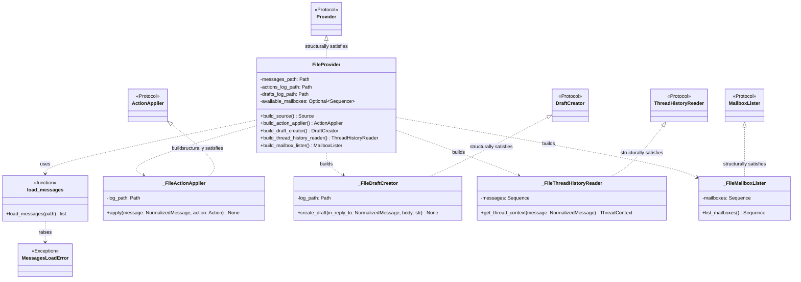
```mermaid
classDiagram
    class Provider { <<Protocol>> }
    class ActionApplier { <<Protocol>> }
    class DraftCreator { <<Protocol>> }
    class ThreadHistoryReader { <<Protocol>> }
    class MailboxLister { <<Protocol>> }
    class MessagesLoadError { <<Exception>> }
    class load_messages {
        <<function>>
        +load_messages(path) list
    }
    class _FileActionApplier {
        -log_path: Path
        +apply(message: NormalizedMessage, action: Action) None
    }
    class _FileDraftCreator {
        -log_path: Path
        +create_draft(in_reply_to: NormalizedMessage, body: str) None
    }
    class _FileThreadHistoryReader {
        -messages: Sequence
        +get_thread_context(message: NormalizedMessage) ThreadContext
    }
    class _FileMailboxLister {
        -mailboxes: Sequence
        +list_mailboxes() Sequence
    }
    class FileProvider {
        -messages_path: Path
        -actions_log_path: Path
        -drafts_log_path: Path
        -available_mailboxes: Optional~Sequence~
        +build_source() Source
        +build_action_applier() ActionApplier
        +build_draft_creator() DraftCreator
        +build_thread_history_reader() ThreadHistoryReader
        +build_mailbox_lister() MailboxLister
    }

    Provider <|.. FileProvider : structurally satisfies
    ActionApplier <|.. _FileActionApplier : structurally satisfies
    DraftCreator <|.. _FileDraftCreator : structurally satisfies
    ThreadHistoryReader <|.. _FileThreadHistoryReader : structurally satisfies
    MailboxLister <|.. _FileMailboxLister : structurally satisfies
    load_messages ..> MessagesLoadError : raises
    FileProvider ..> load_messages : uses
    FileProvider ..> _FileActionApplier : builds
    FileProvider ..> _FileDraftCreator : builds
    FileProvider ..> _FileThreadHistoryReader : builds
    FileProvider ..> _FileMailboxLister : builds
```

#### `spork.core.sources`

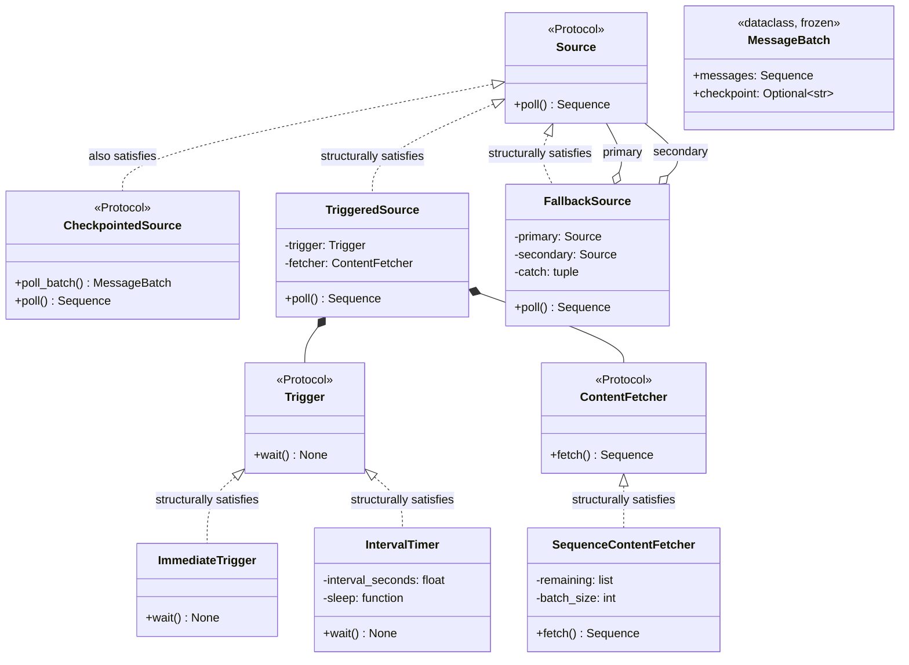
```mermaid
classDiagram
    class Trigger {
        <<Protocol>>
        +wait() None
    }
    class ContentFetcher {
        <<Protocol>>
        +fetch() Sequence
    }
    class Source {
        <<Protocol>>
        +poll() Sequence
    }
    class MessageBatch {
        <<dataclass, frozen>>
        +messages: Sequence
        +checkpoint: Optional~str~
    }
    class CheckpointedSource {
        <<Protocol>>
        +poll_batch() MessageBatch
        +poll() Sequence
    }
    class TriggeredSource {
        -trigger: Trigger
        -fetcher: ContentFetcher
        +poll() Sequence
    }
    class ImmediateTrigger {
        +wait() None
    }
    class SequenceContentFetcher {
        -remaining: list
        -batch_size: int
        +fetch() Sequence
    }
    class IntervalTimer {
        -interval_seconds: float
        -sleep: function
        +wait() None
    }
    class FallbackSource {
        -primary: Source
        -secondary: Source
        -catch: tuple
        +poll() Sequence
    }

    Source <|.. TriggeredSource : structurally satisfies
    Source <|.. FallbackSource : structurally satisfies
    Source <|.. CheckpointedSource : also satisfies
    Trigger <|.. ImmediateTrigger : structurally satisfies
    Trigger <|.. IntervalTimer : structurally satisfies
    ContentFetcher <|.. SequenceContentFetcher : structurally satisfies
    TriggeredSource *-- Trigger
    TriggeredSource *-- ContentFetcher
    FallbackSource o-- Source : primary
    FallbackSource o-- Source : secondary
```

#### `spork.core.rules`

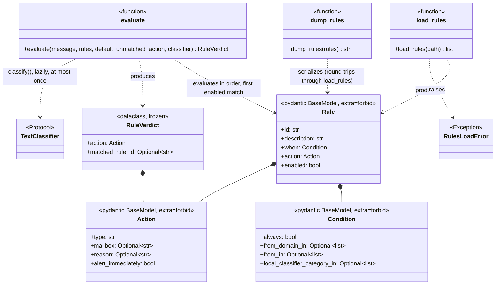
```mermaid
classDiagram
    class TextClassifier { <<Protocol>> }
    class Condition {
        <<pydantic BaseModel, extra=forbid>>
        +always: bool
        +from_domain_in: Optional~list~
        +from_in: Optional~list~
        +local_classifier_category_in: Optional~list~
    }
    class Action {
        <<pydantic BaseModel, extra=forbid>>
        +type: str
        +mailbox: Optional~str~
        +reason: Optional~str~
        +alert_immediately: bool
    }
    class Rule {
        <<pydantic BaseModel, extra=forbid>>
        +id: str
        +description: str
        +when: Condition
        +action: Action
        +enabled: bool
    }
    class RuleVerdict {
        <<dataclass, frozen>>
        +action: Action
        +matched_rule_id: Optional~str~
    }
    class evaluate {
        <<function>>
        +evaluate(message, rules, default_unmatched_action, classifier) RuleVerdict
    }
    class RulesLoadError { <<Exception>> }
    class load_rules {
        <<function>>
        +load_rules(path) list
    }
    class dump_rules {
        <<function>>
        +dump_rules(rules) str
    }

    Rule *-- Condition
    Rule *-- Action
    RuleVerdict *-- Action
    evaluate ..> Rule : evaluates in order, first enabled match
    evaluate ..> RuleVerdict : produces
    evaluate ..> TextClassifier : classify(), lazily, at most once
    load_rules ..> Rule : produces
    load_rules ..> RulesLoadError : raises
    dump_rules ..> Rule : serializes (round-trips through load_rules)
```

#### `spork.core.classify`

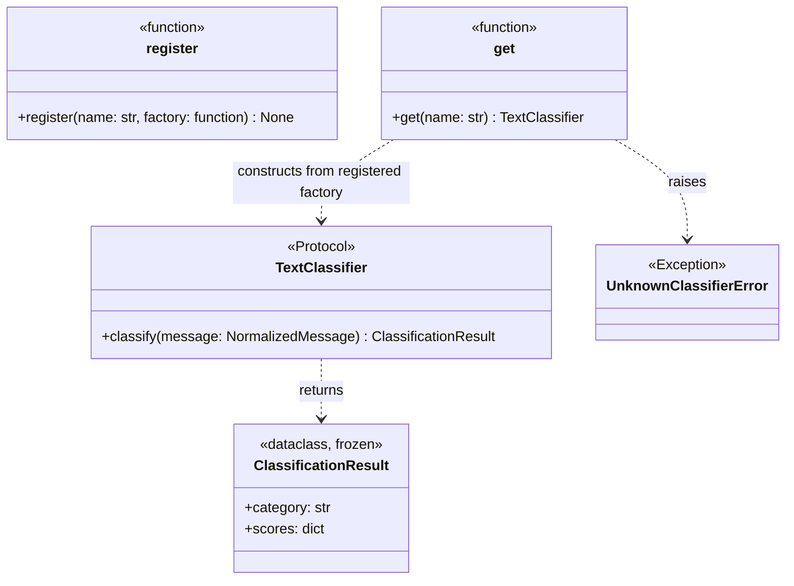
```mermaid
classDiagram
    class ClassificationResult {
        <<dataclass, frozen>>
        +category: str
        +scores: dict
    }
    class TextClassifier {
        <<Protocol>>
        +classify(message: NormalizedMessage) ClassificationResult
    }
    class UnknownClassifierError { <<Exception>> }
    class register {
        <<function>>
        +register(name: str, factory: function) None
    }
    class get {
        <<function>>
        +get(name: str) TextClassifier
    }

    TextClassifier ..> ClassificationResult : returns
    get ..> TextClassifier : constructs from registered factory
    get ..> UnknownClassifierError : raises
```

#### `spork.core.dispatch`

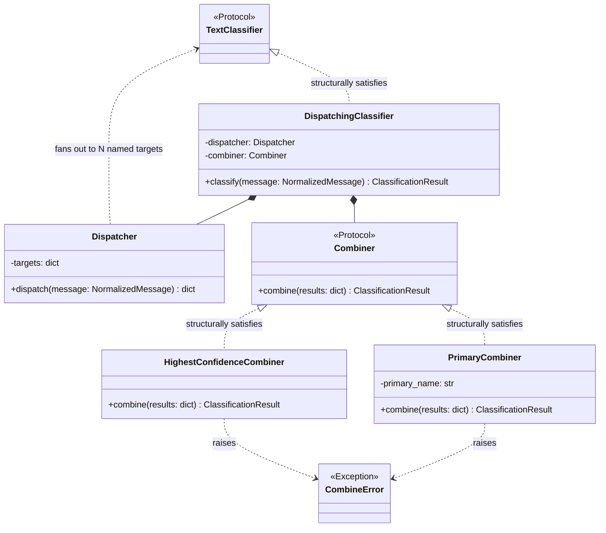
```mermaid
classDiagram
    class TextClassifier { <<Protocol>> }
    class Dispatcher {
        -targets: dict
        +dispatch(message: NormalizedMessage) dict
    }
    class Combiner {
        <<Protocol>>
        +combine(results: dict) ClassificationResult
    }
    class CombineError { <<Exception>> }
    class PrimaryCombiner {
        -primary_name: str
        +combine(results: dict) ClassificationResult
    }
    class HighestConfidenceCombiner {
        +combine(results: dict) ClassificationResult
    }
    class DispatchingClassifier {
        -dispatcher: Dispatcher
        -combiner: Combiner
        +classify(message: NormalizedMessage) ClassificationResult
    }

    Combiner <|.. PrimaryCombiner : structurally satisfies
    Combiner <|.. HighestConfidenceCombiner : structurally satisfies
    TextClassifier <|.. DispatchingClassifier : structurally satisfies
    DispatchingClassifier *-- Dispatcher
    DispatchingClassifier *-- Combiner
    Dispatcher ..> TextClassifier : fans out to N named targets
    PrimaryCombiner ..> CombineError : raises
    HighestConfidenceCombiner ..> CombineError : raises
```

#### `spork.core.llm.base`

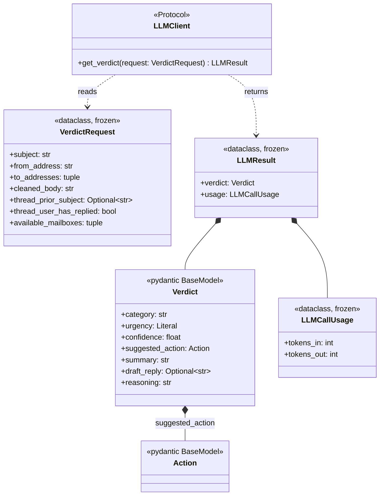
```mermaid
classDiagram
    class Action { <<pydantic BaseModel>> }
    class VerdictRequest {
        <<dataclass, frozen>>
        +subject: str
        +from_address: str
        +to_addresses: tuple
        +cleaned_body: str
        +thread_prior_subject: Optional~str~
        +thread_user_has_replied: bool
        +available_mailboxes: tuple
    }
    class Verdict {
        <<pydantic BaseModel>>
        +category: str
        +urgency: Literal
        +confidence: float
        +suggested_action: Action
        +summary: str
        +draft_reply: Optional~str~
        +reasoning: str
    }
    class LLMCallUsage {
        <<dataclass, frozen>>
        +tokens_in: int
        +tokens_out: int
    }
    class LLMResult {
        <<dataclass, frozen>>
        +verdict: Verdict
        +usage: LLMCallUsage
    }
    class LLMClient {
        <<Protocol>>
        +get_verdict(request: VerdictRequest) LLMResult
    }

    Verdict *-- Action : suggested_action
    LLMClient ..> VerdictRequest : reads
    LLMResult *-- Verdict
    LLMResult *-- LLMCallUsage
    LLMClient ..> LLMResult : returns
```

`Action` is fully defined in `spork.core.rules`'s own diagram — reused
here, not redefined, so a Tier 2 verdict and a Tier 1 rule produce the
exact same terminal-action shape.

#### `spork.core.llm.validate`

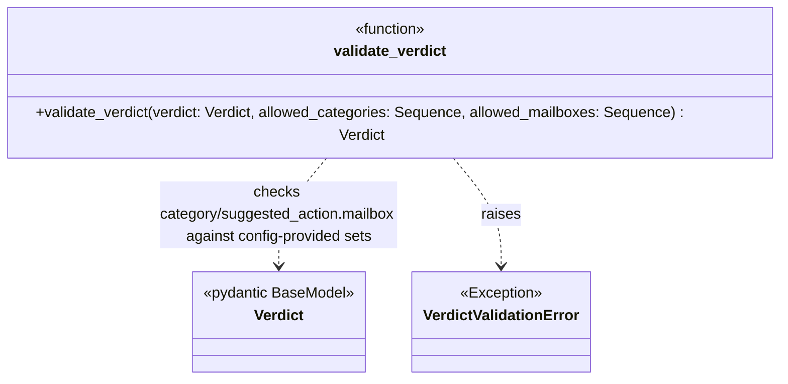
```mermaid
classDiagram
    class Verdict { <<pydantic BaseModel>> }
    class VerdictValidationError { <<Exception>> }
    class validate_verdict {
        <<function>>
        +validate_verdict(verdict: Verdict, allowed_categories: Sequence, allowed_mailboxes: Sequence) Verdict
    }

    validate_verdict ..> Verdict : checks category/suggested_action.mailbox against config-provided sets
    validate_verdict ..> VerdictValidationError : raises
```

#### `spork.core.llm.confidence`

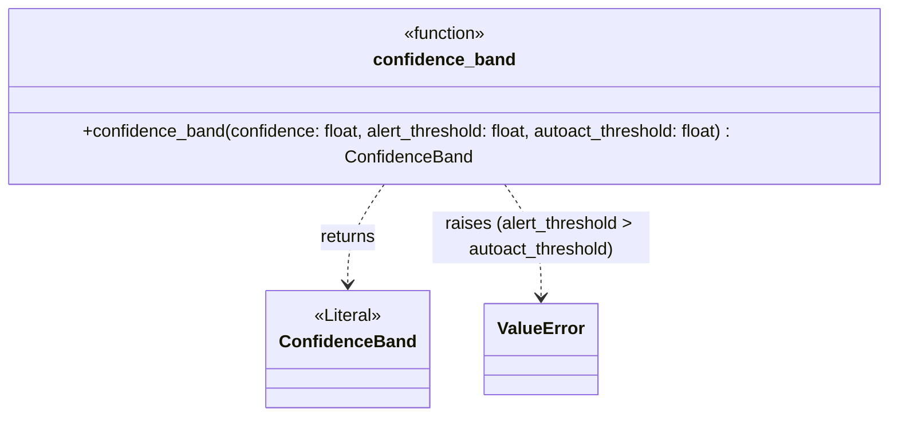
```mermaid
classDiagram
    class ConfidenceBand { <<Literal>> }
    class confidence_band {
        <<function>>
        +confidence_band(confidence: float, alert_threshold: float, autoact_threshold: float) ConfidenceBand
    }

    confidence_band ..> ConfidenceBand : returns
    confidence_band ..> ValueError : raises (alert_threshold > autoact_threshold)
```

#### `spork.core.llm.budget`

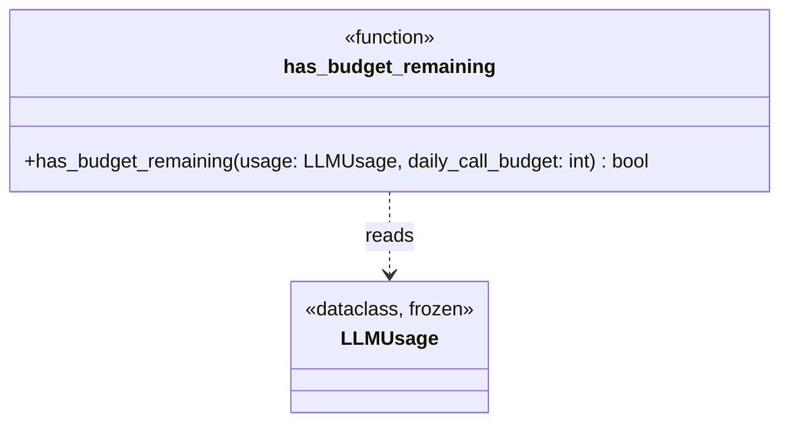
```mermaid
classDiagram
    class LLMUsage { <<dataclass, frozen>> }
    class has_budget_remaining {
        <<function>>
        +has_budget_remaining(usage: LLMUsage, daily_call_budget: int) bool
    }

    has_budget_remaining ..> LLMUsage : reads
```

`LLMUsage` is fully defined in `spork.core.state`'s own diagram below
— `StateDB.get_llm_usage()` produces it, this module only consumes it.

#### `spork.core.llm.loader`

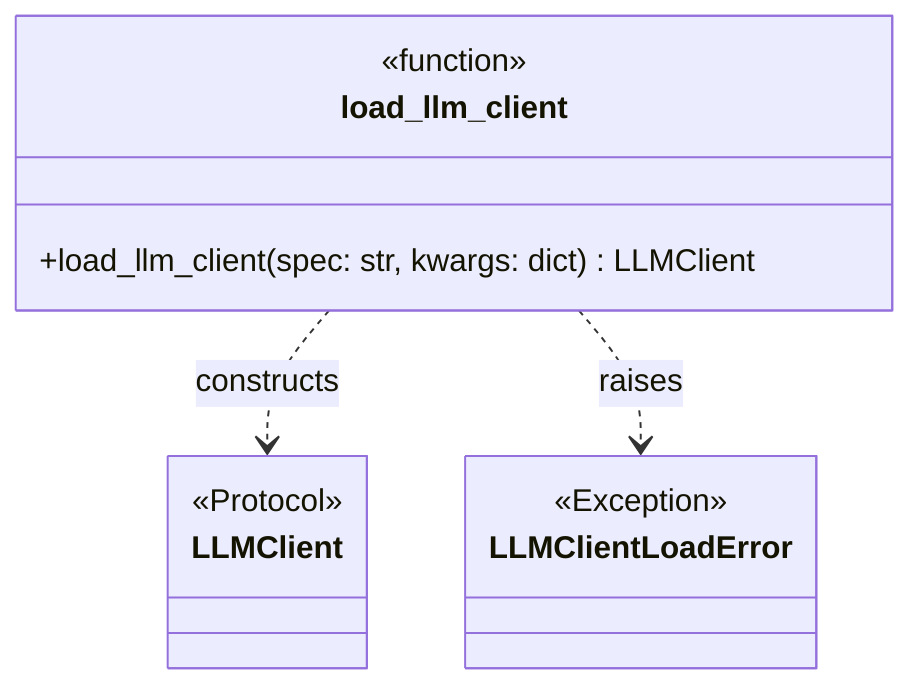
```mermaid
classDiagram
    class LLMClientLoadError { <<Exception>> }
    class load_llm_client {
        <<function>>
        +load_llm_client(spec: str, kwargs: dict) LLMClient
    }
    class LLMClient { <<Protocol>> }

    load_llm_client ..> LLMClient : constructs
    load_llm_client ..> LLMClientLoadError : raises
```

#### `spork.core.llm.prompt`

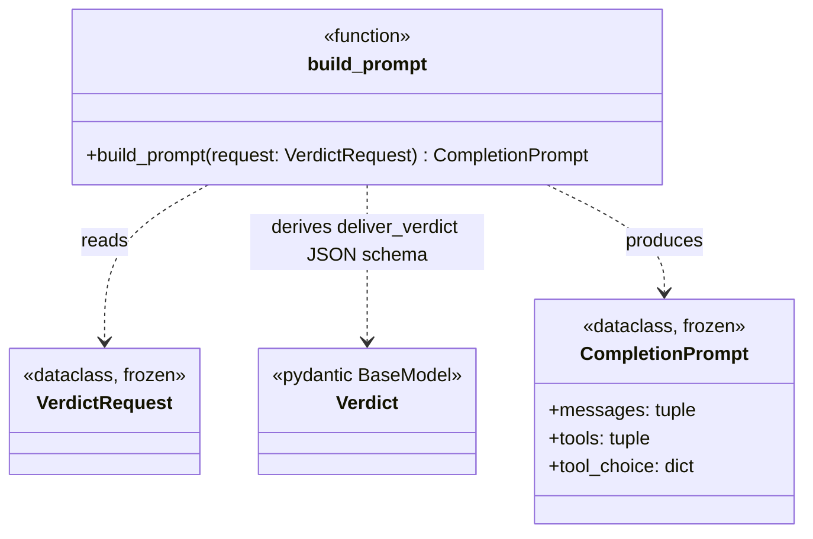
```mermaid
classDiagram
    class CompletionPrompt {
        <<dataclass, frozen>>
        +messages: tuple
        +tools: tuple
        +tool_choice: dict
    }
    class build_prompt {
        <<function>>
        +build_prompt(request: VerdictRequest) CompletionPrompt
    }
    class VerdictRequest { <<dataclass, frozen>> }
    class Verdict { <<pydantic BaseModel>> }

    build_prompt ..> VerdictRequest : reads
    build_prompt ..> Verdict : derives deliver_verdict JSON schema
    build_prompt ..> CompletionPrompt : produces
```

The prompt builder is deliberately independent of LiteLLM. Unit tests
assert the exact system/user message list, tool schema, and forced
`deliver_verdict` tool choice without importing an SDK or making a
network call. `CompletionPrompt` is also the exact request material
the acceptance-corpus recorder persists, so a recording says what was
sent, not only what came back.

#### `spork.core.llm.clients.litellm`

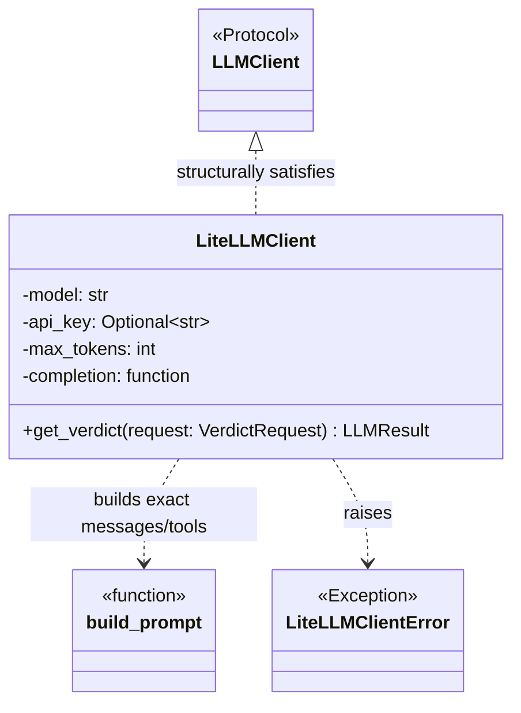
```mermaid
classDiagram
    class LLMClient { <<Protocol>> }
    class LiteLLMClient {
        -model: str
        -api_key: Optional~str~
        -max_tokens: int
        -completion: function
        +get_verdict(request: VerdictRequest) LLMResult
    }
    class LiteLLMClientError { <<Exception>> }
    class build_prompt { <<function>> }

    LLMClient <|.. LiteLLMClient : structurally satisfies
    LiteLLMClient ..> build_prompt : builds exact messages/tools
    LiteLLMClient ..> LiteLLMClientError : raises
```

`LiteLLMClient` is the only live Tier 2 adapter for v1. It uses
LiteLLM's in-process `completion()` API with a forced
`deliver_verdict` tool call; a LiteLLM proxy remains possible later
without changing the protocol, but is out of scope now. The SDK is an
optional `spork[llm]` dependency and is imported lazily, so
`RecordedLLMClient` deployments do not install or import it. Tests
inject a completion callable returning the same response shape as
LiteLLM, which verifies Spork's request and parsing behavior without a
network call or API key.

#### `spork.core.llm.recording`

```mermaid
classDiagram
    class LLMClient { <<Protocol>> }
    class RecordingLLMClient {
        -client: LLMClient
        -corpus_path: Path
        -now: function
        +get_verdict(request: VerdictRequest) LLMResult
    }

    LLMClient <|.. RecordingLLMClient : structurally satisfies
    RecordingLLMClient --> LLMClient : delegates to
    RecordingLLMClient ..> build_prompt : records the same deterministic prompt
```

`RecordingLLMClient` appends one JSON object per successful call. Each
record contains the request subject, the complete prompt messages and
tool definition/choice, a SHA-256 hash of that canonical prompt, the
validated Verdict, token usage, and timestamp. Live corpora default to
`tests/fixtures/corpus/`, which is gitignored because real message
content may be unpublishable; a later CI job may populate a private
corpus from S3. The recorder never writes API keys or raw SDK response
objects.

#### `spork.core.llm.clients.recorded`

```mermaid
classDiagram
    class LLMClient { <<Protocol>> }
    class RecordedResponsesLoadError { <<Exception>> }
    class UnrecordedResponseError { <<Exception>> }
    class load_recorded_responses {
        <<function>>
        +load_recorded_responses(path) dict
    }
    class RecordedLLMClient {
        -responses: dict
        +get_verdict(request: VerdictRequest) LLMResult
    }

    LLMClient <|.. RecordedLLMClient : structurally satisfies
    RecordedLLMClient *-- load_recorded_responses : loads via, at construction
    load_recorded_responses ..> RecordedResponsesLoadError : raises
    RecordedLLMClient ..> UnrecordedResponseError : raises
```

The `LLMClient` equivalent of `FileProvider` (§9.3) — a second, fully
real adapter with no `NotImplementedError` anywhere, for CI/offline use
(§10.5), never a stand-in for a live verdict in production.

#### `spork.core.actions`

```mermaid
classDiagram
    class ActionApplier { <<Protocol>> }
    class ActionExecutionError { <<Exception>> }
    class ActionExecutor {
        -applier: ActionApplier
        +execute(message: NormalizedMessage, action: Action) None
    }

    ActionExecutor --> ActionApplier : delegates non-escalate actions to
    ActionExecutor ..> ActionExecutionError : raises
```

#### `spork.core.alerts.base`

```mermaid
classDiagram
    class AlertUrgency { <<Literal>> }
    class Alerter {
        <<Protocol>>
        +notify(title: str, body: str, url: Optional~str~, urgency: AlertUrgency) None
    }

    Alerter ..> AlertUrgency : urgency parameter
```

#### `spork.core.alerts.log`

```mermaid
classDiagram
    class Alerter { <<Protocol>> }
    class LoggingAlerter {
        +notify(title: str, body: str, url: Optional~str~, urgency: AlertUrgency) None
    }

    Alerter <|.. LoggingAlerter : structurally satisfies
```

The v1 backend: logs each alert via `logging.getLogger(__name__)`
rather than showing a GUI popup — a real, inspectable delivery
channel, not a stub. Never configures handlers itself (Python logging
best practice — that's the application's job, `docs/ROADMAP.md` M7).

#### `spork.core.alerts.loader`

```mermaid
classDiagram
    class AlerterLoadError { <<Exception>> }
    class load_alerter {
        <<function>>
        +load_alerter(spec: str, kwargs: dict) Alerter
    }
    class Alerter { <<Protocol>> }

    load_alerter ..> Alerter : constructs
    load_alerter ..> AlerterLoadError : raises
```

#### `spork.core.state`

```mermaid
classDiagram
    class AuditEntry {
        <<dataclass, frozen>>
        +id: int
        +ts: str
        +jmap_id: str
        +event: str
        +detail_json: Optional~str~
    }
    class LLMUsage {
        <<dataclass, frozen>>
        +date: str
        +calls: int
        +tokens_in: int
        +tokens_out: int
    }
    class StateDB {
        -conn: Connection
        +get_cursor(account_id: str) Optional~str~
        +set_cursor(account_id: str, state: str) None
        +has_processed(jmap_id: str) bool
        +mark_processed(jmap_id: str, ...) None
        +write_audit_entry(...) None
        +write_control_plane_audit_entry(ts, event, detail_json) None
        +get_audit_entries(jmap_id: Optional~str~) list
        +record_llm_call(date: str, tokens_in: int, tokens_out: int) None
        +get_llm_usage(date: str) LLMUsage
        +close() None
    }

    StateDB ..> AuditEntry : returns from get_audit_entries()
    StateDB ..> LLMUsage : returns from get_llm_usage()
```

The underlying `sqlite3.connect()` call sets `check_same_thread=False`
— not shown above since it's a constructor implementation detail, not
part of `StateDB`'s own interface, but load-bearing for §6.2.1's daemon
loop: the connection is created on the event loop's thread, and every
`asyncio.to_thread(process_message, ...)` call touching it runs on
whichever worker thread the pool hands out. Safe specifically because
the loop never runs two such calls concurrently — each message's
pipeline run (every `StateDB` write included) completes before the
next begins, so two threads never touch the connection at the same
instant, only handed off in sequence. This does not make concurrent
multi-thread access to one `StateDB` safe in general — it turns off a
guard rail that's unnecessary under sequential handoff specifically,
not SQLite's own locking.

#### `spork.core.ipc`

```mermaid
classDiagram
    class IpcRequest {
        <<pydantic BaseModel>>
        +command: str
        +params: dict
    }
    class IpcResponse {
        <<pydantic BaseModel>>
        +ok: bool
        +data: dict
        +error: Optional~str~
    }
    class IpcServer {
        -socket_path: Path
        -handlers: dict
        +serve(stop_event) None
    }
    class send_request {
        <<function>>
        +send_request(socket_path, command, params) IpcResponse
    }
    class IpcConnectionError { <<Exception>> }

    IpcServer ..> IpcRequest : parses one per connection
    IpcServer ..> IpcResponse : writes one back
    send_request ..> IpcRequest : sends
    send_request ..> IpcResponse : returns
    send_request ..> IpcConnectionError : raises when nothing's listening
```

One request per connection (§6.2.2) — `IpcServer` is constructed with
a `dict[str, Callable[[dict], dict]]` of command-name -> handler
functions (registered by whoever calls `run_daemon()`'s composition,
same DI pattern as everything else here) and never itself knows what
"status" or "pause" mean. `send_request()` (the CLI's side, plain
synchronous `socket`, no asyncio) raises `IpcConnectionError` — not a
raw `ConnectionRefusedError`/`FileNotFoundError` — for "nothing's
listening," the single signal every CLI command that talks to the
daemon checks for to print "daemon not running" (§6.3) instead of a
raw traceback.

#### `spork.core.pipeline`

Five diagrams: the generic framework (`core.py`); `observer.py`'s
`PipelineObserver` (§12.2, shared by both concrete pipelines below);
`tracing.py`'s `TracingStage`/`TracingSelector` (M7 — the generic
per-stage instrumentation wrapper, also shared by both); then the
concrete Tier 1 pipeline (`meta.py`/`modules.py`/`default.py`, §9.4);
then Tier 2's (`tier2/`, §10.7).

```mermaid
classDiagram
    class Payload~M~ {
        <<dataclass, frozen>>
        +text: str
        +meta: M
    }
    class Filter~M~ {
        <<Protocol>>
        +apply(payload: Payload~M~) Payload~M~
    }
    class Augment~M~ {
        <<Protocol>>
        +augment(payload: Payload~M~) Payload~M~
    }
    class Selector~M~ {
        <<Protocol>>
        +select(payload: Payload~M~) tuple
    }
    class UnknownBranchError { <<Exception>> }
    class Pipeline~M~ {
        -stages: list
        -selector: Optional~Selector~
        -routes: dict
        +run(payload: Payload~M~) Payload~M~
    }

    Pipeline --> Filter : runs each in order (via .apply)
    Pipeline --> Augment : runs each in order (via .augment)
    Pipeline --> Selector : follows its chosen branch
    Pipeline --> Pipeline : a route value is itself a Pipeline
    Pipeline ..> UnknownBranchError : raises
```

`core.py` knows nothing about messages, rules, or the state DB —
`Payload`/`Filter`/`Selector`/`Augment`/`Pipeline` are generic over a
metadata type `M`, provably reusable for a differently-shaped
pipeline, not just this one. `Filter` and `Selector` are conventionally
pure (no I/O); `Augment` is the type for a stage that reaches outside
the payload it was given (a database search, a contact lookup) —
`Pipeline.run` tells them apart by `isinstance`, dispatching to
`.augment()` or `.apply()` accordingly.

```mermaid
classDiagram
    class Alerter { <<Protocol>> }
    class PipelineObserver {
        -alerter: Alerter
        -logger: Logger
        +trace(correlation_id, event, fields) None
        +alert(correlation_id, title, body, url, urgency) None
    }

    PipelineObserver --> Alerter : delegates to, from alert()
```

`PipelineObserver` bundles §12.2's "combine logging and alerting"
decision into one injectable object — every alert-firing pipeline
module below takes one via constructor DI, same as `state_db`.
`trace()` always logs (a `logging.LoggerAdapter`-style correlation-ID
injection); `alert()` does that and delegates to `Alerter.notify()`
(§12.1) — `Alerter` itself is unchanged, `PipelineObserver` composes
it rather than replacing it.

```mermaid
classDiagram
    class Filter~M~ { <<Protocol>> }
    class Selector~M~ { <<Protocol>> }
    class Augment~M~ { <<Protocol>> }
    class PipelineObserver
    class TracingStage~M~ {
        <<Filter, wraps Filter or Augment>>
        -stage: Filter~M~ | Augment~M~
        -ops: PipelineObserver
        +apply(payload: Payload~M~) Payload~M~
    }
    class TracingSelector~M~ {
        <<Selector, wraps Selector>>
        -selector: Selector~M~
        -ops: PipelineObserver
        +select(payload: Payload~M~) tuple
    }
    class wrap_stages { <<function>> }
    class wrap_selector { <<function>> }

    Filter <|.. TracingStage : structurally satisfies
    Augment <|.. TracingStage : structurally satisfies
    Selector <|.. TracingSelector : structurally satisfies
    TracingStage --> PipelineObserver : traces via
    TracingSelector --> PipelineObserver : traces via
    wrap_stages ..> TracingStage : wraps every element of a stages list
    wrap_selector ..> TracingSelector : wraps one selector
```

`TracingStage`/`TracingSelector` (M7, docs/ROADMAP.md's "per-message
tracing" item) are generic, dependency-free wrappers, not a change to
`core.py` itself — `Pipeline`/`Filter`/`Selector`/`Augment` stay
message-agnostic (§9.4's own stated design), and a `TracingStage`
always presents as a plain `Filter` to the outer `Pipeline.run()`
(only `.apply()`), regardless of whether the module it wraps is really
a `Filter` or an `Augment` — internally it still calls the wrapped
stage's real `.apply()`/`.augment()` via the same `isinstance` check
`Pipeline.run()` itself uses, so wrapping never changes what actually
executes, only what gets logged around it. Each records one
`ops.trace()` call after the wrapped stage returns: the wrapped
stage's class name, elapsed time (`time.monotonic()`, not wall-clock —
duration shouldn't be sensitive to a clock adjustment mid-run),
`kind` (`"filter"`/`"augment"`), and — for `TracingSelector` — which
branch was chosen. `correlation_id` is read off `payload.meta` via
`getattr(meta, "correlation_id", None)` rather than a new `Protocol`
bound on `M`: both `MessageMeta` and `Tier2Meta` already carry the
field (§12.2), and duck-typing here keeps `tracing.py` reusable for
any future `Payload` metadata type that happens to expose one, the
same "generic, not hardcoded to this pipeline's shape" spirit
`core.py` itself already has. `build_default_pipeline()`/
`build_tier2_pipeline()` (§9.4/§10.7) wrap every concrete stage/selector
they compose via `wrap_stages()`/`wrap_selector()` at construction
time — no change to any of the 7+13 concrete module classes
themselves, and no change to what a module-level unit test (constructs
a bare `Payload`, calls `.apply()`/`.select()`/`.augment()` directly,
never through a `Pipeline`) exercises, since those tests never go
through the wrapper at all.

```mermaid
classDiagram
    class Filter { <<Protocol>> }
    class Selector { <<Protocol>> }
    class ActionExecutor
    class StateDB
    class PipelineObserver
    class evaluate { <<function>> }

    class MessageMeta {
        <<dataclass, frozen>>
        +message: NormalizedMessage
        +rules: Sequence~Rule~
        +default_unmatched_action: Action
        +classifier: Optional~TextClassifier~
        +verdict: Optional~RuleVerdict~
        +ts: Optional~str~
        +correlation_id: Optional~str~
        +audit_event: Optional~str~
        +audit_detail_json: Optional~str~
    }
    class MissingMetaError { <<Exception>> }

    class IdempotencyGateSelector {
        -state_db: StateDB
        +select(payload) tuple
    }
    class TimestampFilter {
        -now: function
        +apply(payload) Payload
    }
    class CorrelationIdFilter {
        -new_id: function
        +apply(payload) Payload
    }
    class RuleEvaluationSelector {
        +select(payload) tuple
    }
    class ApplyActionFilter {
        -executor: ActionExecutor
        +apply(payload) Payload
    }
    class RecordEscalationFilter {
        -ops: PipelineObserver
        +apply(payload) Payload
    }
    class WriteAuditEntryFilter {
        -state_db: StateDB
        +apply(payload) Payload
    }
    class MarkProcessedFilter {
        -state_db: StateDB
        +apply(payload) Payload
    }

    Selector <|.. IdempotencyGateSelector : structurally satisfies
    Filter <|.. TimestampFilter : structurally satisfies
    Filter <|.. CorrelationIdFilter : structurally satisfies
    Selector <|.. RuleEvaluationSelector : structurally satisfies
    Filter <|.. ApplyActionFilter : structurally satisfies
    Filter <|.. RecordEscalationFilter : structurally satisfies
    Filter <|.. WriteAuditEntryFilter : structurally satisfies
    Filter <|.. MarkProcessedFilter : structurally satisfies

    ApplyActionFilter ..> MissingMetaError : raises
    WriteAuditEntryFilter ..> MissingMetaError : raises
    MarkProcessedFilter ..> MissingMetaError : raises

    RuleEvaluationSelector ..> evaluate : Tier 1 evaluation
    ApplyActionFilter --> ActionExecutor : delegates non-escalate actions to
    RecordEscalationFilter --> PipelineObserver : alerts when action.alert_immediately
    IdempotencyGateSelector --> StateDB
    WriteAuditEntryFilter --> StateDB
    MarkProcessedFilter --> StateDB

    class build_default_pipeline {
        <<function>>
        +build_default_pipeline(executor, state_db, ops, now, new_correlation_id, force) Pipeline
    }
    class process_message {
        <<function>>
        +process_message(message, rules, default_unmatched_action, executor, state_db, ops, classifier, now, new_correlation_id, force) Optional~RuleVerdict~
    }
    build_default_pipeline ..> IdempotencyGateSelector : composes
    build_default_pipeline ..> TimestampFilter : composes
    build_default_pipeline ..> CorrelationIdFilter : composes
    build_default_pipeline ..> RuleEvaluationSelector : composes
    build_default_pipeline ..> ApplyActionFilter : composes
    build_default_pipeline ..> RecordEscalationFilter : composes
    build_default_pipeline ..> WriteAuditEntryFilter : composes
    build_default_pipeline ..> MarkProcessedFilter : composes
    process_message ..> build_default_pipeline : builds, then runs
```

The orchestrator §9 describes in prose — ties idempotency, evaluation,
action execution, and audit logging into the one call a real message
goes through, now composed from these seven modules instead of one
function body. `ActionExecutor`/`StateDB`/`evaluate` are fully defined
in their own diagrams above.

A third diagram: `spork.core.pipeline.tier2` (§10.7), the Tier 2
sibling to the diagram above — reuses the same generic framework and
`MissingMetaError`, but its own `Tier2Meta` and 13 concrete modules,
never M2's.

```mermaid
classDiagram
    class Filter { <<Protocol>> }
    class Selector { <<Protocol>> }
    class Augment { <<Protocol>> }
    class MissingMetaError { <<Exception>> }
    class LLMClient { <<Protocol>> }
    class DraftCreator { <<Protocol>> }
    class ActionExecutor
    class StateDB
    class PipelineObserver
    class clean_body { <<function>> }
    class validate_verdict { <<function>> }
    class confidence_band { <<function>> }
    class has_budget_remaining { <<function>> }

    class Tier2Meta {
        <<dataclass, frozen>>
        +message: NormalizedMessage
        +to_addresses: Sequence~str~
        +thread_prior_subject: Optional~str~
        +thread_user_has_replied: bool
        +available_mailboxes: Sequence~str~
        +ts: Optional~str~
        +correlation_id: Optional~str~
        +request: Optional~VerdictRequest~
        +verdict: Optional~Verdict~
        +llm_usage: Optional~LLMCallUsage~
        +band: Optional~ConfidenceBand~
        +audit_event: Optional~str~
        +audit_detail_json: Optional~str~
    }

    class TimestampFilter {
        -now: function
        +apply(payload) Payload
    }
    class CorrelationIdFilter {
        -new_id: function
        +apply(payload) Payload
    }
    class BudgetGateSelector {
        -state_db: StateDB
        -daily_call_budget: int
        +select(payload) tuple
    }
    class BuildVerdictRequestFilter {
        -max_body_chars: int
        +apply(payload) Payload
    }
    class CallLLMAugment {
        -llm_client: LLMClient
        +augment(payload) Payload
    }
    class RecordLLMUsageFilter {
        -state_db: StateDB
        +apply(payload) Payload
    }
    class ValidateVerdictFilter {
        -allowed_categories: Sequence~str~
        +apply(payload) Payload
    }
    class ConfidenceBandSelector {
        -alert_threshold: float
        -autoact_threshold: float
        +select(payload) tuple
    }
    class ApplyVerdictActionFilter {
        -executor: ActionExecutor
        -ops: PipelineObserver
        +apply(payload) Payload
    }
    class RecordAlertOnlyFilter {
        -ops: PipelineObserver
        +apply(payload) Payload
    }
    class RecordBudgetExhaustedFilter {
        -ops: PipelineObserver
        +apply(payload) Payload
    }
    class CreateDraftIfWantedFilter {
        -draft_creator: DraftCreator
        +apply(payload) Payload
    }
    class WriteAuditEntryFilter {
        -state_db: StateDB
        +apply(payload) Payload
    }
    class MarkProcessedFilter {
        -state_db: StateDB
        +apply(payload) Payload
    }

    Filter <|.. TimestampFilter : structurally satisfies
    Filter <|.. CorrelationIdFilter : structurally satisfies
    Selector <|.. BudgetGateSelector : structurally satisfies
    Filter <|.. BuildVerdictRequestFilter : structurally satisfies
    Augment <|.. CallLLMAugment : structurally satisfies
    Filter <|.. RecordLLMUsageFilter : structurally satisfies
    Filter <|.. ValidateVerdictFilter : structurally satisfies
    Selector <|.. ConfidenceBandSelector : structurally satisfies
    Filter <|.. ApplyVerdictActionFilter : structurally satisfies
    Filter <|.. RecordAlertOnlyFilter : structurally satisfies
    Filter <|.. RecordBudgetExhaustedFilter : structurally satisfies
    Filter <|.. CreateDraftIfWantedFilter : structurally satisfies
    Filter <|.. WriteAuditEntryFilter : structurally satisfies
    Filter <|.. MarkProcessedFilter : structurally satisfies

    BuildVerdictRequestFilter ..> MissingMetaError : raises
    CallLLMAugment ..> MissingMetaError : raises
    RecordLLMUsageFilter ..> MissingMetaError : raises
    ValidateVerdictFilter ..> MissingMetaError : raises
    ConfidenceBandSelector ..> MissingMetaError : raises
    ApplyVerdictActionFilter ..> MissingMetaError : raises
    CreateDraftIfWantedFilter ..> MissingMetaError : raises
    WriteAuditEntryFilter ..> MissingMetaError : raises
    MarkProcessedFilter ..> MissingMetaError : raises

    BuildVerdictRequestFilter ..> clean_body : cleans body via
    CallLLMAugment --> LLMClient : the one I/O stage — external API seam
    ValidateVerdictFilter ..> validate_verdict : Tier 2 verdict validation
    ConfidenceBandSelector ..> confidence_band : Tier 2 confidence gating
    BudgetGateSelector ..> has_budget_remaining : Tier 2 budget check
    ApplyVerdictActionFilter --> ActionExecutor : applies suggested_action via
    ApplyVerdictActionFilter --> PipelineObserver : alerts when band==autoact_alert or urgency==high
    RecordAlertOnlyFilter --> PipelineObserver : always alerts
    RecordBudgetExhaustedFilter --> PipelineObserver : always alerts
    CreateDraftIfWantedFilter --> DraftCreator : creates via, when draft_reply set
    BudgetGateSelector --> StateDB
    RecordLLMUsageFilter --> StateDB
    WriteAuditEntryFilter --> StateDB
    MarkProcessedFilter --> StateDB

    class build_tier2_pipeline {
        <<function>>
        +build_tier2_pipeline(llm_client, executor, draft_creator, state_db, ops, allowed_categories, daily_call_budget, alert_threshold, autoact_threshold, max_body_chars, now, new_correlation_id) Pipeline
    }
    class process_tier2_message {
        <<function>>
        +process_tier2_message(message, to_addresses, ..., ops, ..., now, new_correlation_id) Optional~Verdict~
    }
    build_tier2_pipeline ..> TimestampFilter : composes
    build_tier2_pipeline ..> CorrelationIdFilter : composes
    build_tier2_pipeline ..> BudgetGateSelector : composes
    build_tier2_pipeline ..> BuildVerdictRequestFilter : composes
    build_tier2_pipeline ..> CallLLMAugment : composes
    build_tier2_pipeline ..> RecordLLMUsageFilter : composes
    build_tier2_pipeline ..> ValidateVerdictFilter : composes
    build_tier2_pipeline ..> ConfidenceBandSelector : composes
    build_tier2_pipeline ..> ApplyVerdictActionFilter : composes
    build_tier2_pipeline ..> RecordAlertOnlyFilter : composes
    build_tier2_pipeline ..> RecordBudgetExhaustedFilter : composes
    build_tier2_pipeline ..> CreateDraftIfWantedFilter : composes
    build_tier2_pipeline ..> WriteAuditEntryFilter : composes
    build_tier2_pipeline ..> MarkProcessedFilter : composes
    process_tier2_message ..> build_tier2_pipeline : builds, then runs

    class NormalizedMessage { <<dataclass, frozen>> }
    class ThreadHistoryReader { <<Protocol>> }
    class MailboxLister { <<Protocol>> }
    class TieringConfig { <<pydantic BaseModel>> }
    class parse_to_addresses {
        <<function>>
        +parse_to_addresses(message) Sequence
    }
    class escalate_message {
        <<function>>
        +escalate_message(message, thread_history_reader, mailbox_lister, llm_client, executor, draft_creator, state_db, ops, tiering) Optional~Verdict~
    }
    escalate_message ..> parse_to_addresses : to_addresses
    escalate_message ..> ThreadHistoryReader : get_thread_context()
    escalate_message ..> MailboxLister : list_mailboxes()
    escalate_message ..> TieringConfig : unpacks into process_tier2_message()'s kwargs
    escalate_message ..> process_tier2_message : assembles the call, returns its result
    parse_to_addresses ..> NormalizedMessage : reads .headers["To"]
```

`"autoact"`/`"autoact_alert"` route to the same `act` `Pipeline`
instance (not drawn as two separate branches above — see §10.7's
prose for why one object under two route keys is the accurate
picture, not a diagramming simplification).

`escalate_message()`/`parse_to_addresses()` (`spork.core.pipeline.tier2.escalate`,
M5) are the pieces `docs/ROADMAP.md`'s "wire Tier 2 into the daemon
loop" item originally built inline in `spork.daemon.loop` as
`_escalate_to_tier2()`/`_parse_to_addresses()` — extracted into a
public, importable pair once `spork reclassify <id>` (§13) needed the
exact same "resolve thread history + mailbox list, then run Tier 2"
step outside the daemon loop entirely. `daemon/loop.py`'s
`_run_message_loop()` now calls these instead of defining its own
copies — one real implementation, two callers, not a daemon-only
helper duplicated for the CLI.

#### `spork.core.secrets`

```mermaid
classDiagram
    class SecretsError { <<Exception>> }
    class Secrets {
        <<dataclass, frozen>>
        -values: dict
        +get(name: str) str
    }
    class resolve_secrets {
        <<function>>
        +resolve_secrets(path, reason, provider, profile) Secrets
    }

    resolve_secrets ..> Secrets : produces
    resolve_secrets ..> SecretsError : raises
    Secrets ..> SecretsError : raises, on an unresolved get()
```

#### `spork.core.secret_store`

```mermaid
classDiagram
    class SecretStoreError { <<Exception>> }
    class keyring_service_name {
        <<function>>
        +keyring_service_name(manifest_path, name, profile) str
    }
    class store_secret {
        <<function>>
        +store_secret(manifest_path, name, value, profile) None
    }

    store_secret ..> keyring_service_name : derives SecretSpec scope
    store_secret ..> SecretStoreError : raises
```

#### `spork.core.systemd`

```mermaid
classDiagram
    class InstallServiceError { <<Exception>> }
    class UnitStatus {
        <<dataclass, frozen>>
        +installed: bool
        +enabled: str
        +active: str
    }
    class notify {
        <<function>>
        +notify(state, socket_path, environ) bool
    }
    class check_unit_status {
        <<function>>
        +check_unit_status(unit_name, unit_path, runner) UnitStatus
    }
    class install_service {
        <<function>>
        +install_service(unit_name, unit_path, enable_now, runner) Path
    }
    class UNIT_FILE_CONTENT {
        <<constant, str>>
    }
    class resolve_user_unit_path { <<function>> }

    check_unit_status ..> resolve_user_unit_path : default unit_path
    check_unit_status ..> UnitStatus : produces
    install_service ..> resolve_user_unit_path : default unit_path
    install_service ..> UNIT_FILE_CONTENT : writes verbatim
    install_service ..> InstallServiceError : raises
```

Four small, dependency-free modules rather than one — same reasoning
as `spork.core.secrets` being its own module rather than folded into
`config`: `notify()` (the `sd_notify(3)` protocol — a single
`AF_UNIX SOCK_DGRAM` datagram to `$NOTIFY_SOCKET`, abstract-namespace
`@`-prefix handled per the real spec) needs nothing but the stdlib
`socket` module, hand-rolled rather than a new dependency, the same
"no new dependency for something this small" call `llm/clean.py`'s
`HTMLParser` subclass made (§10). Returns `False` (a no-op, not an
error) when `$NOTIFY_SOCKET` isn't set — true whenever `sporkd` isn't
actually running under a systemd unit with `Type=notify`, e.g. every
test and every manual `uv run sporkd` invocation — so calling it
unconditionally is always safe. `check_unit_status()` shells out to
`systemctl --user is-enabled`/`is-active` (a `runner` callable injected
the same DI-for-subprocess pattern `spork.cli.commands.config`'s
`$EDITOR` launch already uses) and treats a missing `systemctl`
binary, or a "can't connect to the user bus" failure (a real, expected
case in a container/CI environment with no systemd user session — not
hypothetical, confirmed against this project's own dev sandbox), as
`enabled`/`active` == `"unknown"` rather than crashing — `spork
doctor` (§13) needs a clean "can't tell" answer, not a traceback, when
the sandbox it's run in has no systemd session at all. `installed` is
a plain `Path.exists()` check against `resolve_user_unit_path()`,
independent of whether `systemctl` itself is reachable. `install_service()`
writes `UNIT_FILE_CONTENT` (below) to that same path, then runs
`daemon-reload` and, unless `enable_now=False`, `enable --now` — every
`systemctl` failure (including "no bus") wrapped as one
`InstallServiceError`, same one-catchable-type-per-boundary convention
as `RulesLoadError`/`ProviderLoadError`.

`UNIT_FILE_CONTENT` is a plain string constant, not read from the
    repo-root `systemd/sporkd@.service` file at runtime (§7.1) — an
installed `spork` has no guarantee that file is reachable relative to
wherever its package ended up (a venv, an `uv tool install` location,
a distro package's site-packages), so the content is duplicated in
exactly one place a test can hold to the tracked file byte-for-byte
(`tests/core/systemd/test_template.py`), the same "single logical
source of truth, drift caught by a test rather than assumed" choice
this codebase already makes for `rules.writer.dump_rules()`'s
    round-trip guarantee. The tracked `systemd/sporkd@.service` file itself
is what a human reads on GitHub and what the Arch `PKGBUILD` (§14)
installs directly from a full source checkout — it doesn't need
`install_service()`'s runtime lookup problem solved, since packaging
always has the whole repo present.

#### `spork.cli`

```mermaid
classDiagram
    class RulesLoadError { <<Exception>> }
    class ConfigLoadError { <<Exception>> }
    class load_rules { <<function>> }
    class load_config { <<function>> }
    class dump_rules { <<function>> }
    class enforced_override_paths { <<function>> }
    class send_request { <<function>> }
    class IpcConnectionError { <<Exception>> }

    class app {
        <<Typer App>>
        spork
    }
    class rules_app {
        <<Typer App>>
        rules
    }
    class config_app {
        <<Typer App>>
        config
    }
    class test {
        <<Typer command>>
        +test(rules_file: Path) None
    }
    class list_rules {
        <<Typer command "list">>
        +list_rules() None
    }
    class rules_edit {
        <<Typer command "edit">>
        +edit() None
    }
    class enable {
        <<Typer command>>
        +enable(rule_id: str) None
    }
    class disable {
        <<Typer command>>
        +disable(rule_id: str) None
    }
    class config_show {
        <<Typer command "show">>
        +show() None
    }
    class config_edit {
        <<Typer command "edit">>
        +edit() None
    }
    class config_init {
        <<Typer command "init">>
        +init(force: bool, model: str) None
    }
    class status {
        <<Typer command>>
        +status() None
    }
    class pause {
        <<Typer command>>
        +pause() None
    }
    class resume {
        <<Typer command>>
        +resume() None
    }
    class logs {
        <<Typer command>>
        +logs(tail, since, message_id) None
    }
    class doctor {
        <<Typer command>>
        +doctor() None
    }
    class reclassify {
        <<Typer command>>
        +reclassify(message_id: str) None
    }
    class install_service_command {
        <<Typer command "install-service">>
        +install_service_command(enable_now: bool) None
    }
    class CheckpointedProvider { <<Protocol>> }
    class build_provider { <<function>> }
    class build_llm_client { <<function>> }
    class build_alerter { <<function>> }
    class process_message { <<function>> }
    class escalate_message { <<function>> }
    class MessageNotFoundError { <<Exception>> }
    class resolve_secrets { <<function>> }
    class SecretsError { <<Exception>> }
    class StateDB { <<empty box, defined in spork.core.state>> }
    class ProviderLoadError { <<Exception>> }
    class UnknownClassifierError { <<Exception>> }
    class check_unit_status { <<function>> }
    class install_service { <<function>> }
    class InstallServiceError { <<Exception>> }

    app --> rules_app : add_typer("rules")
    app --> config_app : add_typer("config")
    app --> doctor : command("doctor")
    app --> status : command("status")
    app --> pause : command("pause")
    app --> resume : command("resume")
    app --> logs : command("logs")
    app --> reclassify : command("reclassify")
    app --> install_service_command : command("install-service")
    rules_app --> test : command("test")
    rules_app --> list_rules : command("list")
    rules_app --> rules_edit : command("edit")
    rules_app --> enable : command("enable")
    rules_app --> disable : command("disable")
    config_app --> config_show : command("show")
    config_app --> config_edit : command("edit")
    config_app --> config_init : command("init")

    test ..> load_rules : loads/validates rules.toml
    test ..> RulesLoadError : catches, clean CLI error
    list_rules ..> load_config : locates rules_path
    list_rules ..> load_rules : id/enabled/action per rule
    rules_edit ..> load_rules : validates on save
    rules_edit ..> send_request : pushes "reload" (best-effort)
    enable ..> load_rules : reads current rules
    enable ..> dump_rules : rewrites rules.toml
    enable ..> send_request : pushes "reload" (best-effort)
    enable --> StateDB : writes "rules_enable" control-plane audit entry (M7, §7.4)
    disable ..> load_rules : reads current rules
    disable ..> dump_rules : rewrites rules.toml
    disable ..> send_request : pushes "reload" (best-effort)
    disable --> StateDB : writes "rules_disable" control-plane audit entry (M7, §7.4)
    config_show ..> load_config : the effective merged config
    config_show ..> enforced_override_paths : flags enforced values
    config_edit ..> load_config : validates the real merged result on save
    config_edit ..> ConfigLoadError : catches, clean CLI error
    config_edit --> StateDB : writes "config_edit" control-plane audit entry on a successful save (M7, §7.4)
    status ..> send_request : "status"
    pause ..> send_request : "pause"
    resume ..> send_request : "resume"
    send_request ..> IpcConnectionError : "sporkd is not running"
    doctor ..> resolve_secrets : secrets check (§7.3)
    doctor ..> SecretsError : catches, reported as one failed check
    doctor ..> load_config : config check
    doctor ..> ConfigLoadError : catches, reported as one failed check
    doctor ..> build_provider : provider check (config + mapped secrets)
    doctor ..> ProviderLoadError : catches, reported as one failed check
    doctor ..> build_llm_client : LLM check (config + mapped secrets)
    doctor ..> build_alerter : alerter check (config + mapped secrets)
    doctor ..> load_rules : rules check (needs config)
    doctor ..> RulesLoadError : catches, reported as one failed check
    doctor ..> UnknownClassifierError : local_classifier check, catches
     doctor ..> CheckpointedProvider : connects configured JMAP-capable provider
    doctor ..> check_unit_status : systemd unit install/enabled/active check (§14)
    reclassify ..> load_config : locates provider/rules/db
    reclassify ..> build_provider : builds Provider, standalone (§7.4)
    reclassify ..> build_llm_client : builds/wraps LLMClient on escalation
    reclassify ..> build_alerter : builds Alerter
    reclassify ..> MessageNotFoundError : catches, clean CLI error
    reclassify ..> process_message : force=True, bypasses the idempotency gate
    reclassify ..> escalate_message : when Tier 1 escalates
    reclassify --> StateDB : writes "reclassify_triggered" control-plane audit entry (M7, §7.4), distinct from process_message's own per-message row
    install_service_command ..> install_service : writes unit file, daemon-reload, enable --now
    install_service_command ..> InstallServiceError : catches, clean CLI error
```

Unlike every other CLI command in this diagram, `doctor` never stops
at its first failure: it runs each of its nine checks independently
(secrets, config, provider, LLM client, alerter, rules, the configured
local classifier if any, JMAP connectivity, the systemd unit), catching
each check's failures and printing one `[ok]`/`[FAIL]` line per
check, only exiting non-zero (still never a raw traceback) once all
checks have run and at least one failed. The backend/rules/classifier
checks are skipped (reported, not silently omitted) when the config
check itself failed — there's no `SporkConfig` to build them from.

#### `spork.daemon`

```mermaid
classDiagram
    class main {
        <<Typer command>>
        +main(version: bool) None
    }
    class run {
        <<function>>
        +run() None
    }
    class Provider { <<Protocol>> }
    class Source { <<Protocol>> }
    class CheckpointedSource { <<Protocol>> }
    class MessageBatch {
        <<dataclass, frozen>>
        +messages: Sequence~NormalizedMessage~
        +checkpoint: Optional~str~
    }
    class LLMClient { <<Protocol>> }
    class DraftCreator { <<Protocol>> }
    class ThreadHistoryReader { <<Protocol>> }
    class MailboxLister { <<Protocol>> }
    class ActionExecutor
    class StateDB
    class PipelineObserver
    class process_message { <<function>> }
    class escalate_message { <<function>> }
    class IpcServer

    class PendingAuditEvent {
        <<dataclass, frozen>>
        +event: str
        +detail_json: Optional~str~
    }
    class DaemonState {
        <<dataclass>>
        +paused: bool
        +started_at: str
        +pending_control_plane_events: list~PendingAuditEvent~
    }
    DaemonState *-- PendingAuditEvent : pending_control_plane_events (M7)
    class RulesState {
        <<dataclass>>
        +rules: Sequence
    }
    class load_rules { <<function>> }
    class RulesLoadError { <<Exception>> }

    class run_daemon {
        <<function>>
        +run_daemon(config, stop_event) None
    }
    class _run_message_loop {
        <<function>>
        +_run_message_loop(source, rules_state, executor, state_db, ops, classifier, llm_client, draft_creator, thread_history_reader, mailbox_lister, daemon_state, stop_event) None
    }
    class _run_until_signalled {
        <<function>>
        +_run_until_signalled(config) None
    }

    run --> main : typer.run(main)
    main ..> _run_until_signalled : asyncio.run()
    _run_until_signalled ..> run_daemon : awaits, stop_event set by SIGTERM/SIGINT handlers
    run_daemon ..> Secrets : resolve_runtime_secrets() once
    run_daemon ..> Provider : build_provider() -> build_source()/build_action_applier()/build_draft_creator()/build_thread_history_reader()/build_mailbox_lister()
    run_daemon ..> StateDB : opens before source composition; reads account cursor
    run_daemon ..> LLMClient : build_llm_client(), optionally recording-wrapped
    run_daemon --> ActionExecutor : constructs
    run_daemon --> StateDB : opens
    run_daemon --> PipelineObserver : constructs
    run_daemon --> DaemonState : constructs, shared with IpcServer's handlers
    run_daemon --> RulesState : constructs from load_rules(), shared with IpcServer's reload handler
    run_daemon --> IpcServer : constructs, registers status/pause/resume/reload handlers
    run_daemon ..> _run_message_loop : both run inside one asyncio.TaskGroup (§6.2.2)
    run_daemon ..> IpcServer : .serve(stop_event)
    _run_message_loop --> Source : polls, via asyncio.to_thread (§6.2.1)
    _run_message_loop ..> CheckpointedSource : uses poll_batch() when provider supports cursor checkpoints
    CheckpointedSource ..> MessageBatch : returns candidate checkpoint
    _run_message_loop --> StateDB : acknowledges checkpoint only after whole batch succeeds
    _run_message_loop --> DaemonState : skips poll()+processing while paused; drains pending_control_plane_events each iteration (M7, §6.2.2)
    _run_message_loop --> RulesState : reads .rules fresh every poll iteration (§6.2.2)
    _run_message_loop ..> process_message : Tier 1, via asyncio.to_thread
    _run_message_loop ..> escalate_message : Tier 2, when Tier 1 escalates, a second sequential asyncio.to_thread (§6.2.1) — spork.core.pipeline.tier2.escalate (M5), also used by spork reclassify
    escalate_message ..> ThreadHistoryReader : get_thread_context()
    escalate_message ..> MailboxLister : list_mailboxes()
    escalate_message --> DraftCreator : passed through to process_tier2_message
    IpcServer ..> load_rules : reload handler re-reads rules_path
    load_rules ..> RulesLoadError : reload handler catches, returns ok=False, RulesState untouched
```

`main.py` is the thin Typer entrypoint (config loading, signal
handling); `loop.py`'s `run_daemon()`/`_run_message_loop()` are the
actual composition and are deliberately callable with no Typer/CLI
involvement at all, so tests drive them directly with an injected
`stop_event` rather than through a subprocess. `DaemonState`
(`spork.daemon.state`) is the one piece of mutable state the message
loop and the IPC handlers both touch — everything else stays
constructor-injected and effectively read-only per run, the same
DI convention as the rest of this codebase.

## 7. Data & configuration

### 7.1 Project layout (UV-managed)

```mermaid
flowchart TD
    root["friendly-octo-spork/"] --> pyproject["pyproject.toml<br/>[project.scripts] sporkd + spork"]
    root --> uvlock["uv.lock"]
    root --> secretspec["secretspec.toml<br/>declared secrets, §7.3"]
    root --> claudemd["CLAUDE.md<br/>agent guidance"]
    root --> src["src/spork/...<br/>see §6.1"]
    root --> systemd["systemd/<br/>sporkd.service (§14, M6)"]
    root --> pkgbuild["PKGBUILD<br/>Arch package (§14, M6)"]
    root --> tests["tests/<br/>mirrors src/spork/ 1:1"]
    root --> docs["docs/"]
    root --> readme["README.md"]

    docs --> design["DESIGN.md"]
    docs --> roadmap["ROADMAP.md"]
    docs --> coverage["TEST_COVERAGE.md"]
```

`uv sync` sets up the dev environment; `uv run sporkd` / `uv run spork`
during development. Packaged entry points (`sporkd`, `spork`) are what
the systemd unit and an installed `uv tool install` invoke.

### 7.2 App config (`config.toml`)

Three tiers, following real UNIX/XDG convention rather than an
invented scheme — settled by checking the [XDG Base Directory
Specification v0.8](https://specifications.freedesktop.org/basedir/latest/)
and comparable tools (`git`'s system/global scopes, Chromium/Firefox
managed policy) before designing this, not guessed:

| Tier | Path | Precedence | Who edits it |
|---|---|---|---|
| **System enforced** | `/etc/spork/enforced.toml` — fixed, hardcoded | Highest — always wins | A sysadmin, directly; never via `spork config edit` |
| **User** | `$XDG_CONFIG_HOME/spork/config.toml` (default `~/.config/spork/config.toml`) | Middle | `spork config edit` |
| **System default** | first match across `$XDG_CONFIG_DIRS` (colon-separated, preference-ordered, default `/etc/xdg`) + `/spork/config.toml` | Lowest — fills gaps only | A packager/admin, or absent entirely |

`XDG_CONFIG_HOME`/`XDG_CONFIG_DIRS` give the *default* and *user*
tiers for free — the spec itself says `XDG_CONFIG_HOME` (single-
valued) outranks every entry in `XDG_CONFIG_DIRS` (an ordered list,
first entry most important), which is exactly "user overrides
system-default." Neither variable has any concept of "enforced" —
that's deliberate on the spec's part, so the **enforced** tier
intentionally sits outside the XDG search entirely: a fixed `/etc`
path a user can't relocate by setting an environment variable (the
same reason `git`'s *system* scope is the compile-time-fixed
`/etc/gitconfig` rather than something `XDG_CONFIG_DIRS`-influenced,
and the same reason Chromium's managed policy lives at a fixed
`/etc/opt/chrome/policies/managed/`). Spork doesn't enforce filesystem
permissions on `/etc/spork/enforced.toml` itself — same trust
assumption as `/etc/gitconfig`: an admin controls it because normal
users can't write to `/etc` on a correctly-configured system, not
because Spork checks anything (§15).

**Merge semantics:** each present tier is parsed as a raw dict, then
deep-merged table-by-table in ascending precedence (system-default,
then user, then enforced — each later merge's keys overwrite the
earlier merge's at the same key, not a whole-file replace), and the
fully-merged dict is validated against `SporkConfig` exactly once. A
user's `config.toml` only needs to override the keys it actually
cares about (`[tiering] alert_threshold = 0.6`, say) without restating
`[provider]`. There's no clamping/range-enforcement logic — an
enforced value simply overwrites whatever a lower tier set. That's a
deliberate scope call: the enforced tier here is about consistency
across a shared/managed machine, not a privilege boundary within one
user's own account (the user running `sporkd` already controls their
own mailbox and secrets, so there's no real attacker being defended
against by anything fancier). `spork config show` (§13) surfaces the
fully-merged effective config with a note wherever the enforced tier
silently overrode a user-tier value, so a confused user isn't left
guessing why their own edit didn't take effect.

**How `show` knows what's enforced:** `spork.core.config.loader.enforced_override_paths()`
reads `/etc/spork/enforced.toml` on its own (independent of
`load_config()`'s merge) and flattens it into dotted key paths — e.g.
`{"tiering.daily_call_budget", "provider.kwargs.host"}` — every path
literally present in that file, not just ones that differ from what
the user set. Presence in the enforced tier is what makes a value
unchangeable by the user, regardless of whether their own config
happened to already agree with it. `spork config show` walks
`SporkConfig`'s known (closed) field set, printing `(enforced)` next
to any field whose dotted path is in that set.

**Redaction, honestly scoped:** `provider`/`llm`/`alerts` `kwargs` are
the one place a value resembling a credential could end up in
`config.toml` (§7.3's secrets model says it shouldn't — `JmapProvider`'s
`api_token` is meant to come from SecretSpec, not a config key — but
`show` doesn't get to assume every config file was authored correctly).
`spork config show` redacts any `kwargs` entry whose key
case-insensitively contains `token`, `key`, `secret`, or `password` —
a heuristic name-based check, stated as exactly that, not a guarantee
against every way a secret could be spelled.

`secret_kwargs` is different: its values are SecretSpec field names,
not credentials. `spork config show` prints those mappings as ordinary
configuration so the operator can see which constructor argument uses
which declared secret; it never resolves or prints the mapped value.

**`spork config edit`, and why it doesn't push a live reload:** opens
the *user* tier's `config.toml` in `$EDITOR`, then validates by calling
`load_config()` for real (no path overrides) — the actual merged
config a running `sporkd` would use, not just "is the user's file
syntactically valid TOML" — since a user-tier edit can break validation
in ways that only show up merged (deleting a key only the user tier
ever set, with no default and nothing else supplying it). A validation
failure is reported cleanly and nothing is pushed anywhere. Unlike
`spork rules edit`/`enable`/`disable` (§6.2.2), a successful save
**does not** push anything to a running daemon — it prints "restart
sporkd to apply" instead. Rules and config aren't the same kind of
change: reloading rules only ever swaps `RulesState.rules`, a plain
list `_run_message_loop()` already re-reads every cycle; config
controls the `Provider`/`LLMClient`/`Alerter` themselves, objects
`run_daemon()` constructs once at startup and hands out to both tasks
in its `TaskGroup()` — swapping those live means tearing down and
rebuilding a `Source` (and, for `JmapProvider`, a live JMAP session)
out from under an `asyncio.to_thread()` call that might be using it at
that exact instant, a different and harder problem than reassigning
one list reference. Not solved here — "restart to apply" is the
honest answer until (if ever) that problem gets its own design.

```toml
# ~/.config/spork/config.toml (user tier) — every key below can also
# appear in the system-default or enforced tiers; this example shows
# the full schema, not what a typical minimal user file would contain.

[provider]
spec = "spork.core.providers.jmap.provider:JmapProvider"   # "module:ClassName" — same loader
                                                              # convention as llm/alerts below (§9.3)
[provider.kwargs]
host = "api.fastmail.com"
account_email = "will@example.com"   # used to resolve the JMAP account ID
fallback_poll_interval_seconds = 300
reconnect_backoff_seconds = [2, 5, 15, 60, 300]
[provider.secret_kwargs]
api_token = "JMAP_API_TOKEN"

[llm]
spec = "spork.core.llm.clients.litellm:LiteLLMClient"   # §10.1
[llm.kwargs]
model = "anthropic/claude-sonnet-4-5"
max_tokens = 1024
[llm.secret_kwargs]
api_key = "ANTHROPIC_API_KEY"

# Optional acceptance-only recording. Omit in normal operation.
[llm_recording]
corpus_path = "/home/will/spork/tests/fixtures/corpus/live.jsonl"

[alerts]
spec = "spork.core.alerts.log:LoggingAlerter"   # v1's only real backend — §12.1
[alerts.kwargs]

[tiering]
default_unmatched_action = "escalate"     # "escalate" | "ignore"
alert_threshold = 0.55                    # below this, alert_only (Tier 3) — §10.3
autoact_threshold = 0.85                  # above this, autoact — §10.3
daily_call_budget = 200                   # hard stop; §10.4
max_body_chars = 4000                     # §10.5's clean_body() truncation limit
local_classifier = "keyword_heuristic"    # name registered in classify/registry.py — swap
                                           # to experiment with a different local text-processing
                                           # backend; see §9.1
allowed_categories = ["needs_reply", "fyi", "newsletter", "spam"]   # §10.2

db_path = "~/.local/share/spork/state.sqlite3"   # $XDG_DATA_HOME — persistent app data
rules_path = "~/.config/spork/rules.toml"
log_level = "INFO"   # DEBUG|INFO|WARNING|ERROR|CRITICAL (M7, §6.2) — sporkd's own
                      # operational log verbosity, journald-captured under systemd;
                      # overridden by `sporkd --log-level` when given, never merged
                      # with it. Unrelated to audit_log (§7.4), which always records
                      # regardless of this setting.

# socket_path is optional — resolve_socket_path() (§6.4) defaults to
# $XDG_RUNTIME_DIR/spork/sporkd.sock (0700, tmpfs-backed, gone on
# reboot/logout — exactly right for a control socket per the XDG
# spec's own lifetime rules for $XDG_RUNTIME_DIR) and falls back to
# /tmp/spork-$UID/sporkd.sock with a printed warning if
# $XDG_RUNTIME_DIR isn't set (a real possibility outside a systemd
# session — the spec itself declines to mandate a default and pushes
# fallback behavior onto the application).
# socket_path = "~/.local/state/spork/sporkd.sock"   # only if overriding the default
```

```toml
# /etc/spork/enforced.toml (system enforced tier) — a sysadmin-managed
# machine might ship only this, e.g. to guarantee a spend cap no user
# config can raise:

[tiering]
daily_call_budget = 200
```

### 7.3 Secrets (`secretspec.toml`)

Spork declares its secrets with [SecretSpec](https://github.com/cachix/secretspec)
rather than ad hoc `.env` files. `secretspec.toml` ships in the repo (it
declares *what* is needed, not the values); actual values live in
whatever backend the user configures (system keyring by default —
1Password or another provider is a per-user choice, not something Spork
hardcodes).

```toml
[project]
name = "spork"
revision = "1.0"

[profiles.default]
JMAP_API_TOKEN = { description = "Fastmail JMAP API token (Settings → Privacy & Security → New API token)" }
ANTHROPIC_API_KEY = { description = "Claude API key for Tier 2 classification" }
ALERT_WEBHOOK_URL = { description = "Optional webhook (e.g. ntfy/pushover) for alerts", required = false }

[profiles.development]
JMAP_API_TOKEN = { required = false, prompt = true }
ANTHROPIC_API_KEY = { required = false, prompt = true }

[providers]
default = "keyring://"
```

- `sporkd` resolves secrets once at startup via the SecretSpec Python
  SDK (not by shelling out to `secretspec run`, since it's a long-lived
  process) and holds them in memory only; they are never written to the
  state DB or logs.
- `spork secrets enroll` prompts without echoing values and writes the
  required credentials to SecretSpec's OS keyring scope
  (`secretspec/{project}/{profile}/{key}`), using the current OS user as
  the keyring account. It does not use the daemon IPC socket: the daemon
  cannot open that socket until required startup secrets already resolve.
- When no provider is passed explicitly, Spork honors the installed
  manifest's `[providers].default` value before falling back to SecretSpec's
  global default. This keeps enrollment and daemon resolution on the same
  backend without overwriting unrelated global SecretSpec settings.
- On Linux, the `keyring` provider uses Python Secret Service access for
  reads because SecretSpec's native resolver can report a usable keyring
  during inventory while failing to retrieve values from the unlocked Login
  collection. The service/account scope remains SecretSpec-compatible.
- `spork doctor` (§13, M6) runs the equivalent of `secretspec check`
  as its first check: `resolve_secrets(resolve_secretspec_path(),
  reason="spork doctor")`, reporting a missing/malformed manifest or
  an unresolved required secret as one `[FAIL]` line rather than
  stopping the rest of the checks — `spork.core.config` (the piece
  this was blocked on) landed in M5.
- `resolve_secretspec_path()` (`spork.core.config.paths`, M6) resolves
  the *installed* `secretspec.toml` to `$XDG_CONFIG_HOME/spork/secretspec.toml`
  — colocated with `config.toml` (§7.2) under the same per-user config
  directory, not the repo-root copy this section's example came from
  (that one ships in the repo purely as the documented, versioned
  *shape* of what's needed — §7.1 — a real install copies or symlinks
  it into place as part of the README quickstart, §14).
- Every secret access is covered by SecretSpec's built-in audit log
  (who/when/outcome) — Spork does not need to build its own.

### 7.4 State store (SQLite)

Single file, WAL mode, no external DB dependency. Built tables (final —
`StateDB` has real, tested methods for each):

- `processed_messages(jmap_id, thread_id, received_at, tier_reached, verdict_json, action_taken, processed_at)`
  — the dedupe/idempotency key. A message is only ever acted on once
  unless a manual `spork reclassify` forces it.
- `audit_log(id, ts, jmap_id, event, detail_json)` — human-readable
  trail for `spork logs`. As of M7, not just per-message triage
  outcomes: `jmap_id = ""` (the empty string — never a real JMAP ID,
  so it's a safe, unambiguous "not about any one message" sentinel,
  chosen over adding a nullable column or a second table because it
  needs no schema change at all, and this codebase has no migration
  mechanism yet to make one safely — §7.4's own "no separate
  migrations step exists yet" note) marks a **control-plane** entry:
  `spork rules enable/disable`, `spork config edit`,
  `spork pause`/`resume`, and `spork reclassify <id>` being
  operator-triggered (distinct from its own per-message outcome row,
  which still gets a real `jmap_id`) — see §13 for exactly which
  event name each one writes.
  `StateDB.write_control_plane_audit_entry(*, ts, event, detail_json)`
  is a thin wrapper over the same `write_audit_entry()` insert,
  `jmap_id` fixed to `""` rather than exposed as a parameter, so a
  caller can't accidentally write a control-plane entry under a real
  message's ID. `get_audit_entries()` is unchanged (still returns
  every row, message and control-plane alike, oldest-first) — `spork
  logs` (§13) needed no new filtering to show both in one trail.
- `push_cursor(account_id, state)` — the last JMAP `state` string seen,
  so a restart resumes from where it left off instead of re-scanning the
  whole mailbox.
- `llm_usage(date, calls, tokens_in, tokens_out)` — `date` is the
  primary key (one row per day, upserted via `record_llm_call()`);
  feeds the daily budget check (§10.4) and makes actual spend visible
  via `spork status` (§7.2, M5).

**Why `spork reclassify <id>` (§13, M5) is a standalone CLI command,
not daemon-mediated:** it opens its own `StateDB` connection directly,
the same way `spork logs` already does, and runs whether or not
`sporkd` is running — no new IPC command, no daemon-side "fetch by ID
and reprocess" capability to build. This is safe *because* of WAL mode
(stated above, not a new addition for this item): SQLite's WAL journal
already lets one writer and multiple readers proceed without blocking
each other, and even the one case that does contend — `sporkd` and a
`spork reclassify` process both trying to write at the same instant —
is a bounded wait, not a corruption risk: `sqlite3.connect()`'s default
5-second busy timeout (never overridden in `StateDB.__init__`, so it's
already in effect) means a losing writer retries briefly rather than
failing outright, and SQLite's own single-writer-at-a-time lock is what
actually prevents interleaved writes either way. `StateDB` was never
designed to be safe for genuinely concurrent multi-thread use *within
one process* (§6.2.1's `check_same_thread=False` note is explicit about
that) — but two independent connections from two separate processes,
each only ever writing sequentially on its own, is exactly what SQLite
in WAL mode is built to support.

Still indicative, not final — not built yet:

- `rule_stats(rule_id, matches, last_matched_at)` — powers
  `spork rules stats` so unused/over-firing rules are visible.

### 7.5 Rules (`rules.toml`)

Rules are Tier 1 only — deterministic, no network calls, fast enough to
run on every message. A rule is a condition + action, evaluated in
order; first match wins per phase (a message can still be *tagged* by
multiple rules if authored that way, but only one terminal action fires).

```toml
[[rule]]
id = "known-newsletter-senders"
description = "File known newsletters straight to Reading"
when = { from_domain_in = ["substack.com", "newsletter.example.com"] }
action = { type = "move", mailbox = "Reading" }
enabled = true

[[rule]]
id = "calendar-invites"
when = { has_header = "text/calendar" }
action = { type = "tag", mailbox = "Calendar" }

[[rule]]
id = "vip-senders"
description = "Anything from these addresses always alerts, never auto-filed"
when = { from_in = ["boss@example.com", "spouse@example.com"] }
action = { type = "escalate", reason = "vip_sender", alert_immediately = true }

[[rule]]
id = "default-escalate"
description = "Fallback: anything unmatched goes to the LLM"
when = { always = true }
action = { type = "escalate" }
enabled = true

[[rule]]
id = "locally-scored-urgent"
description = "Local classifier (§9.1) flags urgency; skip straight to alert"
when = { local_classifier_category_in = ["urgent"] }
action = { type = "escalate", reason = "local_classifier_urgent" }
enabled = true
```

`local_classifier_category_in` is resolved by calling the configured
`TextClassifier` backend (§9.1) once per message and checking its
`category` — swapping `tiering.local_classifier` in `config.toml`
changes what this condition sees without editing the rule.

`action.alert_immediately` is what makes `vip-senders` actually alert
at escalation time (§12.2), rather than the generic "just wait for
Tier 2" treatment every other `escalate` action gets — deliberately a
flag on `Action`, not a hardcoded check against `reason == "vip_sender"`
or any other string convention: any escalation rule can opt into an
immediate alert this way (a legal notice, a security alert from a
known sender), not only ones about VIP identity specifically.

`when` conditions are a closed, declarative set (sender/domain lists,
subject/header regex, mailbox membership, list-unsubscribe header
presence, thread-has-prior-reply, etc.) — deliberately **not** arbitrary
Python, so `spork rules test <file>` can safely dry-run untrusted rule
edits against sample messages without executing user code. Complex
conditions that don't fit the schema are a signal to write a Sieve rule
(Tier 0) instead, or accept the message going to Tier 2.

`action.type = "escalate"` is what hands a message to Tier 2; everything
else is a terminal Tier 1 action and never invokes the LLM.

**`spork rules enable/disable <id>`** flips one rule's `enabled` field
and rewrites the whole file via `spork.core.rules.writer.dump_rules()`
— a small, purpose-built serializer for this exact closed schema
(`[[rule]]` blocks, inline `when`/`action` tables), not a general TOML
library: nothing else in this codebase writes TOML, and the schema is
simple enough (strings, bools, string lists) that hand-rolling the
handful of lines it takes is cheaper and more auditable than a new
dependency. The real, stated tradeoff: `dump_rules()` regenerates the
file from the validated `Rule` models, so **comments and formatting in
a hand-edited `rules.toml` don't survive an `enable`/`disable` call** —
`spork rules edit` (which just opens `$EDITOR` and otherwise leaves the
file alone) is unaffected. Every write is followed by a best-effort
`reload` request to a running `sporkd` (§6.2.2) — "sporkd is not
running, changes will apply on next start" if there's no socket to
reach, never an error, since the file write itself already succeeded.

## 8. JMAP integration

- **Client library:** [`jmapc`](https://github.com/smkent/jmapc) 0.3.x,
  installed through the optional `spork[jmap]` extra — has
  Email query/get/set, EventSource push, and Fastmail-specific methods
  already wrapped; no need to hand-roll the protocol. The provider
  remains dynamically loaded, so a FileProvider installation never
  imports or needs this optional dependency. `JmapClient` wraps every
  session, transport, method, and decode failure as `JmapError`; callers
  do not depend on `requests` or `jmapc` exception hierarchies.
- **Auth:** bearer API token (from secretspec), scoped to the mail
  account only where Fastmail's token scoping allows it.
- **Push:** EventSource subscription to the mail account's state
  changes. `JmapPushTrigger` requests `EmailDelivery,Email` events,
  ignores events for other accounts and unrelated state types, and
  returns only when the configured account has a relevant change. A
  stream exhaustion/transport failure sleeps according to the explicit
  reconnect schedule and raises `JmapPushDisconnectedError`; this hands
  control to the fallback source rather than trapping the daemon in an
  internal reconnect loop. The next source poll retries push first.
  `CheckpointedFallbackSource` composes that primary with an interval
  JMAP poller, so a flaky connection degrades to "slower" rather than
  "silent." Both paths share the same in-memory candidate cursor.
- **Push lifecycle:** the trigger owns EventSource iteration and retry
  delay; the fallback source owns primary/secondary selection; the
  daemon still owns durable cursor acknowledgement. Push recovery is
  represented by the next successful primary poll, not a second alerting
  mechanism. Disconnect-duration health alerts remain a separate M4
  unit.
- **Fetch/checkpoint pattern:** the persisted cursor is the Email object
  state consumed by `Email/changes(sinceState=...)`, not an
  `Email/query` state or an EventSource ID; those tokens are different
  JMAP domains and are never interchanged. Each changes page's created
  IDs is fetched with one `Email/get`, normalized, and filtered to the
  Inbox-role mailbox. `hasMoreChanges` pages are exhausted before
  returning. `JmapFetchResult` carries both the messages and the final
  candidate Email state. The client does not persist it: the daemon
  acknowledges that state only after every message in the batch has
  completed, including empty batches. A crash mid-batch therefore
  replays the old state; `processed_messages` safely skips work that
  completed before the crash.
- **First-run behavior:** `since_cursor=None` baselines the account by
  calling `Email/get(ids=[])` and returns no historical messages plus
  the current Email state. Spork starts with mail arriving after it was
  enabled rather than unexpectedly triaging an unbounded existing
  inbox. A separate explicit import/backfill feature would need its own
  policy and is not implicit startup behavior.
- **Connection/readiness:** `connect()` performs authenticated session
  discovery, resolves the primary account and Inbox-role mailbox, and
  is idempotent. It is injected with a client factory in contract tests
  but uses `jmapc.Client.create_with_api_token()` in production. A later
  daemon-composition unit moves this call before `READY=1`; standalone
  operations may call it lazily through read methods as well.
- **Mailboxes as tags:** Fastmail/JMAP allows a message to belong to
  multiple mailboxes. Spork uses this natively for triage buckets
  (`Urgent`, `Needs-Reply`, `FYI`, `Reading`, `Needs-Review`) via
  `Email/set` `mailboxIds` updates — no separate tag store.
  `Needs-Review` is the Tier 3 holding pen: Tier 2 verdicts below the
  autoact threshold land there in addition to alerting, so the human has
  a single place to work through them even if they miss the alert.
- **Drafts:** an LLM-suggested reply is written into the account's
  Drafts mailbox via `Email/set` (`keywords: {"$draft": true}`,
  correct `mailboxIds`, in-reply-to headers set for threading). Spork
  **never** calls `EmailSubmission/set`. Sending is always a human action
  from their normal mail client.
- **Sieve (Tier 0):** for the genuinely deterministic cases (known
  mailing lists, obvious auto-filing), push a Sieve script server-side
  via the Sieve JMAP extension (RFC 9661) / ManageSieve, so those
  messages are filed before Spork ever sees them and cost nothing. No
  Python library wraps the Sieve JMAP methods yet, so this is a small
  hand-rolled `SieveScript/get|set` client — tracked as its own
  roadmap item, not a blocker for v1.
- **Rate limits:** batch fetches, prefer push over polling, and back off
  on 429s using Fastmail's documented limits; the daemon logs (not
  crashes on) rate-limit responses.

## 9. Triage pipeline

```mermaid
flowchart TD
    newmsg(["new message"]) --> tier1{"Tier 1 rule engine<br/>(rules.toml, first match wins)"}
    tier1 -->|"terminal action<br/>(move / tag / ignore)"| done["apply, log, done"]
    tier1 -->|"escalate<br/>(explicit rule, or default-unmatched policy)"| tier2["Tier 2: Claude classification<br/>(see §10 for schema)"]
    tier2 --> conf{confidence}
    conf -->|"≥ autoact threshold"| act1["apply verdict's action, log<br/>(no alert unless verdict.urgent)"]
    conf -->|"< alert threshold"| act2["file to Needs-Review + alert (Tier 3)<br/>no auto-action"]
    conf -->|"between thresholds"| act3["apply action AND alert<br/>(acted on, but flagged for the human<br/>to sanity-check)"]
```

Rule *conditions* in the diagram above are plain deterministic matching
(sender, headers, regex — §7.5). Rules may additionally reference the
output of a **local classifier** (§9.1) as one more condition input, so
a rule can read e.g. "if the local classifier scores this `urgent` and
the sender isn't a known list, escalate" without that scoring logic
living in the rule engine itself.

**Orchestration: `spork.core.pipeline`** ties the idempotency check
(`StateDB.has_processed`), the rule engine, the action executor, and
the audit log into the single call a real message goes through: skip
if already processed; otherwise evaluate, act (or not), record. A
message is only ever marked processed *after* its action successfully
applies — if the executor raises, nothing is recorded, so a retry (the
next poll/push cycle) picks the same message up again rather than
silently losing it. `process_message()` (the public entry point M2
shipped, and every existing caller/test's contract) is a thin wrapper
over a pipeline **composed from independently testable/benchmarkable
Filter and Selector modules** — see §9.4.

**Interim policy for `escalate` before Tier 2 exists (M3).** A verdict
that resolves to `escalate` has nowhere to actually go until M3 builds
the Claude call — `process_message()` doesn't call the action executor
for it (which would reject `escalate` anyway, §9.3), writes an audit
entry noting the message is escalated-pending-Tier-2, and marks it
processed regardless, so the daemon doesn't re-evaluate (and re-pay any
classifier cost for) the same message every cycle while Tier 2 remains
unbuilt. This is a deliberate, temporary trade-off — once M3 lands,
this policy is revisited so escalated messages actually get a Tier 2
verdict instead of being marked done. Reprocessing an already-escalated
message once Tier 2 exists is what `spork reclassify` (M5) is for.

### 9.1 Modularity: pluggable local classifiers

Tier 2 (Claude) is the expensive, capable tier; Tier 1 rules (§7.5) are
free but purely deterministic. There's a useful middle tier — cheap,
local, *non*-LLM text processing (keyword/regex scoring today; nothing
rules out a small local model, spaCy pipeline, fastText classifier, or a
scikit-learn bag-of-words model later) that can produce signals like
"looks urgent" or "looks like a newsletter" for rules to key off, without
spending an API call. This is explicitly designed as a swap point, not a
fixed implementation, because the right technique here is genuinely an
open experiment — what scores well on one person's mail may not on
another's.

The contract is a small `Protocol` (`spork.core.classify.base.TextClassifier`):

```python
class TextClassifier(Protocol):
    def classify(self, message: NormalizedMessage) -> ClassificationResult:
        """Score/label a message. Must be local and fast — no network
        calls, no LLM. Implementations decide their own labels/scores;
        rules opt into whichever ones they care about by name."""
        ...
```

- **`ClassificationResult`** is deliberately loose (a category label plus
  an open `scores: dict[str, float]` bag) rather than a fixed enum, so a
  new backend isn't forced into categories designed for a different
  technique.
- **Registry, not inheritance.** Backends self-register under a string
  name (`spork.core.classify.registry`); `config.toml`'s
  `tiering.local_classifier` picks one by name. Swapping techniques is a
  one-line config change, never a code change to the rule engine or the
  daemon pipeline.
- **Default backend ships dependency-free**: a keyword/regex heuristic
  (`classify/keyword.py`) so the tool works out of the box with zero
  extra installs. Anything heavier (spaCy, a local embedding model, a
  small fine-tuned classifier) is an additional backend module behind
  the same `Protocol` — added, not swapped in by editing existing code.
- **No implicit fallback.** An unresolvable/misconfigured classifier name
  is a startup-time config error (`UnknownClassifierError`, caught and
  reported cleanly by `sporkd`/`spork reclassify`) — a rule that
  references classifier output should never quietly stop firing
  because a backend failed to load. `spork doctor` surfacing this
  proactively, before startup, is intended but not built yet
  (`docs/ROADMAP.md` M6) — today it's caught where it actually happens.
- This tier is optional: rules that don't reference classifier output
  never invoke it, so it costs nothing for a config that doesn't use it.

### 9.2 Modularity: message sources and multi-target dispatch

§9.1 makes *which classifier* swappable. This section makes *where
messages come from* and *how many classifiers see each one* swappable
too, using the same "protocol + small composable pieces" approach
rather than one bespoke pipeline hardcoded to JMAP.

**Sources: decoupling *when* from *what*.** Every way spork receives
mail decomposes into two independent concerns:

```python
class Trigger(Protocol):
    """Decides *when* to fetch — knows nothing about content."""

    def wait(self) -> None:
        """Block until it's time to fetch again."""
        ...


class ContentFetcher(Protocol):
    """Decides *what* to fetch, once triggered — knows nothing about timing."""

    def fetch(self) -> Sequence[NormalizedMessage]: ...


class Source(Protocol):
    """What the pipeline actually pulls from."""

    def poll(self) -> Sequence[NormalizedMessage]: ...
```

A generic `TriggeredSource(trigger, fetcher)` composes any `Trigger` +
any `ContentFetcher` into a `Source` by calling `trigger.wait()` then
`fetcher.fetch()`. Three concrete shapes this takes:

| Trigger | ContentFetcher | Notes |
|---|---|---|
| JMAP `EventSource` push | `Email/query`+`Email/get` batch | In practice implemented as one `Source`, not composed — the push payload's state token *is* the fetch call's argument, so splitting them buys nothing here. |
| Interval timer | IMAP `FETCH` | A real case for composing two independently-testable, independently-swappable pieces via `TriggeredSource`. |
| `ImmediateTrigger` (no-op wait) | `SequenceContentFetcher` (pre-loaded list) | The "replay a test/demo file through a for-loop" debug source — gets built for free from two small, otherwise-reusable pieces, no bespoke class needed. |

Only the third row exists yet (docs/ROADMAP.md); JMAP push and
IMAP-polling `Source`/`Trigger`/`ContentFetcher` implementations are
real-I/O work that lands with M1's remainder. The point of settling the
protocol now is that the rest of the pipeline (dispatch, rule engine)
never needs to know which row produced a given `NormalizedMessage`.

**Dispatch: one message, one or many classifier targets.** A
`Dispatcher` fans a single message out to any number of named
`TextClassifier` backends (§9.1) — "one" is just the N=1 case, no
special-cased path:

```python
class Dispatcher:
    def __init__(self, targets: Mapping[str, TextClassifier]) -> None: ...
    def dispatch(self, message: NormalizedMessage) -> dict[str, ClassificationResult | Exception]:
        """Run every target; a target that raises is captured as its
        own result entry rather than aborting the others — one broken
        experimental backend must never take production classification
        down with it."""
```

Failure isolation is deliberate: the whole reason to dispatch to
multiple targets is to run a *candidate* classifier alongside a
*production* one, and a candidate is allowed to be half-finished or
flaky.

That one primitive supports two different things people mean by
"running classifiers in parallel," without needing two different
mechanisms:

1. **Evaluation / shadow mode.** Call `dispatcher.dispatch()` directly
   and log/compare all N results. The actual triage decision is
   unaffected — a candidate classifier gets to prove itself on live
   traffic before anyone trusts its output.
2. **Ensemble feeding one decision.** Wrap the `Dispatcher` and a
   `Combiner` (reduces N results to 1) in a `DispatchingClassifier`:

   ```python
   class Combiner(Protocol):
       def combine(
           self, results: Mapping[str, ClassificationResult | Exception]
       ) -> ClassificationResult: ...


   class DispatchingClassifier:
       """A TextClassifier whose classify() dispatches to N targets and
       combines their results — from the rule engine's point of view,
       indistinguishable from a single classifier."""

       def __init__(self, dispatcher: Dispatcher, combiner: Combiner) -> None: ...
       def classify(self, message: NormalizedMessage) -> ClassificationResult: ...
   ```

   Because `DispatchingClassifier` satisfies the same `TextClassifier`
   protocol as any single backend, `spork.core.rules.engine.evaluate()`
   (§9) needs **zero changes** to consume an ensemble instead of one
   classifier — it was already decoupled from "how many techniques
   produced this answer" by §9.1's design.

Two built-in combiners cover the common cases: one that always defers
to a named primary target (shadow-mode-as-a-classifier: the others ran
and are inspectable, but only the primary's opinion is the decision),
and one that picks whichever successful result reports the highest
confidence score. Both are swappable the same way classifier backends
are — a `Combiner` is a small enough contract that a bespoke one
(majority vote, "escalate if any target says urgent") is cheap to add
later without touching `Dispatcher` or `DispatchingClassifier`.

### 9.3 Modularity: pluggable mail-backend providers

§9.2 settled *how a message gets acquired* (`Trigger`+`ContentFetcher`
→ `Source`) as a transport-agnostic shape. This section settles the
layer above it: JMAP is the only backend spork talks to today, but
it's built as one **provider** behind a common adapter, not baked into
the daemon, so a second backend (IMAP was the running example back in
§9.2) is an addition, not a rewrite.

```python
class ActionApplier(Protocol):
    """Applies one rule/verdict Action to a message on the remote backend."""

    def apply(self, message: NormalizedMessage, action: Action) -> None: ...


class DraftCreator(Protocol):
    """Creates a draft reply in the account's Drafts mailbox — never sent."""

    def create_draft(self, in_reply_to: NormalizedMessage, body: str) -> None: ...


@dataclass(frozen=True, slots=True)
class ThreadContext:
    """Everything §10.7's `Tier2Meta` needs about a message's thread history.

    Deliberately narrow — exactly the two facts
    `process_tier2_message()` consults (`thread_prior_subject`,
    `thread_user_has_replied`), not a general-purpose thread-search
    result. Keeping it this small means a provider only has to answer
    the specific question Tier 2 asks, not build a full thread-fetch
    API this codebase doesn't otherwise need.
    """

    prior_subject: str | None
    user_has_replied: bool


class ThreadHistoryReader(Protocol):
    """Resolves one message's `ThreadContext` — a provider's third read side,
    alongside `Source` (new mail) and whatever `build_action_applier()`
    reads to apply an action."""

    def get_thread_context(self, message: NormalizedMessage) -> ThreadContext: ...


class MailboxLister(Protocol):
    """Lists the account's mailbox names, for Tier 2's `available_mailboxes`
    (§10.1) and `validate_verdict()`'s closed-set check (§10.2)."""

    def list_mailboxes(self) -> Sequence[str]: ...


class Provider(Protocol):
    """What every mail-backend integration adapts to.

    A provider is the daemon's *entire* relationship to one remote
    source of truth — reading from it (`build_source`), writing an
    action to it (`build_action_applier`), writing a draft to it
    (`build_draft_creator`), and answering the two read-side questions
    Tier 2 needs (`build_thread_history_reader`, `build_mailbox_lister`)
    are five operations against the same backend, not separate concerns
    that happen to share one. Mailbox role resolution and anything else
    backend-specific is reached through whatever a provider hands back,
    not through this Protocol — but every kind of read/write belongs
    here.
    """

    def build_source(self) -> Source: ...
    def build_action_applier(self) -> ActionApplier: ...
    def build_draft_creator(self) -> DraftCreator: ...
    def build_thread_history_reader(self) -> ThreadHistoryReader: ...
    def build_mailbox_lister(self) -> MailboxLister: ...
```

`spork.core.actions.executor.ActionExecutor` (M2) is the one consumer
of `ActionApplier` — it takes whatever a provider's
`build_action_applier()` returns, applies `move`/`tag`/`ignore`
actions, and rejects `escalate` outright (reaching the executor with
one means something upstream routed a Tier-2-only action to the
terminal step by mistake). `ActionApplier` lives in
`spork.core.providers.base` alongside `Provider`, not in
`spork.core.actions` — it's provider-owned I/O; `ActionExecutor` is
generic business logic that depends on it, not the reverse. `DraftCreator`
is the M3 counterpart for `Verdict.draft_reply` (§10.1, §10.6) —
provider-owned I/O the same way `ActionApplier` is, for the same
reason: creating a draft is backend-specific work, not something a
generic caller should know how to do itself.

- **Package layout: `spork.core.providers.<name>`.** JMAP's
  client/push/mailbox/backoff modules move from
  `spork.core.jmap` to `spork.core.providers.jmap` — a future IMAP
  backend lands as a sibling package (`spork.core.providers.imap`),
  not a special case bolted onto the JMAP one.
- **The Adapter: `JmapProvider`.** Wraps `JmapClient` +
  `JmapPushTrigger` (§8) into a `Source` via the existing
  `TriggeredSource` (§9.2) for `build_source()`, and wraps
  `JmapClient.apply_action()` (one of seven `NotImplementedError` stubs
  alongside `connect()`/`fetch_new_messages()`/`create_draft()`/
  `get_thread_context()`/`list_mailboxes()`/`get_message()`, same
  reason — a live session is real-network work) for
  `build_action_applier()`/`build_draft_creator()`/
  `build_thread_history_reader()`/`build_mailbox_lister()`/
  `build_message_lookup()`. `JmapProvider` doesn't reimplement
  fetch/push/mutate logic, it composes pieces that already exist into
  the shape `Provider` promises.
- **Loadable at runtime: `spork.core.providers.loader`.** A provider is
  named in config as a `"module.path:ClassName"` spec (e.g.
  `"spork.core.providers.jmap.provider:JmapProvider"`) and resolved via
  `importlib` at startup, the same way `tiering.local_classifier`
  names a classifier backend (§9.1) — except here the payoff is bigger:
  spork never imports a provider's dependencies (`jmapc`, an eventual
  IMAP library) unless that provider is the one actually configured.
  Swapping providers, or adding a third-party one, is a config change
  plus an installed package — never an edit to `spork.core.providers`
  itself.
- **Fails loud on a bad spec.** A malformed spec, an unimportable
  module, a missing class, or a constructor that rejects the given
  config all raise a single `ProviderLoadError`, caught and reported
  cleanly wherever `load_provider()` is actually called
  (`sporkd`/`spork reclassify`) — same as `UnknownClassifierError`
  (§9.1). `spork doctor` surfacing this proactively, before startup,
  is intended but not built yet (`docs/ROADMAP.md` M6).
- **A second, fully real Adapter: `FileProvider`.** `JmapProvider` is
  the only provider spork ships that talks to a live backend, and it's
  still mid-M1 (`connect()`/`fetch_new_messages()`/`apply_action()`/
  `create_draft()` are settled-shape `NotImplementedError` stubs) —
  which means until a live Fastmail session exists, nothing has ever
  actually exercised `Provider` as an *abstraction* end to end, only as
  one half-implemented instance of it. `spork.core.providers.file.FileProvider`
  closes that gap: it adapts a literal, explicitly-supplied JSON file
  of messages to `Provider`, with no NotImplementedError anywhere.
  `build_source()` replays the file's messages once via
  `ImmediateTrigger` + `SequenceContentFetcher` (§9.2); `build_action_applier()`
  appends every applied action to a JSON-lines log instead of mutating
  anything, since there's no real mailbox underneath to mutate;
  `build_draft_creator()` (§10.6) does the same for drafts — a second
  JSON-lines log, distinct from the actions one, since a draft isn't an
  action. It is **not** a way to fake "recent mail" for `JmapProvider`
  or for `spork rules test` (§13) — spork has no local mail store to
  substitute for one, and `FileProvider` doesn't pretend to be JMAP or
  claim to be live mail at all. Its purpose is narrower and more
  useful: proving, with a real second implementation, that `Provider`'s
  read/write split actually holds for a backend other than JMAP — plus
  a genuinely handy building block for local dev/demo/CI work that
  wants a Provider without any network dependency. `build_thread_history_reader()`/
  `build_mailbox_lister()` are real here too, not stubs: thread context
  is derived from the *other* messages already present in the same
  `messages_path` file that share a `thread_id` — `prior_subject` is
  the earliest such message's subject, `user_has_replied` is whether
  any of them carries `"Sent"` in `mailbox_ids` (a message spork itself
  sent into that thread). `list_mailboxes()` returns an explicit
  `available_mailboxes` constructor argument when given, or falls back
  to the sorted union of every `mailbox_ids` value across the file —
  real, inspectable data derived from the same fixture, never invented
  to fill the method out. `build_message_lookup()` (M5, for `spork
  reclassify <id>`, §13) is real too: `get_message()` scans the same
  fixture file for a matching `message_id`, raising `MessageNotFoundError`
  (named subjects/ids the way `UnrecordedResponseError` does, §10.5) if
  none matches — a real, if small, index over data that's already
  there, not a stand-in for `JmapClient.get_message()`'s eventual
  `Email/get` call.

### 9.4 Modularity: Filter/Selector/Augment pipeline modules

Message processing is a fixed sequence today, but M3 adds a real fork:
an escalated verdict needs to go somewhere — a Tier 2 LLM call —
before anything is applied, and building that LLM call's prompt is
going to need context a message doesn't carry on its own (a thread's
prior messages, a sender's contact record). Rather than growing
`process_message()`'s body with another
`if verdict.action.type == "escalate":` branch (the pattern that would
keep recurring at every future tier), `spork.core.pipeline` is built
from three structural kinds of module, generic over a metadata type
`M` (`spork.core.pipeline.core`):

```python
@dataclass(frozen=True, slots=True)
class Payload(Generic[M]):
    """The (text, metadata) unit every module reads and returns.

    `text` is whatever content payload is currently in flight — a
    message body for a cleaning/prompt-building chain, unused (left
    alone) by a module that only cares about `meta`. `meta` is a
    concrete, typed value per pipeline (never a loose dict — see
    MessageMeta below) so mypy --strict still catches a module reading
    a field another module never set.
    """

    text: str
    meta: M


class Filter(Protocol[M]):
    """A module that transforms one Payload into another. Always
    produces exactly one output — no branching, no routing.
    Conventionally *pure*: no I/O, deterministic given its input — see
    `Augment` for the type that's expected to reach outside the
    payload."""

    def apply(self, payload: Payload[M]) -> Payload[M]: ...


class Selector(Protocol[M]):
    """A module that reads one Payload and routes it to exactly one of
    its named branches, chosen per-payload — the sole place branching
    logic lives, so no Filter ever needs an if/else about what happens
    next. Conventionally pure like `Filter` — routing decisions read
    `meta`, they don't fetch anything to make one."""

    def select(self, payload: Payload[M]) -> tuple[str, Payload[M]]: ...


class Augment(Protocol[M]):
    """A module that enriches a Payload with additional context before
    passing it on — the type for I/O: a database search for a
    message's thread history, a contact-details lookup, anything that
    reaches outside the payload it was given.

    Same one-in-one-out shape as `Filter` and interchangeable with it
    inside a `Pipeline`'s stage list — the split is not about output
    shape, it's a signal to the reader (and to `Pipeline.run`, which
    dispatches on it via `isinstance`) that this stage is expected to
    talk to something external. Nothing in the type system stops a
    `Filter` from doing I/O; the split exists so a module's declared
    type alone tells a reader — and its own tests — whether to expect
    a real dependency.
    """

    def augment(self, payload: Payload[M]) -> Payload[M]: ...


Stage = Filter[M] | Augment[M]


class Pipeline(Generic[M]):
    """Composes modules: a straight-line chain of Filters/Augments,
    optionally ending in a Selector whose branches are themselves
    Pipelines.

    Recursive by construction — a `routes` value is just another
    Pipeline, so an arbitrarily deep branching tree is built by nesting
    Pipeline(...) calls, never by teaching this class about a specific
    branch's meaning. An empty Pipeline() (no stages, no selector) is
    the identity — the natural "this branch stops here." Filters and
    Augments interleave freely in one `stages` list — dispatched via
    `isinstance(stage, Augment)` (`.augment()`) or otherwise (`.apply()`)
    — so an Augment (fetch contact) can sit between two Filters
    (clean, then compose) with no separate list to keep in sync.
    """

    def __init__(
        self,
        stages: Sequence[Stage[M]] = (),
        *,
        selector: Selector[M] | None = None,
        routes: Mapping[str, "Pipeline[M]"] | None = None,
    ) -> None: ...
    def run(self, payload: Payload[M]) -> Payload[M]: ...
```

`spork.core.pipeline`'s three existing state-DB-touching modules
(`IdempotencyGateSelector`'s read, `WriteAuditEntryFilter`'s and
`MarkProcessedFilter`'s writes) predate the Filter/Selector purity
convention above and stay `Selector`/`Filter` rather than becoming
`Augment` — they're the pipeline's own bookkeeping (idempotency,
audit), not context fetched *for* a message, which is what `Augment`
is for. No concrete `Augment` ships yet: there's no live thread-search
or contact-lookup backend in this codebase to call (JMAP search is
still behind `NotImplementedError` — see §8), and stubbing one against
fake data would be exactly the thing CLAUDE.md's TDD rules forbid
faking. This section adds the framework-level `Augment` Protocol and
`Pipeline` support only; a concrete Augment lands when M3's
prompt-building chain actually needs one and can call something real.

`spork.core.pipeline.meta.MessageMeta` is the concrete metadata type
the M2/M3 message pipeline uses — `message`, `rules`,
`default_unmatched_action`, `classifier`, `verdict`, `ts`,
`audit_event`, `audit_detail_json`, all `Optional` until the module
responsible for that field has run. `spork.core.pipeline.modules`
implements the seven concrete Filters/Selectors that reproduce M2's
`process_message()` behavior exactly:

- **`IdempotencyGateSelector`** — branches `"skip"` (already processed)
  or `"continue"`. `build_default_pipeline()`/`process_message()` both
  take a `force: bool = False` (M5, for `spork reclassify <id>`, §13):
  when `True`, the idempotency gate is skipped from the pipeline
  entirely (`process` runs directly, no `IdempotencyGateSelector`
  wrapping it) rather than being consulted and overridden — `has_processed()`
  is never even called, so there's no risk of the gate's own logic
  drifting out of sync with a bypass flag it would otherwise need to
  know about. `MarkProcessedFilter`'s existing upsert (built with
  exactly this in mind, per its own docstring) still runs at the end
  either way, overwriting whatever `processed_messages` row already
  existed with the fresh outcome.
- **`TimestampFilter`** — calls the injected clock exactly once; every
  later module reads the shared `meta.ts` rather than each calling its
  own clock (a real M2 behavior gap this refactor closes: the old
  `process_message()` called `now()` twice, once for the audit
  entry and once for `processed_at`, which could record two
  microseconds-apart timestamps for what's really one event).
- **`RuleEvaluationSelector`** — runs `rules.engine.evaluate()`, sets
  `meta.verdict`, branches `"terminal"` or `"escalate"`.
- **`ApplyActionFilter`** — calls `ActionExecutor.execute()` for a
  terminal verdict; sets `meta.audit_event`/`audit_detail_json`.
- **`RecordEscalationFilter`** — the `"escalate"` branch's counterpart:
  no action to apply, just sets `meta.audit_event =
  "escalated_pending_tier2"`.
- **`WriteAuditEntryFilter`** — writes whatever `meta.audit_event`/
  `audit_detail_json` describe via `state_db.write_audit_entry()`.
  Generic across both branches — it doesn't know or care which one set
  those fields.
- **`MarkProcessedFilter`** — writes `state_db.mark_processed()`.

`spork.core.pipeline.default.build_default_pipeline(...)` wires these
into the nested `Pipeline` `process_message()` runs — the same
construction M2's `process_message()` did inline, now named and
reusable on its own, and the exact seam M3's Tier 2 escalation work
slots into: the `"escalate"` route is a `Pipeline[MessageMeta]` like
any other, so replacing it with one that calls Claude first is a
change to *what pipeline that route points at*, never a rewrite of
`Pipeline`, `RuleEvaluationSelector`, or the `"terminal"` branch.

- **Independently validated.** A module's acceptance tests construct a
  bare `Payload` and assert what `.apply()`/`.select()`/`.augment()`
  returns — no `Pipeline`, no other module, no full `process_message()`
  call needed to test that `WriteAuditEntryFilter` writes the right
  entry, and (once one exists) a future `Augment`'s tests are free to
  mock exactly the one dependency it calls, nothing else in the chain.
- **Independently benchmarked.** `benchmarks/core/pipeline/` (outside
  `testpaths`, so it never runs as part of `uv run pytest` — a
  `pytest-benchmark` repeated-call timing run is a different kind of
  test than the correctness suite and shouldn't slow every push) times
  each module's `.apply()`/`.select()` in isolation via
  `pytest-benchmark`'s `benchmark` fixture. Run with
  `uv run pytest benchmarks/` — this is the seam that matters most for
  a future `Augment`: an I/O-bound lookup is exactly the kind of stage
  worth timing on its own, separate from the pure stages around it.
- **Composed.** `Pipeline` and `Payload`/`Filter`/`Selector`/`Augment`
  know nothing about messages, rules, or audit logs — `MessageMeta` and
  `spork.core.pipeline.modules` are one concrete use of a generic
  framework, provably reusable for a differently-shaped pipeline (M3's
  Tier 2 prompt-building chain — clean the body, look up thread/contact
  context, build the prompt, call Claude, parse the verdict — is a
  `Filter`/`Augment` chain over the same `Payload`/`Pipeline` machinery,
  not a new abstraction).

## 10. LLM integration (Claude API)

- **Model:** configurable, default `claude-sonnet-5` — cheap enough for
  per-message classification, capable enough for summarize/draft.
- **Input:** subject, from/to, a truncated/cleaned plaintext body
  (HTML stripped, quoted-reply chains collapsed), thread context (prior
  subject + whether the user has replied on this thread before), and
  the list of mailbox/tag names available so the model picks from a
  closed set rather than inventing categories.
- **Output:** structured (tool use / JSON schema) verdict:

```json
{
  "category": "needs_reply",
  "urgency": "high",
  "confidence": 0.78,
  "suggested_action": { "type": "tag", "mailbox": "Needs-Reply" },
  "summary": "Client is asking to move Thursday's call to Friday 2pm.",
  "draft_reply": "Hi ..., Friday 2pm works ...",
  "reasoning": "short justification, logged for audit, not shown in alerts"
}
```

- `category`/`suggested_action.mailbox` are validated against the closed
  set of configured mailboxes — an out-of-set value from the model is
  treated as a schema failure, not silently applied.
- `draft_reply` is optional and only populated for categories where a
  draft is configured as wanted (`config.toml` per-category toggle);
  when present it always goes through §7's draft-not-send path.
- **Cost control:**
  - Tier 1 already filters most volume out before any LLM call.
  - `daily_call_budget` hard-stops Tier 2 calls per day; once hit,
    everything that would've escalated instead goes straight to
    Needs-Review + alert ("LLM budget exhausted") so nothing is silently
    dropped.
  - Prompt kept short (truncated body, no full quoted history) to bound
    tokens per call; `llm_usage` table makes actual spend visible via
    `spork status`.

### 10.1 Modularity: the `LLMClient` adapter

Claude is the only Tier 2 backend spork talks to today, but — same
reasoning as §9.3's mail-backend `Provider` — it's built as one
**client** behind a common adapter, not called directly from the
pipeline, so a second backend (a different model provider entirely) is
an addition, not a rewrite.

```python
@dataclass(frozen=True, slots=True)
class VerdictRequest:
    """Everything an LLMClient needs to produce one Verdict — already
    assembled by the (not-yet-built) prompt-building step, so an
    LLMClient implementation never touches NormalizedMessage or the
    rule engine directly."""

    subject: str
    from_address: str
    to_addresses: tuple[str, ...]
    cleaned_body: str
    thread_prior_subject: str | None
    thread_user_has_replied: bool
    available_mailboxes: tuple[str, ...]


class Verdict(BaseModel):
    """One Tier 2 verdict — the parsed, schema-validated form of this
    section's JSON output. A pydantic model, not a dataclass (unlike
    VerdictRequest): this is the one place spork parses untrusted
    external structured output, same reasoning as `rules.schema`
    validating a hand-edited rules.toml."""

    model_config = ConfigDict(extra="forbid")

    category: str
    urgency: Literal["low", "medium", "high"]
    confidence: float  # Field(ge=0.0, le=1.0)
    suggested_action: Action  # reuses rules.schema.Action
    summary: str
    draft_reply: str | None = None
    reasoning: str


@dataclass(frozen=True, slots=True)
class LLMCallUsage:
    tokens_in: int
    tokens_out: int


@dataclass(frozen=True, slots=True)
class LLMResult:
    verdict: Verdict
    usage: LLMCallUsage


class LLMClient(Protocol):
    """Given one VerdictRequest, return a validated verdict and usage."""

    def get_verdict(self, request: VerdictRequest) -> LLMResult: ...
```

`LLMResult` is a frozen dataclass containing the validated `Verdict`
and an `LLMCallUsage(tokens_in, tokens_out)` value. The pipeline stores the
verdict in `Tier2Meta` as before and records the usage immediately after
the call. This closes the current zero-token accounting limitation
without exposing a LiteLLM response object outside the adapter.

- **`Verdict` reuses `rules.schema.Action`** for `suggested_action` —
  the same terminal-action shape a Tier 1 rule produces, so
  `ActionExecutor` (M2) can consume either without knowing which tier
  produced it. `extra="forbid"` plus a `field_validator` rejecting
  `suggested_action.type == "escalate"` (a schema-level contradiction —
  a verdict already *is* Tier 2's output, there's nowhere further to
  escalate to) mean a malformed or hallucinated field is a validation
  failure at the client boundary, not something that reaches the
  executor. Validating `category`/`suggested_action.mailbox` against
  *this deployment's* configured set is deliberately a separate, later
  step (`docs/ROADMAP.md`'s "Verdict validation against configured
  mailbox/category set") — `Verdict` only enforces shape, not
  deployment-specific vocabulary.
- **Package layout: `spork.core.llm.clients.<name>`** — mirrors
  `spork.core.providers.<name>`. `LiteLLMClient` is the sole live v1
  implementation; LiteLLM handles provider-specific SDK translation
  in-process while Spork retains its narrow protocol and recorded
  client for deterministic testing.
- **Loadable at runtime: `spork.core.llm.loader`** — a client is named
  in config (e.g.
  `[llm] client = "spork.core.llm.clients.litellm:LiteLLMClient"`)
  and resolved via `importlib` at startup, identical mechanics to
  `spork.core.providers.loader.load_provider` (down to the error type's
  shape, `LLMClientLoadError`) — spork never imports the optional
  `litellm` SDK unless `LiteLLMClient` is actually configured.
- **`LiteLLMClient` uses forced tool calling, not free-form JSON.**
  `build_prompt()` derives a single `deliver_verdict` tool's parameter
  schema from `Verdict.model_json_schema()` and sets `tool_choice` to
  that function explicitly. `get_verdict()` validates the selected
  tool name and its JSON arguments before constructing `Verdict`; a
  missing/wrong/malformed tool call raises one `LiteLLMClientError`.
  LiteLLM is an optional dependency loaded only when this adapter is
  configured. Proxy deployment mode is deliberately out of scope for
  v1; an in-process `completion()` call is the production path.

### 10.2 Verdict validation against configured mailbox/category set

A `Verdict` (§10.1) only proves its own shape — pydantic can't know
*this deployment's* configured categories or mailbox names, since
those live in `config.toml`/JMAP mailbox state, not in the schema.
`spork.core.llm.validate` closes that gap as one pure function:

```python
class VerdictValidationError(Exception):
    """Raised when a Verdict's category or suggested_action.mailbox
    falls outside this deployment's configured closed set — an
    out-of-set value from the model is treated as a schema failure
    (§10), not silently applied."""


def validate_verdict(
    verdict: Verdict,
    *,
    allowed_categories: Sequence[str],
    allowed_mailboxes: Sequence[str],
) -> Verdict: ...
```

No I/O, no dependency on `Provider`/JMAP — `allowed_categories`/
`allowed_mailboxes` are passed in already resolved (from
`config.toml`'s category list and a provider's mailbox listing),
keeping this function trivially unit-testable. Returns `verdict`
unchanged on success (never coerces/truncates a bad value into a valid
one — a deployment-specific mismatch is exactly the kind of thing that
should stop the pipeline, not get silently rewritten);
`suggested_action.mailbox` is only checked when set (`None` for
`ignore`, per `rules.schema.Action`'s docstring).

### 10.3 Confidence-band logic

§11's three bands — autoact silently, autoact + alert, alert-only (no
action) — as one pure function of a verdict's confidence and the two
`config.toml` thresholds (§7.2):

```python
ConfidenceBand = Literal["autoact", "autoact_alert", "alert_only"]


def confidence_band(
    confidence: float,
    *,
    alert_threshold: float,
    autoact_threshold: float,
) -> ConfidenceBand: ...
```

`confidence >= autoact_threshold` → `"autoact"`;
`alert_threshold <= confidence < autoact_threshold` → `"autoact_alert"`;
`confidence < alert_threshold` → `"alert_only"`. Both thresholds are
config values, not verdict fields, so `spork.core.llm.confidence`
guards the one invariant config could get backwards —
`alert_threshold > autoact_threshold` (a misconfigured `config.toml`
where the "always alert" line is set higher than the "never alert"
line) — by raising `ValueError` eagerly rather than silently producing
whichever band the broken comparison happens to fall into.

### 10.4 `daily_call_budget` enforcement + `llm_usage` tracking

Two pieces, both real today (no live API call needed to build or test
either): `StateDB` (§7.4) gains an `llm_usage` table plus the methods
to read/write it, and `spork.core.llm.budget` gains the pure
enforcement check.

```python
@dataclass(frozen=True, slots=True)
class LLMUsage:
    date: str
    calls: int
    tokens_in: int
    tokens_out: int


class StateDB:
    def record_llm_call(self, date: str, *, tokens_in: int, tokens_out: int) -> None: ...
    def get_llm_usage(self, date: str) -> LLMUsage: ...


def has_budget_remaining(usage: LLMUsage, *, daily_call_budget: int) -> bool: ...
```

`get_llm_usage()` never returns `None` — a date with no recorded calls
is `LLMUsage(date, calls=0, tokens_in=0, tokens_out=0)`, so a caller
never special-cases "never called today" separately from "called zero
times today." `record_llm_call()` upserts (accumulates onto an
existing day's row, doesn't overwrite it) — the same
`INSERT ... ON CONFLICT DO UPDATE` pattern `set_cursor()`/
`mark_processed()` already use.

`has_budget_remaining()` is deliberately decoupled from `StateDB` —
`usage.calls < daily_call_budget`, nothing else — the same way
`confidence_band()` is decoupled from `Verdict`. A future
`BudgetGateSelector` (the escalate branch's actual gate, once the
Tier 2 pipeline is wired end to end) calls `get_llm_usage()` then this
function: the same two-step shape `IdempotencyGateSelector` already
uses for `has_processed()` (docs/DESIGN.md §9.4). Once budget is
exhausted, §10's policy applies: everything that would've escalated
instead goes straight to Needs-Review + alert, never a silently
dropped message.

### 10.5 Recorded-response fixtures for CI

`LiteLLMClient` can't make a live call in CI — no live API key, and
even with one, a real call is slow, costs money, and isn't
deterministic. `spork.core.llm.clients.recorded.RecordedLLMClient` is
the `LLMClient` equivalent of `FileProvider` (§9.3): a second, *fully
real* adapter with no `NotImplementedError` anywhere, that replays
pre-recorded `Verdict`s instead of calling a live API.

```python
class RecordedResponsesLoadError(ValueError):
    """Raised when a recorded-responses JSON file can't be parsed into Verdicts."""


class UnrecordedResponseError(KeyError):
    """Raised when a request has no matching recorded response."""


def load_recorded_responses(path: str | Path) -> dict[str, Verdict]: ...


class RecordedLLMClient:
    def __init__(self, responses_path: str | Path) -> None: ...
    def get_verdict(self, request: VerdictRequest) -> Verdict: ...
```

- **Fixture shape:** a JSON object keyed by `request.subject` —
  `{"Re: Thursday call": {"category": "needs_reply", ...}}` — loaded
  once at construction (fail fast on a malformed fixture file, not on
  the first `get_verdict()` call). Keyed by subject rather than a hash
  of the full request for one reason: a human reading the fixture file
  can immediately tell which recorded email each entry is for. A
  request whose subject has no matching entry raises
  `UnrecordedResponseError` naming the subjects that *were* recorded —
  same "name what's available" shape as `UnknownBranchError` (§9.4).
- **Not a way to fake a live verdict for production use** — same
  caveat `FileProvider`'s docstring states for messages: this is
  explicitly a recording/replay backend for CI and offline dry-runs,
  documented as exactly that, never a stand-in for `LiteLLMClient`
  in a real deployment.
- **Loadable the same way `LiteLLMClient` is** —
  `spork.core.llm.loader.load_llm_client()` works on any `LLMClient`
  spec, so
  `"spork.core.llm.clients.recorded:RecordedLLMClient"` with a
  `responses_path=` kwarg is a config change, not special-cased code.

### 10.6 Draft creation path

A `Verdict.draft_reply` (§10.1) needs somewhere real to land: §11's
hard invariant is "draft, never send" — no code path calls
`Email/set` into `EmailSubmission`, only into the account's Drafts
mailbox. `DraftCreator` (§9.3) is that write, alongside `ActionApplier`
on the same `Provider` contract every backend already adapts to — a
verdict's draft doesn't need a parallel abstraction, it needs one more
method on the one that already exists.

- **`JmapClient.create_draft()` is a fourth settled-shape stub**,
  alongside `connect()`/`fetch_new_messages()`/`apply_action()`:
  creating a real draft means a real `Email/set` call against a live
  Fastmail session, which this environment can't exercise honestly.
  Signature settled now (`create_draft(message, body) -> None`),
  raises `NotImplementedError` pointing at `docs/ROADMAP.md`'s M3 in
  the meantime. `_JmapDraftCreator` (in `spork.core.providers.jmap.provider`,
  alongside `_JmapContentFetcher`/`_JmapActionApplier`) is a pure
  delegation to it, same shape as the other two.
- **`FileProvider.build_draft_creator()` is real**, same reasoning as
  its `build_action_applier()`: `_FileDraftCreator` appends every
  created draft to a second JSON-lines log (`drafts_log_path`,
  distinct from `actions_log_path` — a draft isn't an action, and
  keeping them in separate files means either can be inspected without
  filtering the other out). Defaults to a `drafts.jsonl` next to
  `actions_log_path` when not given explicitly, so existing
  `FileProvider(messages_path, actions_log_path)` call sites keep
  working unchanged.
- **Never wired to `EmailSubmission` anywhere in this design** — the
  hard invariant is enforced by omission: no `Provider` method, no
  `DraftCreator` implementation, and no future pipeline module has any
  path to it, consistent with §11's "draft, never send" and §15's "no
  outbound send capability at all in v1."

### 10.7 The Tier 2 pipeline, wired end to end

§9.4 promised this: "M3's Tier 2 prompt-building chain ... is a
`Filter`/`Augment` chain over the same `Payload`/`Pipeline` machinery,
not a new abstraction." This section cashes that promise in —
`spork.core.pipeline.tier2` composes every piece §10.1–§10.6 built into
one runnable pipeline, the same way `spork.core.pipeline.default`
composes M2's seven modules. It reuses the *generic* framework
(`Payload`/`Filter`/`Selector`/`Augment`/`Pipeline`, `MissingMetaError`)
verbatim; it does **not** reuse M2's *concrete* `MessageMeta`/modules —
`RuleVerdict` and `llm.base.Verdict` are different shapes (the latter's
action field is `suggested_action`, not `action`), so a Tier 2
`MarkProcessedFilter` reusing M2's would read the wrong attribute and
fail at runtime, and even the shape-compatible ones (`WriteAuditEntryFilter`)
would fail `mypy --strict` reused against a different concrete meta
type. `Tier2Meta` and its own module set are the honest way to keep
both pipelines correctly typed.

```python
@dataclass(frozen=True, slots=True)
class Tier2Meta:
    message: NormalizedMessage
    to_addresses: Sequence[str]
    thread_prior_subject: Optional[str]
    thread_user_has_replied: bool
    available_mailboxes: Sequence[str]
    ts: Optional[str] = None
    request: Optional[VerdictRequest] = None
    verdict: Optional[Verdict] = None
    band: Optional[ConfidenceBand] = None
    audit_event: Optional[str] = None
    audit_detail_json: Optional[str] = None
```

`to_addresses`/`thread_prior_subject`/`thread_user_has_replied`/
`available_mailboxes` are caller-supplied, exactly like `MessageMeta.rules`
— this pipeline doesn't parse `NormalizedMessage.headers` itself
(`NormalizedMessage` has no structured "to" field yet); assembling
those from a real message is real-fetch-adjacent work for whatever
eventually decides a message needs Tier 2 processing, not this
pipeline's job.

**Modules** (`spork.core.pipeline.tier2.modules`), in the order they
run:

1. **`TimestampFilter(now)`** — calls the clock once, same role as M2's.
2. **`BudgetGateSelector(state_db, daily_call_budget)`** — reads
   `meta.ts`'s date, calls `StateDB.get_llm_usage()` then
   `has_budget_remaining()` (§10.4); routes `"budget_ok"` or
   `"budget_exhausted"`.
3. **`BuildVerdictRequestFilter(max_body_chars)`** — cleans
   `payload.text` via `clean_body()` (§10, body cleaning), assembles a
   `VerdictRequest` from it plus `meta`'s caller-supplied fields.
4. **`CallLLMAugment(llm_client)`** — the one `Augment` in this
   pipeline, and the only stage that reaches outside the payload:
   calls `llm_client.get_verdict(meta.request)`, sets `meta.verdict`
   and `meta.llm_usage` from the returned `LLMResult`.
   **This is the seam the external API sits behind** — with
   `RecordedLLMClient` (§10.5) it runs today, no live account needed;
   swap in a real `LiteLLMClient` once M3's live-call blocker
   clears and nothing else in this pipeline changes.
5. **`RecordLLMUsageFilter(state_db)`** — records that a call was made
   (§10.4) immediately after it happens, before validation — the call
   cost budget/tokens regardless of whether spork ends up liking the
   response's shape. Reads the real `tokens_in`/`tokens_out` values
   stored in `meta.llm_usage`; `RecordedLLMClient` deliberately returns
   zeros because replaying a fixture makes no external call.
6. **`ValidateVerdictFilter(allowed_categories)`** — calls
   `validate_verdict()` (§10.2) against the configured category set
   and `meta.available_mailboxes`; raises on failure. Same policy as
   M2's `ApplyActionFilter`/`ActionExecutionError`: a raise here aborts
   the run without marking the message processed, so it's retried next
   cycle — an accepted tradeoff already in production for Tier 1, not
   a new one introduced here.
7. **`ConfidenceBandSelector(alert_threshold, autoact_threshold)`** —
   calls `confidence_band()` (§10.3), sets `meta.band`, routes
   `"autoact"` / `"autoact_alert"` / `"alert_only"`.
8. **`ApplyVerdictActionFilter(executor)`** — applies
   `verdict.suggested_action` via the same `ActionExecutor` (M2) a
   Tier 1 terminal action uses; sets `audit_event`/`audit_detail_json`
   naming `meta.band` so the entry records *which* band triggered it.
9. **`RecordAlertOnlyFilter()`** — the `"alert_only"` branch's
   counterpart to 8: no action applied, just records why.
10. **`RecordBudgetExhaustedFilter()`** — the `"budget_exhausted"`
    branch's counterpart: records that Tier 2 was skipped for budget,
    matching §10's cost-control policy ("everything that would've
    escalated instead goes straight to Needs-Review + alert").
11. **`CreateDraftIfWantedFilter(draft_creator)`** — if
    `meta.verdict.draft_reply` is set, creates it via `DraftCreator`
    (§10.6). Runs on every non-budget-exhausted branch (`autoact`,
    `autoact_alert`, *and* `alert_only`) — a draft is never sent, so
    there's no reason to withhold one from a message a human still has
    to review.
12. **`WriteAuditEntryFilter(state_db)`** — writes whatever
    `audit_event`/`audit_detail_json` describe, generic across all four
    outcome branches, same role as M2's.
13. **`MarkProcessedFilter(state_db)`** — marks the message processed.
    Unlike M2's, doesn't require `meta.verdict` (the
    `"budget_exhausted"` branch never sets one) — `tier_reached` is
    always `"tier2"`, `action_taken` is the verdict's action type when
    there is one, `None` otherwise.

`MissingMetaError` (defined in `spork.core.pipeline.meta`, reused here
rather than duplicated — it's a generic "module ran before its
dependency" signal, never actually specific to `MessageMeta`) is what
each of these raises when an earlier module it depends on hasn't run.

**Composition** (`spork.core.pipeline.tier2.default.build_tier2_pipeline()`):

```python
act = Pipeline(
    [
        ApplyVerdictActionFilter(executor),
        CreateDraftIfWantedFilter(draft_creator),
        WriteAuditEntryFilter(state_db),
        MarkProcessedFilter(state_db),
    ]
)
alert_only = Pipeline(
    [
        RecordAlertOnlyFilter(),
        CreateDraftIfWantedFilter(draft_creator),
        WriteAuditEntryFilter(state_db),
        MarkProcessedFilter(state_db),
    ]
)
budget_ok = Pipeline(
    [
        BuildVerdictRequestFilter(max_body_chars),
        CallLLMAugment(llm_client),
        RecordLLMUsageFilter(state_db),
        ValidateVerdictFilter(allowed_categories),
    ],
    selector=ConfidenceBandSelector(alert_threshold, autoact_threshold),
    routes={"autoact": act, "autoact_alert": act, "alert_only": alert_only},
)
budget_exhausted = Pipeline(
    [RecordBudgetExhaustedFilter(), WriteAuditEntryFilter(state_db), MarkProcessedFilter(state_db)]
)
return Pipeline(
    [TimestampFilter(now)],
    selector=BudgetGateSelector(state_db, daily_call_budget),
    routes={"budget_ok": budget_ok, "budget_exhausted": budget_exhausted},
)
```

`"autoact"` and `"autoact_alert"` deliberately route to the *same*
`act` `Pipeline` object — nothing in `Pipeline.routes` requires distinct
values per key, and the only difference between the two bands
(whether a human gets alerted) is a fact `meta.band` already records
for a future M4 `Alerter` to query, not a difference in what this
pipeline does. A small, real demonstration of routes being "just
another `Pipeline` value," not a special-cased branch table.

`process_tier2_message(message, *, to_addresses, thread_prior_subject,
thread_user_has_replied, available_mailboxes, llm_client, executor,
draft_creator, state_db, allowed_categories, daily_call_budget,
alert_threshold, autoact_threshold, max_body_chars=4000, now=...) ->
Verdict | None` is the entry point, mirroring `process_message()`'s
shape: builds the pipeline, seeds `Payload(text=message.body_text,
meta=Tier2Meta(...))`, runs it, returns `result.meta.verdict` (`None`
on the budget-exhausted branch).

**Deliberately not built here: deciding *which* escalated message to
run this on.** Tier 1 records an escalation as pending but does not call
`mark_processed()`. This leaves a failed Tier 2 attempt retryable, while
`MarkProcessedFilter` remains the terminal write owned by Tier 2. The
`sporkd` main loop still needs to decide "this message escalated and
hasn't had its Tier 2 run yet" and schedule it; that scheduling half
needs a live JMAP session and is not faked here.

## 11. Safety & human-in-the-loop

- **Draft, never send.** No code path calls `EmailSubmission/set`. This
  is a hard invariant, not a config toggle, for v1.
- **Confidence gating.** Two thresholds (§7.2) create three bands:
  auto-act silently, auto-act + alert, alert-only-no-action. Defaults
  are conservative; tightening/loosening is a config change, not a code
  change.
- **Idempotency.** `processed_messages` ensures a message is only acted
  on once; reprocessing requires an explicit `spork reclassify <id>`.
- **Reversibility bias.** Default rule actions are mailbox
  moves/tags (reversible — move it back) rather than deletion. Deletion
  as an action type is deliberately out of scope for v1 rules.
- **Rule dry-run.** `spork rules test` evaluates a rule file against a
  sample of recent messages (fetched read-only) and prints what *would*
  happen, before it's enabled live.
- **Audit trail.** Every action taken (or alert raised) is logged with
  enough detail (`spork logs`) to answer "why did this happen to this
  email" after the fact.

## 12. Alerting

Alerts fire for: Tier 3 (below `alert_threshold`), `urgency: high`
verdicts regardless of confidence band, VIP-sender escalations, and
daemon-health events (JMAP push disconnected > N minutes, LLM budget
exhausted, daemon crash-looping). §12.1 settles the adapter every
backend implements; §12.2 settles what actually triggers a `notify()`
call.

**v1 scope: Linux desktop notifications only** (docs/ROADMAP.md M4) —
a webhook backend (ntfy/Pushover/Slack-incoming-webhook-style, URL
from a secretspec-managed secret since it's a bearer credential, not
plain config) is real and useful but deliberately deferred to
post-v1: `Alerter` is built as an adapter specifically so adding one
later is a config change plus a new backend class, never a redesign
(same reasoning as §9.3's `Provider`/§10.1's `LLMClient`).

### 12.1 The `Alerter` adapter

```python
AlertUrgency = Literal["low", "normal", "critical"]


class Alerter(Protocol):
    """Delivers one alert through some channel — swappable via config
    without touching whatever decided an alert was needed."""

    def notify(
        self, title: str, body: str, *, url: str | None = None, urgency: AlertUrgency = "normal"
    ) -> None: ...
```

`AlertUrgency`'s three levels match the [Desktop Notifications
Specification](https://specifications.freedesktop.org/notification/1.2/urgency-levels.html)'s
own urgency vocabulary exactly — confirmed against the spec (and
`notify-send(1)`'s identical `-u low|normal|critical` flag) before
settling this shape, not guessed: low/normal don't need to interrupt,
critical notifications shouldn't auto-expire. A future desktop backend
needs no translation layer; a future non-desktop backend maps its own
scheme onto the same three rather than inventing a fourth.

- **`spork.core.alerts.log.LoggingAlerter`** — the v1 backend. Logs
  each alert (`logging.getLogger(__name__)`, urgency mapped to a log
  level — `low`→`INFO`, `normal`→`WARNING`, `critical`→`ERROR`) rather
  than showing a GUI popup. This is a real, working delivery channel
  (structured, inspectable, greppable output), not a stub standing in
  for one — the same "genuinely real, not fake" bar `FileProvider`
  (§9.3) and `RecordedLLMClient` (§10.5) hold, just a different valid
  channel, not a placeholder for the channel actually promised. A real
  desktop-notification backend (`notify-send -u {urgency} title body`,
  wrapping `org.freedesktop.Notifications` over the session D-Bus —
  confirmed via `notify-send(1)`, no new DBus library dependency
  needed) is a deliberate near-term follow-up behind the same
  `Alerter` Protocol, not built this round; per Python logging best
  practice, `LoggingAlerter` never configures handlers itself
  (`logging.basicConfig()` etc.) — that's the application's job
  (`docs/ROADMAP.md` M7's structured-logging item), library code only
  emits.
- **`spork.core.alerts.loader.load_alerter()`/`AlerterLoadError`** —
  identical "module.path:ClassName" mechanics to
  `providers.loader.load_provider()`/`llm.loader.load_llm_client()`,
  so `[alerts] backend = "spork.core.alerts.log:LoggingAlerter"` in
  `config.toml` is how a deployment picks one, not a hardcoded import
  — and swapping in a real desktop backend later is the same one-line
  config change, no code change anywhere that calls `notify()`.

### 12.2 Alert triggers

Four of the trigger dimensions listed at the top of §12 are visible to
`spork.core.pipeline` — they're outcomes of running one message
through Tier 1 or Tier 2 and can be wired in as pipeline modules.
Daemon-health events (JMAP push disconnected, LLM budget exhausted at
the *daemon* level, crash-looping) are **not** — they're about
`sporkd`'s own lifecycle, not a `Payload`/`Pipeline.run()` for any one
message, so they get no module here. The M5 daemon loop
(`spork.daemon.loop.run_daemon()`) exists now, with `PipelineObserver`/
`Alerter` already threaded through it for per-message alerts. Of the
three daemon-health signals, one is wired in directly on the loop
(§12.3, daily-budget-exhausted); the other two remain real,
currently-untracked follow-up — JMAP push disconnected still needs a
live EventSource connection to detect at all (see the comment in
`spork.core.providers.jmap.push`), and crash-loop detection belongs to
M6/systemd, not this loop.

**`spork.core.pipeline.observer.PipelineObserver`** is the "combine
logging and alerting" object: every alert-worthy pipeline outcome
below is *also* a trace-worthy one (an alert is never sent without an
audit-log-adjacent record of why), so one call site handles both
instead of every alerting module separately remembering to log and
then alert.

```python
class PipelineObserver:
    """Bundles per-message correlation-ID tracing with alert delegation.

    Constructed once per build_default_pipeline()/build_tier2_pipeline()
    call, the same way state_db is (§9.4/§10.7) — a service, injected
    into whichever modules need it, never carried in
    MessageMeta/Tier2Meta (data, not services).
    """

    def __init__(self, alerter: Alerter, logger: logging.Logger | None = None) -> None:
        self._alerter = alerter
        self._logger = logger or logging.getLogger("spork.pipeline")

    def trace(self, correlation_id: str, event: str, **fields: object) -> None:
        """Always logs — a logging.LoggerAdapter wrapping self._logger
        with {"correlation_id": correlation_id} as its extra dict (the
        Python Logging Cookbook's documented pattern for contextual
        log data), so every trace() call for one message's pipeline
        run shares one correlation ID in its log record, without a
        module-global contextvars.ContextVar."""
        ...

    def alert(
        self,
        correlation_id: str,
        title: str,
        body: str,
        *,
        url: str | None = None,
        urgency: AlertUrgency = "normal",
    ) -> None:
        """trace()s the same event, then delegates to Alerter.notify()
        — the one call an alert-firing module makes, replacing the
        "log this, and also remember to alert about it" duplicate call
        pattern."""
        ...
```

`trace`/`alert` take `correlation_id` as an explicit argument rather
than reading module-global state — it comes from `meta.correlation_id`
(new field on both `MessageMeta` and `Tier2Meta`), set by a new
`CorrelationIdFilter` that runs first in each pipeline's main branch,
mirroring `TimestampFilter`'s existing `now: Callable[[], str]` DI
pattern with `new_id: Callable[[], str] = lambda: uuid.uuid4().hex`.
Threading it through `meta` (not a `ContextVar`) keeps it consistent
with this codebase's existing data-flows-through-`meta`,
services-are-injected split, and avoids global mutable state that
would misattribute log lines if the daemon ever processes messages
concurrently.

**Known limitation, stated rather than papered over:** a correlation
ID is scoped to one pipeline *run*, not one message's full lifetime.
`process_message()`'s Tier 1 run and a later `process_tier2_message()`
run for the same (now-escalated) message each get their own —
`escalate_message()` (§6.2.1, M5 — the real caller `process_tier2_message()`
now has, in `_run_message_loop()` and `spork reclassify` alike) doesn't
thread Tier 1's correlation ID into `Tier2Meta` the way it threads
`to_addresses`/`thread_prior_subject` in. Stitching the two into one
cross-tier trace is real, wanted work — genuinely unbuilt, not blocked
on anything missing anymore now that a real caller exists — and is
*not* part of what M7's "per-message tracing" checklist item resolves
below, so it stays open even once that item is done.

`docs/ROADMAP.md` M7's "per-message tracing" item itself (every Tier
1/Tier 2 Filter/Selector/Augment stage logged, so one message's full
journey through *one* pipeline run is reconstructable from logs alone)
is `TracingStage`/`TracingSelector`, above — every concrete module both
`build_default_pipeline()` and `build_tier2_pipeline()` compose is
wrapped with one, so a stage's own class never needs to call
`ops.trace()` itself to be traced. M7 separately owns wiring `sporkd`'s
overall structured logging setup (handlers, level, journal output,
§6.2) and audit-trail completeness beyond triage outcomes (§7.4).

`Verdict.urgency` (`"low" | "medium" | "high"`, `llm.base.Verdict`) and
`AlertUrgency` (`"low" | "normal" | "critical"`, §12.1) are deliberately
different `Literal`s — one is Claude's judgment about the message,
the other is this alert's desktop-notification urgency — so firing an
alert from a `Verdict` needs an explicit translation, never an assumed
1:1:

```python
_ALERT_URGENCY_BY_VERDICT_URGENCY: dict[str, AlertUrgency] = {
    "low": "low",
    "medium": "normal",
    "high": "critical",
}
```

The four wiring points, each `PipelineObserver`-injected the same way
`state_db` is:

| Module | Tier | Fires when | Title/urgency |
|---|---|---|---|
| `RecordEscalationFilter` | 1 | `verdict.action.alert_immediately` is `True` | e.g. `"Escalated: {matched_rule_id}"`, `urgency="normal"` — VIP-style rules opt in explicitly (§7.5); the common `default-escalate` catch-all does not, so an ordinary unmatched message escalating to Tier 2 stays silent until Tier 2 has an opinion |
| `RecordAlertOnlyFilter` | 2 | always (the `alert_only` band's entire purpose is "a human must decide") | `"Needs review: {verdict.category}"`, urgency via the table above |
| `ApplyVerdictActionFilter` | 2 | `meta.band == "autoact_alert"` **or** `verdict.urgency == "high"` | the latter is the orthogonal dimension from §12's intro — a high-urgency verdict alerts even inside a plain `"autoact"` band, since this filter is the shared `act` `Pipeline` both bands route to (§10.7) |
| `RecordBudgetExhaustedFilter` | 2 | always | `"Tier 2 skipped: daily budget exhausted"`, `urgency="critical"` — §10's documented policy: budget-exhausted mail goes straight to Needs-Review + alert, never silently dropped |

None of this changes what any module *applies* (actions, drafts,
audit entries are unchanged) — `PipelineObserver` is an additional
side effect alongside the existing one, same shape as adding
`WriteAuditEntryFilter` was to the M2 pipeline: composition, not a
rewrite of `build_default_pipeline()`/`build_tier2_pipeline()`'s
existing stages.

### 12.3 Daemon-level daily-budget-exhausted alert

The first of §12.2's three daemon-health signals to get wired in
(docs/ROADMAP.md M4's "Alert triggers" item) — chosen over the other
two because it's the only one that needs no live network to build
honestly: it's a `StateDB` read, the same one `BudgetGateSelector`
(§10.7) already does per Tier-2-eligible message, just asked once more
from the daemon loop itself. The other two — JMAP push disconnected,
daemon crash-looping — stay genuinely blocked (see the comment in
`spork.core.providers.jmap.push` for the former; the latter is M6/
systemd's job, not this loop's).

**Distinct from `RecordBudgetExhaustedFilter` (§12.2's table):** that
filter alerts *per skipped message* — "this one didn't get a Tier 2
opinion" — every single time Tier 1 escalates while the budget is
already gone, which is by design (§10's documented policy: never
silently drop budget-exhausted mail). This is a different signal at a
different level: a one-shot-per-day daemon-health notification —
"sporkd itself has hit its ceiling for today" — meant for an operator
skimming alerts, not a per-message audit trail. Firing it every time
would just be `RecordBudgetExhaustedFilter` again under a different
name; firing it once tells the operator something new.

**Mechanism:**

- `DaemonState` (§6.2.2) gains one field:
  `budget_exhausted_alert_date: str | None = None` — the ISO date
  (`YYYY-MM-DD`, matching `StateDB.get_llm_usage(date)`'s existing
  slicing convention, `now()[:10]`) this alert last fired on, or
  `None` if it hasn't fired today. Reassignment-only, same
  no-lock-needed reasoning as `paused`/`started_at`.
- `_run_message_loop()` gains a `now: Callable[[], str] = _utc_now_iso`
  DI parameter, mirroring the pattern already used by
  `process_message()`/`process_tier2_message()`/`CorrelationIdFilter`
  — production callers never override it, tests inject a fixed clock
  to control which day's budget row is checked without needing to
  cross an actual midnight.
- Right after each `escalate_message()` call (the only place Tier 2
  calls — and therefore budget spend — happen in the loop), a small
  helper checks `state_db.get_llm_usage(today)` against
  `tiering.daily_call_budget` via the existing
  `spork.core.llm.budget.has_budget_remaining()`. If the budget is
  gone *and* `daemon_state.budget_exhausted_alert_date != today`, it
  fires one `ops.alert(..., urgency="critical")` call and sets
  `daemon_state.budget_exhausted_alert_date = today`. If the budget
  still has headroom, or today's alert already fired, it's a no-op.
- **Self-resetting across date rollover, no special-casing:** the
  guard is an equality check against *today's* date, not a boolean
  flag — the day after exhaustion, `today` no longer matches the
  stored date (even though the field is still set from yesterday), so
  the very next exhausted-budget check fires again and overwrites the
  field with the new date. No midnight timer, no explicit reset logic
  anywhere.
- The alert's `correlation_id` (required by `PipelineObserver.alert()`,
  §12.2) isn't any one message's — this fires from daemon lifecycle,
  not a `Pipeline.run()` — so it gets its own fresh one via the same
  `new_id: Callable[[], str] = lambda: uuid.uuid4().hex` DI pattern
  `CorrelationIdFilter` uses, not threaded from whichever message
  happened to trigger the check.

## 13. CLI command reference (v1 surface)

```
spork status                  # daemon up/down, paused/started_at only —
                               # push connection state/queue depth/LLM
                               # spend vs budget aren't reported yet
                               # (§6.2.2, honest gaps, not fabricated)
spork pause / resume          # stop/start Tier 1+2 processing without
                               # killing the daemon (§6.2.2's honest
                               # caveat: today this also stops polling,
                               # not just acting on what's already
                               # fetched — see the design note). Each
                               # queues a "daemon_paused"/"daemon_resumed"
                               # control-plane audit_log entry (§7.4, M7),
                               # written on the next message-loop iteration
                               # (§6.2.2) — not synchronously with the IPC
                               # response, a stated tradeoff, not a gap

spork rules list              # show rules.toml: id/enabled/description/
                               # action per rule. Per-rule match counts
                               # aren't tracked (§7.4's rule_stats is a
                               # separate, still-unbuilt item behind a
                               # different command, spork rules stats)
spork rules test <file>       # dry-run a candidate rules.toml against
                               # recent mail, no side effects
spork rules edit              # open rules.toml in $EDITOR, validate on save,
                               # push a reload to sporkd if it's running
                               # (§6.2.2/§7.5)
spork rules enable/disable <id>  # flip one rule's enabled field,
                               # rewrite the file, push a reload — real
                               # tradeoff: this rewrite doesn't preserve
                               # hand-written comments/formatting (§7.5).
                               # Writes a "rules_enable"/"rules_disable"
                               # control-plane audit_log entry
                               # (detail_json: {"rule_id": ...}, §7.4, M7)

spork config show             # effective (merged) config; kwargs entries whose
                               # key looks like a credential are redacted
                               # (heuristic, not a guarantee — §7.2); flags every
                               # value present in the enforced tier
spork config edit             # open the *user* tier's config.toml in $EDITOR,
                               # validate the real merged result on save — never
                               # pushes a reload (§7.2's "why not," unlike rules):
                               # restart sporkd to apply. Never touches the
                               # system-default or enforced tiers; those are
                               # edited directly with real filesystem permissions.
                               # Writes a "config_edit" control-plane audit_log
                                # entry on a successful save (§7.4, M7)
spork config init [--force] [--model <id>]  # create a safe JMAP/LiteLLM
                                # config and disabled starter rules; never
                                # writes credential values

spork [--config <path>] [--secretspec <path>] <command>
                                # process-local diagnostic path overrides;
                                # sporkd accepts the same two options

spork logs [--tail] [--since] [--message-id]  # reads StateDB directly,
                                               # works even if sporkd isn't running.
                                               # Control-plane entries (§7.4, M7)
                                               # show up in the unfiltered listing
                                               # too — --message-id only ever
                                               # matches per-message rows, by design
spork reclassify <message-id> # standalone, like spork logs — works whether
                               # or not sporkd is running (§7.4's WAL-mode
                               # reasoning). Looks the message up via
                               # Provider.build_message_lookup(), forces it
                               # through Tier 1 (force=True bypasses the
                               # idempotency gate) and, if it escalates,
                               # straight into Tier 2 as well. Also writes a
                               # "reclassify_triggered" control-plane
                               # audit_log entry (detail_json:
                               # {"message_id": ...}, §7.4, M7) — distinct
                               # from the per-message outcome row Tier 1/2's
                               # own WriteAuditEntryFilter already writes,
                               # so "an operator forced this" stays visible
                               # even though the outcome looks the same as
                               # an ordinary automatic run

spork doctor                  # secretspec check, config/provider/LLM/
                               # alerter/rules/local-classifier load checks, JMAP auth
                               # check, systemd unit install/enabled/
                                # active state — DB migration status
                                # isn't wired in yet

spork secrets enroll          # prompt for JMAP_API_TOKEN and
                                # ANTHROPIC_API_KEY; store both in the
                                # current user's OS keyring, never config/files

spork install-service [INSTANCE] [--no-enable-now]  # writes the unit template to
                               # ~/.config/systemd/user/sporkd@.service,
                               # systemctl --user daemon-reload, and
                               # (unless --no-enable-now) enable --now
                               # sporkd@<instance>
                               # (§14)
```

`spork rules test` genuinely requires a live JMAP connection — spork is
a pure client to JMAP as the source of truth (§9.3), with no local mail
store to substitute (beyond, potentially, a transient cache to survive
a mid-processing network drop, which is resilience, not an offline
mode). There's no fixture-file fallback for "recent mail": testing
against synthetic data isn't testing against recent mail, it's testing
against synthetic data, and the command would say something else if
that's what it did. Until M1's live JMAP fetch exists, `spork rules
test` loads and validates the given `rules.toml` (real, useful on its
own — catches a malformed file before it ever reaches the daemon) and
then fails clearly rather than pretending to dry-run anything.
`FileProvider` (§9.3) doesn't change this: it exists to prove the
`Provider` abstraction itself, not to give this command a fixture mode
it deliberately doesn't have.

## 14. systemd integration

`systemd/sporkd@.service` (repo root, §7.1; user-unit template, installed to
`~/.config/systemd/user/sporkd@.service` — `resolve_user_unit_path()`,
`spork.core.config.paths`, M6):

```ini
[Unit]
Description=Spork JMAP email triage daemon
After=network-online.target
Wants=network-online.target

[Service]
Type=notify
ExecStart=%h/.local/bin/sporkd --config %h/.config/spork/%i/config.toml --secretspec %h/.config/spork/%i/secretspec.toml
Restart=on-failure
RestartSec=5
# Secrets are resolved by sporkd itself via the SecretSpec SDK at
# startup — no secret material is passed through the unit file.

[Install]
WantedBy=default.target
```

- `Type=notify`: `run_daemon()` (§6.2) calls `spork.core.systemd.notify.notify("READY=1")`
  once it's finished composing the provider/rules/LLM client/alerter
  and is about to enter its message loop + serve the IPC socket — the
  same point `DaemonState.started_at` is stamped — so `systemctl --user
  status` reflects "this process finished starting up and is ready to
  work," not just "the process exists." `notify()` is a plain
  `AF_UNIX SOCK_DGRAM` write to `$NOTIFY_SOCKET` (the real `sd_notify(3)`
  wire protocol, hand-rolled against the stdlib `socket` module rather
  than a new dependency) and is a safe no-op — returns `False`, sends
  nothing — whenever `$NOTIFY_SOCKET` isn't set, which is every test
  run and every plain `uv run sporkd` invocation outside a `Type=notify`
  unit. This is **not** gated on a live JMAP session specifically:
  against a `FileProvider`-backed config (or any config buildable
  today) it fires once composition succeeds, same as it eventually
  will once a real `JmapProvider` is part of that composition (M1) —
  "ready" means "daemon fully assembled and about to serve," not
  "JMAP push connected," which §12.3/M4's still-open "push disconnected"
  alert is the actual signal for.
- `WantedBy=default.target` (not `graphical-session.target`) so it comes
  up on login whether or not a graphical session is present; the desktop
  alert backend degrades to "unavailable, log only" if there's no DBus
  session bus, rather than failing the whole unit.
- **Install flow: `spork install-service [INSTANCE] [--no-enable-now]`**
  (`spork.core.systemd.install.install_service()`, M6) — writes the
  unit file's content (`spork.core.systemd.template.UNIT_FILE_CONTENT`,
  byte-identical to the tracked `systemd/sporkd@.service`) to
  `resolve_user_unit_path()`, creating parent directories as needed,
  then runs `systemctl --user daemon-reload` and, unless
  `--no-enable-now` is passed, `systemctl --user enable --now sporkd@<instance>`.
  Every `systemctl` failure — including "not installed" and "can't
  connect to the user bus," both real, expected outcomes in a
  container/CI environment with no systemd user session — is caught
  and reported as one clean `InstallServiceError`, never a raw
  traceback. `loginctl enable-linger <user>` (wanted so `sporkd` keeps
  running even fully logged out) is a documented manual step, not run
  automatically: it needs privileges `spork install-service` has no
  business assuming it has. `spork doctor` (§13, M6) reports the
  resulting unit's installed/enabled/active state via the same
  `spork.core.systemd.unit.check_unit_status()` this command's
  `daemon-reload`/`enable --now` calls change the answer to.
- **Arch Linux packaging**: `PKGBUILD` (repo root, §7.1, M6) builds
  `spork`/`sporkd` (via `uv build`) and installs `systemd/sporkd@.service`
  directly — the same tracked file `spork install-service` embeds a
  copy of, not a second, divergent unit definition — to
  `/usr/lib/systemd/user/sporkd@.service`, the standard vendor-supplied
  user-unit search path (distinct from `~/.config/systemd/user/`,
  where a manual/`pip`-style install places it): a distro package
  belongs in the package-managed tree, never a user's own config
  directory, so `makepkg -si` needs no separate "now run
  `spork install-service`" step — `systemctl --user enable --now
  sporkd` alone is enough once the package is installed.

## 15. Security considerations

- Secrets never touch disk in Spork's own state (SQLite has no secret
  columns); SecretSpec's chosen provider (keyring by default) owns
  secret-at-rest storage.
- Local control socket is a Unix domain socket with filesystem
  permissions (0600, owned by the invoking user) — not a TCP port, so
  no network exposure and no auth scheme needed for v1.
- `/etc/spork/enforced.toml` (§7.2's system-enforced config tier) is
  trusted on the strength of normal `/etc` filesystem permissions, the
  same assumption `/etc/gitconfig` and Chromium's managed-policy
  directory make — Spork does not itself verify the file's ownership
  or mode. A machine where unprivileged users can write to `/etc` has
  a problem this config tier was never meant to solve.
- LLM prompts include email content by design (that's the point) — the
  design assumes the user is comfortable with their mail body going to
  the configured LLM provider. This is called out explicitly in the
  README, not buried.
- Rule conditions are a closed declarative schema specifically so
  `spork rules test` can be run against arbitrary/untrusted rule files
  without code execution risk.
- No outbound send capability at all in v1 — removes an entire class of
  "LLM did something embarrassing to a real recipient" risk.

## 16. Testing strategy

- **Unit:** rule engine (condition matching), verdict schema validation,
  action executor (mocked JMAP client), state DB migrations.
- **Contract/integration:** `JmapClient` accepts a narrow injected client
  factory; CI exercises jmapc request classes against recorded-shaped,
  sanitized response objects, including paging and malformed responses,
  without a live Fastmail account or network access. Manual acceptance
  separately verifies the production factory against Fastmail without
  placing credentials or mailbox content in fixtures.
- **LLM:** prompt → verdict tests run against recorded Claude API
  responses for a fixed set of sample emails (not live calls in CI);
  a small manual/eval script (not CI-gated) for prompt-quality iteration
  against the live API.
- **End-to-end (manual, pre-release):** point at a real test Fastmail
  account, verify push connectivity, rule firing, draft creation, and
  systemd unit lifecycle. `docs/acceptance/` contains the milestone-scoped
  Gherkin acceptance specifications for that evidence; they are deliberately
  manual until a dedicated live-account harness exists. The acceptance
  directory README records prerequisites, evidence status, and the boundary
  between offline tests and live verification.

### 16.1 Property-based (fuzz) testing of decision logic

100% line coverage (true of every module below as of M7) proves every
line *ran* under test, not that the assertions around it are strong
enough to catch a wrong decision — a mutated comparison operator can
still execute every line and pass every example-based test if the
examples happen not to distinguish `<` from `<=`. Property-based tests
close that gap for spork's actual decision logic — the modules that
decide what happens to a message, as opposed to the plumbing around
them: `spork.core.rules.engine` (condition matching, first-match-wins),
`spork.core.actions.executor` (action-type guardrails),
`spork.core.dispatch.combine` (multi-target reduction), and
`spork.core.pipeline.default.process_message()` (idempotency + rule
evaluation + action + audit, tied together). These four are picked
because they're both *decision* logic (a bug here silently misfiles or
misfires on real mail, the exact failure mode §11 exists to bound) and
already fully covered by example-based tests — the two preconditions
mutation testing (§16.2) needs to be worth running at all.

Uses [Hypothesis](https://hypothesis.readthedocs.io/): each property
test states an invariant that must hold for *any* input in a generated
space, not one hand-picked example — e.g. "evaluate() never returns a
verdict for a disabled rule, no matter what rules/message Hypothesis
generates," or "ActionExecutor.execute() either raises
ActionExecutionError or calls the applier exactly once, never both,
never neither." These live alongside the existing acceptance/edge-case
tests as `test_<module>_fuzz.py` siblings (same mirrored-path
convention, §"Conventions"), run as an ordinary part of `uv run
pytest` — unlike mutation testing (§16.2), a property test is still a
correctness test, just a more general one, so it belongs in the normal
gate.

### 16.2 Mutation testing of decision logic

Mutation testing (via [mutmut](https://mutmut.readthedocs.io/)) answers
the question line/branch coverage can't: for each of a set of
mechanical changes to the code under test (flip a comparator, change a
boolean, drop a guard clause), does *some* test actually fail? A
mutant that survives (every test still passes against the mutated
code) means the suite has a line that runs but is never actually
checked — a real gap example-based coverage can't see. Scoped to the
same four modules as §16.1, for the same reason: only worth running
where coverage is already complete and the logic is decision-critical
enough that a surviving mutant is worth someone's time to look at.

Deliberately **not** part of `uv run pytest` or either CI gate
(`pr-checks.yml`/`push-format-test.yml`) — a mutation run re-executes
the relevant test files once per mutant, so it's minutes, not seconds,
the same "different kind of test, doesn't belong in the fast loop"
reasoning `benchmarks/` already established for performance tests.
`mutation/README.md` documents the manual invocation
(`uv run mutmut run`, scoped via `[tool.mutmut]` in `pyproject.toml`)
and `.github/workflows/mutation-testing.yml` runs it on a weekly
schedule plus `workflow_dispatch`, uploading the result summary as a
build artifact rather than failing the workflow — a surviving mutant
is a prompt for a human to look and decide (real gap vs. genuinely
equivalent mutant), not something that should silently block unrelated
PRs from a schedule they don't control. A mutant killed by adding a
test is committed as an ordinary test-improvement commit, following
the same "close a real gap with one more targeted test" discipline as
any other coverage gap; a mutant judged equivalent (the mutated code
is behaviorally identical to the original, e.g. mutating dead code) is
recorded as such in `mutation/README.md`, not silently ignored.

## 17. Open questions / risks

- **Sieve JMAP client** (RFC 9661) has no existing Python library — needs
  to be hand-rolled. Scoping this small (get/set a single script) keeps
  it from blocking v1, which can ship with Tier 0 configured manually in
  Fastmail's UI instead.
- **Body cleaning for LLM input** (HTML stripping, quote-chain
  collapsing) is fiddly in practice; budget real iteration time here,
  it directly affects verdict quality.
- **Confidence calibration** — Claude's self-reported `confidence` is a
  starting point, not ground truth; the threshold defaults in §7.2 will
  need tuning against real usage before they're trustworthy.
- **DBus/notification availability** varies across desktop environments
  and headless setups (SSH-only login sessions) — the alert backend
  needs a clearly-communicated fallback (webhook, or log-only) rather
  than failing silently.
- **Multi-device Fastmail token** — if the user also uses Fastmail's own
  clients/rules concurrently, verify Spork's actions and Fastmail's
  native sort rules don't fight each other (e.g. both trying to move the
  same message).
