# Design Spec

**Project:** friendly-octo-spork ("Spork")
**Status:** Draft v0.1 — pre-implementation
**Author:** william@barrulemedical.im (with Claude)
**Last updated:** 2026-08-11

> **Naming note:** the repo name is the GitHub-generated placeholder. This
> spec adopts a working product name, **Spork**, purely so the two
> executables and package can have concrete names (`sporkd`, `spork`).
> Rename freely before the first release — nothing below depends on the
> name itself.

## 1. Overview

Spork is a personal email-triage tool for a Fastmail (JMAP) mailbox. It
listens for new mail, runs each message through a tiered classification
pipeline — cheap/deterministic first, LLM only when warranted — and takes
mailbox actions (file, tag, draft a reply) or raises an alert for the human
to handle. It is built to run continuously as a per-user background service,
with a companion CLI for status, configuration, and rule management.

This document specifies the architecture, components, data formats, and
key design decisions. See `ROADMAP.md` for phasing.

## 2. Goals

- Near-real-time triage of a single Fastmail account via JMAP push.
- A tiered pipeline that spends LLM tokens only on ambiguous/important mail.
- Deterministic, auditable rules for anything that runs unattended.
- Safe defaults: nothing is auto-sent or irreversibly destroyed without
  either high confidence or human confirmation.
- A daemon that survives logout/login cycles via systemd user services,
  plus a CLI that a human actually wants to run.
- Secrets declared, not scattered across `.env` files.

## 3. Non-goals (v1)

- Multi-account / multi-tenant support. One JMAP account, one user.
- A web UI. CLI + local notifications only.
- Fleet/admin JMAP APIs — irrelevant for a single personal mailbox.
- Full natural-language rule authoring in v1 (see roadmap — planned, not
  blocking).
- Auto-send of LLM-drafted replies. Draft-and-hold only, indefinitely,
  unless a future explicit opt-in is added per-rule.

## 4. Terminology

| Term | Meaning |
|---|---|
| **Tier 0** | Sieve rules running server-side on Fastmail; no Spork process involved. |
| **Tier 1** | Cheap local classification (rules/heuristics, no LLM call). |
| **Tier 2** | LLM escalation (Claude API call) for ambiguous/important mail. |
| **Tier 3** | Human review — surfaced via alert, no automatic action taken. |
| **Rule** | A user-authored condition → action mapping, evaluated at Tier 1. |
| **Action** | A mailbox mutation: move, tag (add/remove mailbox), draft, notify, no-op. |
| **Verdict** | The structured output of a Tier 1 or Tier 2 classification pass. |
| **Trigger** | Decides *when* to fetch — a push connection, a timer, an immediate no-op for tests. |
| **ContentFetcher** | Decides *what* to fetch, given a trigger fired — knows nothing about timing. |
| **Source** | A Trigger + ContentFetcher pair (sometimes fused, sometimes composed) that yields `NormalizedMessage` batches. |
| **Dispatch target** | A named `TextClassifier` backend a message can be fanned out to. |
| **Combiner** | Reduces N dispatch targets' results to the single `ClassificationResult` a decision acts on. |
| **Provider** | The daemon's whole relationship to one remote mail backend (JMAP, IMAP, ...): both read (`build_source`) and write (`build_action_applier`); loaded dynamically by spec string, never hardcoded. |
| **ActionApplier** | A provider's write side — applies one rule/verdict `Action` to a message on the remote backend. |

## 5. Architecture

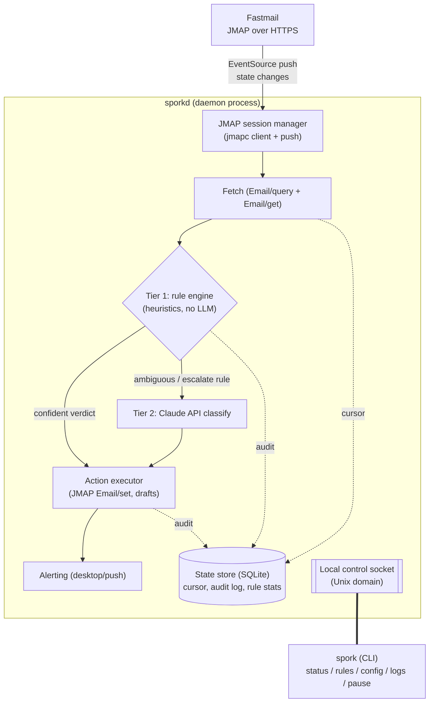
```mermaid
flowchart TD
    fastmail[Fastmail<br/>JMAP over HTTPS]
    fastmail -->|EventSource push<br/>state changes| session

    subgraph sporkd["sporkd (daemon process)"]
        direction TB
        session["JMAP session manager<br/>(jmapc client + push)"]
        fetch["Fetch (Email/query + Email/get)"]
        tier1{"Tier 1: rule engine<br/>(heuristics, no LLM)"}
        tier2["Tier 2: Claude API classify"]
        exec_["Action executor<br/>(JMAP Email/set, drafts)"]
        alert["Alerting (desktop/push)"]
        state[("State store (SQLite)<br/>cursor, audit log, rule stats")]
        socket[["Local control socket<br/>(Unix domain)"]]

        session --> fetch --> tier1
        tier1 -->|confident verdict| exec_
        tier1 -->|"ambiguous / escalate rule"| tier2
        tier2 --> exec_
        exec_ --> alert
        fetch -.->|cursor| state
        exec_ -.->|audit| state
        tier1 -.->|audit| state
    end

    socket === cli["spork (CLI)<br/>status / rules / config / logs / pause"]
```

Two OS processes, one shared library:

- **`sporkd`** — long-running daemon, owns the JMAP connection, the state
  DB, and the rule engine. Started by a systemd user unit at login.
- **`spork`** — short-lived CLI, talks to `sporkd` over a local control
  channel (Unix domain socket) for anything live (status, pause/resume,
  "classify this message now"), and reads/writes config + rules files
  directly for anything that's just editing state on disk.
- **`spork.core`** — shared library: JMAP client wrapper, rule schema,
  Tier 1 evaluator, Claude client wrapper, action executor, state DB
  models. Both executables import it; there is no logic duplicated
  between them.

## 6. Components

### 6.1 Core library (`spork.core`)

Solid boxes are built and tested today; dashed boxes are planned
layout for a milestone that hasn't landed yet (M3's `llm/prompts.py`
— the not-yet-built step that assembles a `VerdictRequest` from a
message —, a future real desktop-notification `Alerter` backend
alongside M4's `alerts/log.py`, and M5's `ipc/` + most of
`cli/commands/`). `config/` is real as of M5's first item — no longer
a dashed box. This is layout orientation only — see §6.4 for what each
built module's classes actually look like.

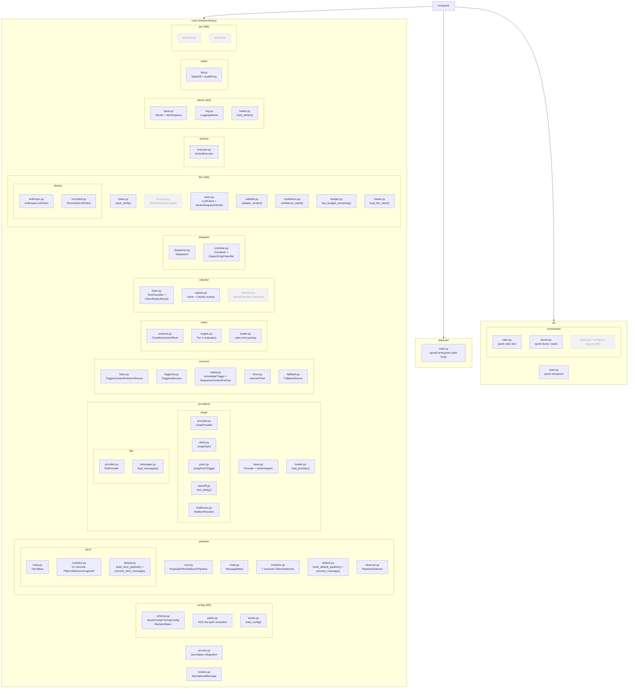
```mermaid
flowchart TD
    src["src/spork/"] --> core & daemon_pkg & cli_pkg

    subgraph core["core/ (shared library)"]
        subgraph config_pkg["config/ (M5)"]
            config_schema["schema.py<br/>SporkConfig/TieringConfig/<br/>BackendSpec"]
            config_paths["paths.py<br/>XDG tier-path resolution"]
            config_loader["loader.py<br/>load_config()"]
        end
        secrets_mod["secrets.py<br/>secretspec integration"]
        models_mod["models.py<br/>NormalizedMessage"]

        subgraph pipeline["pipeline/"]
            pipeline_core["core.py<br/>Payload/Filter/Selector/Pipeline"]
            pipeline_meta["meta.py<br/>MessageMeta"]
            pipeline_modules["modules.py<br/>7 concrete Filters/Selectors"]
            pipeline_default["default.py<br/>build_default_pipeline() +<br/>process_message()"]
            pipeline_observer["observer.py<br/>PipelineObserver"]
            subgraph pipeline_tier2["tier2/"]
                tier2_meta["meta.py<br/>Tier2Meta"]
                tier2_modules["modules.py<br/>13 concrete Filters/Selectors/Augment"]
                tier2_default["default.py<br/>build_tier2_pipeline() +<br/>process_tier2_message()"]
            end
        end

        subgraph providers["providers/"]
            providers_base["base.py<br/>Provider + ActionApplier"]
            providers_loader["loader.py<br/>load_provider()"]
            subgraph jmap["jmap/"]
                jmap_provider["provider.py<br/>JmapProvider"]
                jmap_client["client.py<br/>JmapClient"]
                jmap_push["push.py<br/>JmapPushTrigger"]
                jmap_backoff["backoff.py<br/>next_delay()"]
                jmap_mailboxes["mailboxes.py<br/>MailboxResolver"]
            end
            subgraph file_["file/"]
                file_provider["provider.py<br/>FileProvider"]
                file_messages["messages.py<br/>load_messages()"]
            end
        end

        subgraph sources["sources/"]
            sources_base["base.py<br/>Trigger/ContentFetcher/Source"]
            sources_triggered["triggered.py<br/>TriggeredSource"]
            sources_replay["replay.py<br/>ImmediateTrigger +<br/>SequenceContentFetcher"]
            sources_timer["timer.py<br/>IntervalTimer"]
            sources_fallback["fallback.py<br/>FallbackSource"]
        end

        subgraph rules["rules/"]
            rules_schema["schema.py<br/>Condition/Action/Rule"]
            rules_engine["engine.py<br/>Tier 1 evaluate()"]
            rules_loader["loader.py<br/>rules.toml parsing"]
        end

        subgraph classify["classify/"]
            classify_base["base.py<br/>TextClassifier +<br/>ClassificationResult"]
            classify_registry["registry.py<br/>name -> factory lookup"]
            classify_keyword["keyword.py<br/>default heuristic backend"]:::planned
        end

        subgraph dispatch["dispatch/"]
            dispatch_dispatcher["dispatcher.py<br/>Dispatcher"]
            dispatch_combine["combine.py<br/>Combiner +<br/>DispatchingClassifier"]
        end

        subgraph llm["llm/ (M3)"]
            llm_clean["clean.py<br/>clean_body()"]
            llm_prompts["prompts.py<br/>VerdictRequest builder"]:::planned
            llm_base["base.py<br/>LLMClient +<br/>VerdictRequest/Verdict"]
            llm_validate["validate.py<br/>validate_verdict()"]
            llm_confidence["confidence.py<br/>confidence_band()"]
            llm_budget["budget.py<br/>has_budget_remaining()"]
            llm_loader["loader.py<br/>load_llm_client()"]
            subgraph llm_clients["clients/"]
                llm_anthropic["anthropic.py<br/>AnthropicLLMClient"]
                llm_recorded["recorded.py<br/>RecordedLLMClient"]
            end
        end

        subgraph actions["actions/"]
            actions_executor["executor.py<br/>ActionExecutor"]
        end

        subgraph alerts["alerts/ (M4)"]
            alerts_base["base.py<br/>Alerter + AlertUrgency"]
            alerts_log["log.py<br/>LoggingAlerter"]
            alerts_loader["loader.py<br/>load_alerter()"]
        end

        subgraph state["state/"]
            state_db["db.py<br/>StateDB + AuditEntry"]
        end

        subgraph ipc["ipc/ (M5)"]
            ipc_protocol["protocol.py"]:::planned
            ipc_server["server.py"]:::planned
        end
    end

    subgraph daemon_pkg["daemon/"]
        daemon_main["main.py<br/>sporkd entrypoint (stub loop)"]
    end

    subgraph cli_pkg["cli/"]
        cli_main["main.py<br/>spork entrypoint"]
        subgraph cli_commands["commands/"]
            cli_rules["rules.py<br/>spork rules test"]
            cli_doctor["doctor.py<br/>spork doctor (stub)"]
            cli_status["status.py / config.py / logs.py (M5)"]:::planned
        end
    end

    classDef planned stroke-dasharray: 4 3,opacity:0.65
```

### 6.2 Daemon (`sporkd`)

Single-process, asyncio event loop:

1. Load config + secrets at startup; fail fast with a clear error if
   required secrets are missing (`secretspec check` semantics).
2. Open a JMAP session, resolve mailbox IDs/roles once, cache them.
3. Start the EventSource push listener. On reconnect/backoff, fall back
   to a periodic `Email/query` poll (interval configurable) so the tool
   degrades gracefully instead of going silent.
4. On a push notification (or poll tick): fetch new `Email` objects in
   one batched JMAP call (`Email/query` + `Email/get` via result
   references), skipping IDs already in the state DB.
5. Run each message through the Tier 1 rule engine.
6. If a rule matches with an action, or explicitly resolves to "no
   action", apply it and stop.
7. If a rule marks the message for escalation, or no rule matches and the
   default policy is "escalate unknowns", send it to Tier 2 (Claude).
8. Apply the resulting Verdict via the action executor; anything at or
   above the configured alert threshold also fires an alert.
9. Record an audit entry (message ID, tier reached, verdict, action
   taken, latency, token cost if Tier 2) in the state DB.
10. Serve the local control socket concurrently for CLI requests
    (status, pause, "reclassify message X", "reload rules").

### 6.3 CLI (`spork`)

Talks to the daemon over the Unix socket when the daemon is up; falls
back to "daemon not running" messaging (with the systemd unit name to
start it) rather than silently doing nothing. Config/rules subcommands
that only touch files on disk work even with the daemon stopped, and
push a "reload" request to the daemon if it's running so changes take
effect without a restart.

See §12 for the full command reference.

**CLI framework: [Typer](https://typer.tiangolo.com/).** Chosen over
plain Click for the same reason the rest of this codebase leans on
type hints rather than docstring conventions or manual validation
(docs/TEST_COVERAGE.md, the `Protocol`-based modularity in §9.1/§9.2):
Typer derives each command's arguments/options/help text from type
hints and `typer.Option`/`typer.Argument` annotations, so a command's
signature *is* its CLI contract — no separate argparse/click
boilerplate to keep in sync with it by hand. It's built directly on
Click (so anything Click can do is still reachable if a future command
needs it) and gets `--install-completion` and Rich-formatted help for
free. `spork` is a Typer command **group** (`typer.Typer()` with
`@app.callback()` — subcommands land per §12 as M5 builds them);
`sporkd` is a single-command app (`typer.run(main)`) since the daemon
never has subcommands, just flags.

### 6.4 Module UML diagrams

One `classDiagram` per built module, in §6.1's component-tree order.
Protocols are stereotyped `<<Protocol>>`; a Protocol implementation is
drawn with a realization arrow labeled "structurally satisfies," never
plain inheritance, per this project's Protocol-based DI convention —
nothing here actually subclasses anything it implements. A free
function is drawn as a box stereotyped `<<function>>` so its
dependencies/raises are visible in the same diagram as the classes it
works with; it isn't a claim that the function is a class. A type
referenced from another module (e.g. `Source` inside
`providers.base`'s own diagram) is drawn as an empty box with just its
stereotype — the full definition lives in that other type's own
diagram, not duplicated here. Modules with no classes yet
(`llm/prompts.py`, `ipc/`, most of `cli/commands/`) don't get a
diagram until they have something to diagram, same as the component
tree in §6.1. (This list used to also say `alerts/` and `config.py` —
stale by the time M4 gave `alerts/` real diagrams; `config/` follows
the same "settle the shape at design time" precedent below, before any
of it is actually built.)

#### `spork.core.config`

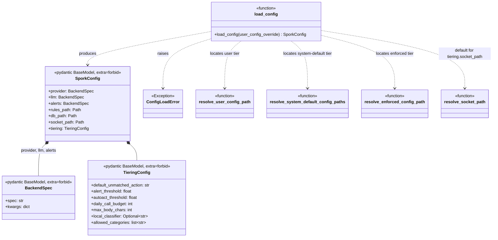
```mermaid
classDiagram
    class BackendSpec {
        <<pydantic BaseModel, extra=forbid>>
        +spec: str
        +kwargs: dict
    }
    class TieringConfig {
        <<pydantic BaseModel, extra=forbid>>
        +default_unmatched_action: str
        +alert_threshold: float
        +autoact_threshold: float
        +daily_call_budget: int
        +max_body_chars: int
        +local_classifier: Optional~str~
        +allowed_categories: list~str~
    }
    class SporkConfig {
        <<pydantic BaseModel, extra=forbid>>
        +provider: BackendSpec
        +llm: BackendSpec
        +alerts: BackendSpec
        +rules_path: Path
        +db_path: Path
        +socket_path: Path
        +tiering: TieringConfig
    }
    class ConfigLoadError { <<Exception>> }

    SporkConfig *-- BackendSpec : provider, llm, alerts
    SporkConfig *-- TieringConfig

    class resolve_user_config_path { <<function>> }
    class resolve_system_default_config_paths { <<function>> }
    class resolve_enforced_config_path { <<function>> }
    class resolve_socket_path { <<function>> }

    class load_config {
        <<function>>
        +load_config(user_config_override) SporkConfig
    }
    load_config ..> resolve_user_config_path : locates user tier
    load_config ..> resolve_system_default_config_paths : locates system-default tier
    load_config ..> resolve_enforced_config_path : locates enforced tier
    load_config ..> resolve_socket_path : default for tiering.socket_path
    load_config ..> SporkConfig : produces
    load_config ..> ConfigLoadError : raises
```

`paths.py` (`resolve_user_config_path`/`resolve_system_default_config_paths`/
`resolve_enforced_config_path`/`resolve_socket_path`) is deliberately
free functions, not methods on `SporkConfig` — pure path-resolution
logic against environment variables, testable in total isolation from
TOML parsing or pydantic validation (§7.2 settles exactly what each
one does). `load_config()` is the only thing that calls all four:
locates each of the three tier files that actually exist, deep-merges
their raw dicts in ascending precedence (system-default, then user,
then enforced — each later merge's keys win), and validates the fully
merged dict against `SporkConfig` once. `ConfigLoadError` wraps every
failure mode (malformed TOML in any tier, a merged dict that fails
`SporkConfig` validation, an unreadable file) — one catchable type per
module boundary, the same convention as `RulesLoadError`/
`ProviderLoadError`/`AlerterLoadError`. Built as M5's first item, real
and 100%-covered — this diagram settled the shape before any of it
was implemented, same as `spork.core.alerts`' had.

#### `spork.core.models`

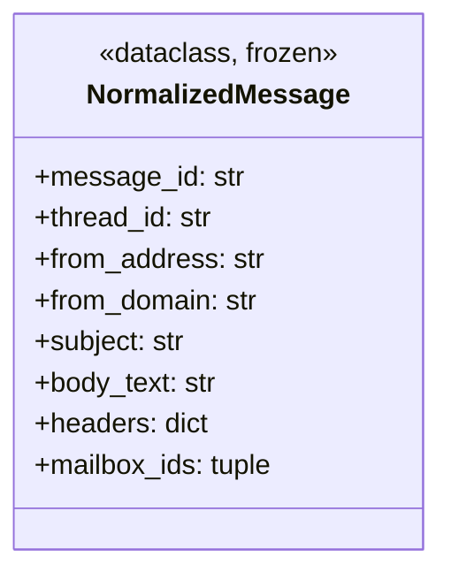
```mermaid
classDiagram
    class NormalizedMessage {
        <<dataclass, frozen>>
        +message_id: str
        +thread_id: str
        +from_address: str
        +from_domain: str
        +subject: str
        +body_text: str
        +headers: dict
        +mailbox_ids: tuple
    }
```

The one type nearly every other module below depends on — consumers
aren't re-drawn on every diagram that just takes a `NormalizedMessage`
parameter, only where it's genuinely part of the module's own shape.

#### `spork.core.providers.base`

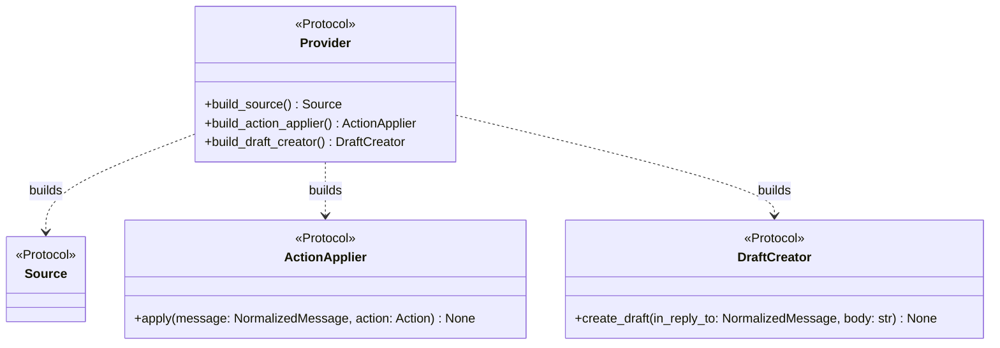
```mermaid
classDiagram
    class ActionApplier {
        <<Protocol>>
        +apply(message: NormalizedMessage, action: Action) None
    }
    class DraftCreator {
        <<Protocol>>
        +create_draft(in_reply_to: NormalizedMessage, body: str) None
    }
    class Provider {
        <<Protocol>>
        +build_source() Source
        +build_action_applier() ActionApplier
        +build_draft_creator() DraftCreator
    }
    class Source { <<Protocol>> }

    Provider ..> Source : builds
    Provider ..> ActionApplier : builds
    Provider ..> DraftCreator : builds
```

`Source` is fully defined in `spork.core.sources`' own diagram below;
`Action` is fully defined in `spork.core.rules`'.

#### `spork.core.providers.loader`

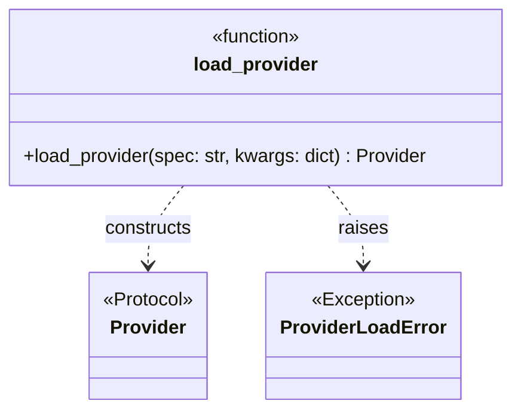
```mermaid
classDiagram
    class ProviderLoadError {
        <<Exception>>
    }
    class load_provider {
        <<function>>
        +load_provider(spec: str, kwargs: dict) Provider
    }
    class Provider { <<Protocol>> }

    load_provider ..> Provider : constructs
    load_provider ..> ProviderLoadError : raises
```

#### `spork.core.providers.jmap`

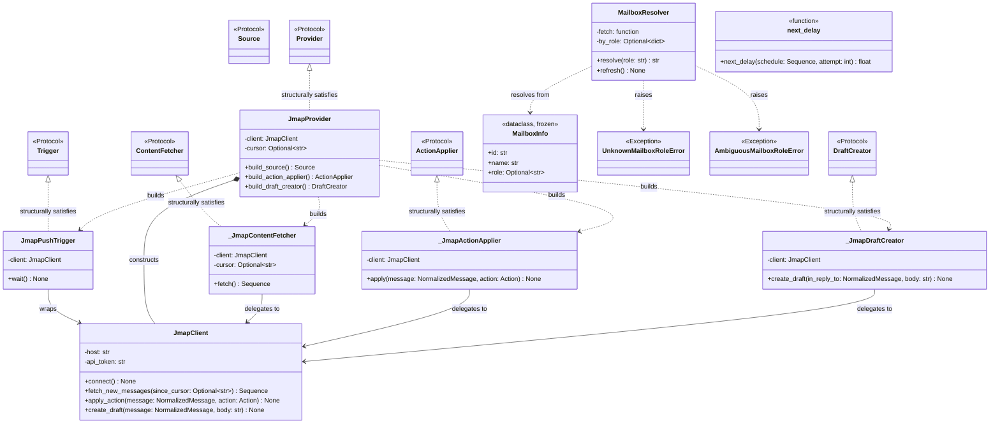
```mermaid
classDiagram
    class Trigger { <<Protocol>> }
    class ContentFetcher { <<Protocol>> }
    class Source { <<Protocol>> }
    class ActionApplier { <<Protocol>> }
    class DraftCreator { <<Protocol>> }
    class Provider { <<Protocol>> }

    class JmapClient {
        -host: str
        -api_token: str
        +connect() None
        +fetch_new_messages(since_cursor: Optional~str~) Sequence
        +apply_action(message: NormalizedMessage, action: Action) None
        +create_draft(message: NormalizedMessage, body: str) None
    }
    class JmapPushTrigger {
        -client: JmapClient
        +wait() None
    }
    class MailboxInfo {
        <<dataclass, frozen>>
        +id: str
        +name: str
        +role: Optional~str~
    }
    class UnknownMailboxRoleError { <<Exception>> }
    class AmbiguousMailboxRoleError { <<Exception>> }
    class MailboxResolver {
        -fetch: function
        -by_role: Optional~dict~
        +resolve(role: str) str
        +refresh() None
    }
    class next_delay {
        <<function>>
        +next_delay(schedule: Sequence, attempt: int) float
    }
    class JmapProvider {
        -client: JmapClient
        -cursor: Optional~str~
        +build_source() Source
        +build_action_applier() ActionApplier
        +build_draft_creator() DraftCreator
    }
    class _JmapContentFetcher {
        -client: JmapClient
        -cursor: Optional~str~
        +fetch() Sequence
    }
    class _JmapActionApplier {
        -client: JmapClient
        +apply(message: NormalizedMessage, action: Action) None
    }
    class _JmapDraftCreator {
        -client: JmapClient
        +create_draft(in_reply_to: NormalizedMessage, body: str) None
    }

    Trigger <|.. JmapPushTrigger : structurally satisfies
    ContentFetcher <|.. _JmapContentFetcher : structurally satisfies
    ActionApplier <|.. _JmapActionApplier : structurally satisfies
    DraftCreator <|.. _JmapDraftCreator : structurally satisfies
    Provider <|.. JmapProvider : structurally satisfies

    JmapPushTrigger --> JmapClient : wraps
    MailboxResolver ..> MailboxInfo : resolves from
    MailboxResolver ..> UnknownMailboxRoleError : raises
    MailboxResolver ..> AmbiguousMailboxRoleError : raises
    JmapProvider *-- JmapClient : constructs
    JmapProvider ..> JmapPushTrigger : builds
    JmapProvider ..> _JmapContentFetcher : builds
    JmapProvider ..> _JmapActionApplier : builds
    JmapProvider ..> _JmapDraftCreator : builds
    _JmapContentFetcher --> JmapClient : delegates to
    _JmapActionApplier --> JmapClient : delegates to
    _JmapDraftCreator --> JmapClient : delegates to
```

`backoff.next_delay()` is a pure function of `(schedule, attempt)`
with no dependency on the other classes here — drawn standalone
rather than wired into the rest, matching the code (`JmapPushTrigger`
doesn't call it yet; the daemon's future reconnect loop will).

#### `spork.core.providers.file`

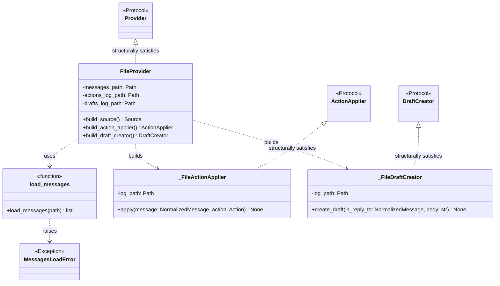
```mermaid
classDiagram
    class Provider { <<Protocol>> }
    class ActionApplier { <<Protocol>> }
    class DraftCreator { <<Protocol>> }
    class MessagesLoadError { <<Exception>> }
    class load_messages {
        <<function>>
        +load_messages(path) list
    }
    class _FileActionApplier {
        -log_path: Path
        +apply(message: NormalizedMessage, action: Action) None
    }
    class _FileDraftCreator {
        -log_path: Path
        +create_draft(in_reply_to: NormalizedMessage, body: str) None
    }
    class FileProvider {
        -messages_path: Path
        -actions_log_path: Path
        -drafts_log_path: Path
        +build_source() Source
        +build_action_applier() ActionApplier
        +build_draft_creator() DraftCreator
    }

    Provider <|.. FileProvider : structurally satisfies
    ActionApplier <|.. _FileActionApplier : structurally satisfies
    DraftCreator <|.. _FileDraftCreator : structurally satisfies
    load_messages ..> MessagesLoadError : raises
    FileProvider ..> load_messages : uses
    FileProvider ..> _FileActionApplier : builds
    FileProvider ..> _FileDraftCreator : builds
```

#### `spork.core.sources`

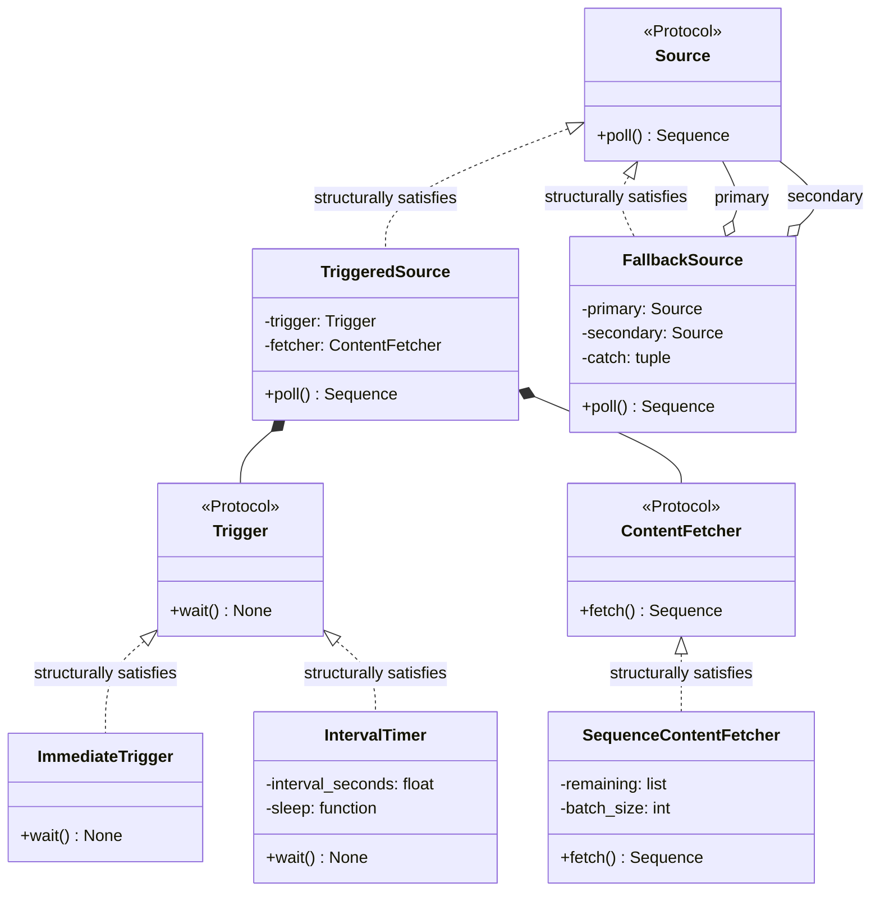
```mermaid
classDiagram
    class Trigger {
        <<Protocol>>
        +wait() None
    }
    class ContentFetcher {
        <<Protocol>>
        +fetch() Sequence
    }
    class Source {
        <<Protocol>>
        +poll() Sequence
    }
    class TriggeredSource {
        -trigger: Trigger
        -fetcher: ContentFetcher
        +poll() Sequence
    }
    class ImmediateTrigger {
        +wait() None
    }
    class SequenceContentFetcher {
        -remaining: list
        -batch_size: int
        +fetch() Sequence
    }
    class IntervalTimer {
        -interval_seconds: float
        -sleep: function
        +wait() None
    }
    class FallbackSource {
        -primary: Source
        -secondary: Source
        -catch: tuple
        +poll() Sequence
    }

    Source <|.. TriggeredSource : structurally satisfies
    Source <|.. FallbackSource : structurally satisfies
    Trigger <|.. ImmediateTrigger : structurally satisfies
    Trigger <|.. IntervalTimer : structurally satisfies
    ContentFetcher <|.. SequenceContentFetcher : structurally satisfies
    TriggeredSource *-- Trigger
    TriggeredSource *-- ContentFetcher
    FallbackSource o-- Source : primary
    FallbackSource o-- Source : secondary
```

#### `spork.core.rules`

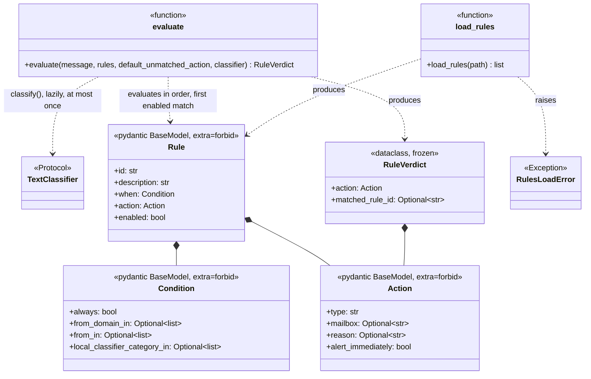
```mermaid
classDiagram
    class TextClassifier { <<Protocol>> }
    class Condition {
        <<pydantic BaseModel, extra=forbid>>
        +always: bool
        +from_domain_in: Optional~list~
        +from_in: Optional~list~
        +local_classifier_category_in: Optional~list~
    }
    class Action {
        <<pydantic BaseModel, extra=forbid>>
        +type: str
        +mailbox: Optional~str~
        +reason: Optional~str~
        +alert_immediately: bool
    }
    class Rule {
        <<pydantic BaseModel, extra=forbid>>
        +id: str
        +description: str
        +when: Condition
        +action: Action
        +enabled: bool
    }
    class RuleVerdict {
        <<dataclass, frozen>>
        +action: Action
        +matched_rule_id: Optional~str~
    }
    class evaluate {
        <<function>>
        +evaluate(message, rules, default_unmatched_action, classifier) RuleVerdict
    }
    class RulesLoadError { <<Exception>> }
    class load_rules {
        <<function>>
        +load_rules(path) list
    }

    Rule *-- Condition
    Rule *-- Action
    RuleVerdict *-- Action
    evaluate ..> Rule : evaluates in order, first enabled match
    evaluate ..> RuleVerdict : produces
    evaluate ..> TextClassifier : classify(), lazily, at most once
    load_rules ..> Rule : produces
    load_rules ..> RulesLoadError : raises
```

#### `spork.core.classify`

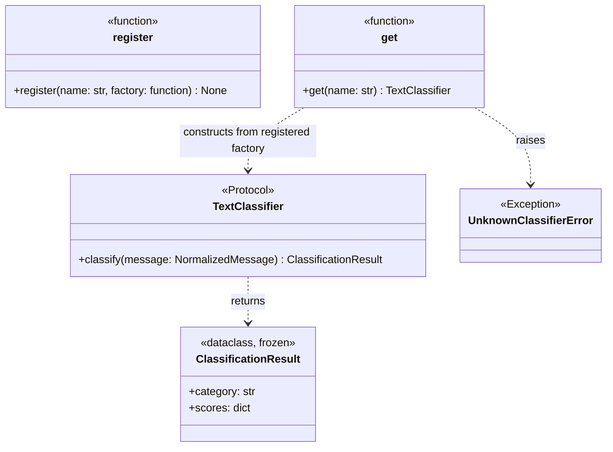
```mermaid
classDiagram
    class ClassificationResult {
        <<dataclass, frozen>>
        +category: str
        +scores: dict
    }
    class TextClassifier {
        <<Protocol>>
        +classify(message: NormalizedMessage) ClassificationResult
    }
    class UnknownClassifierError { <<Exception>> }
    class register {
        <<function>>
        +register(name: str, factory: function) None
    }
    class get {
        <<function>>
        +get(name: str) TextClassifier
    }

    TextClassifier ..> ClassificationResult : returns
    get ..> TextClassifier : constructs from registered factory
    get ..> UnknownClassifierError : raises
```

#### `spork.core.dispatch`

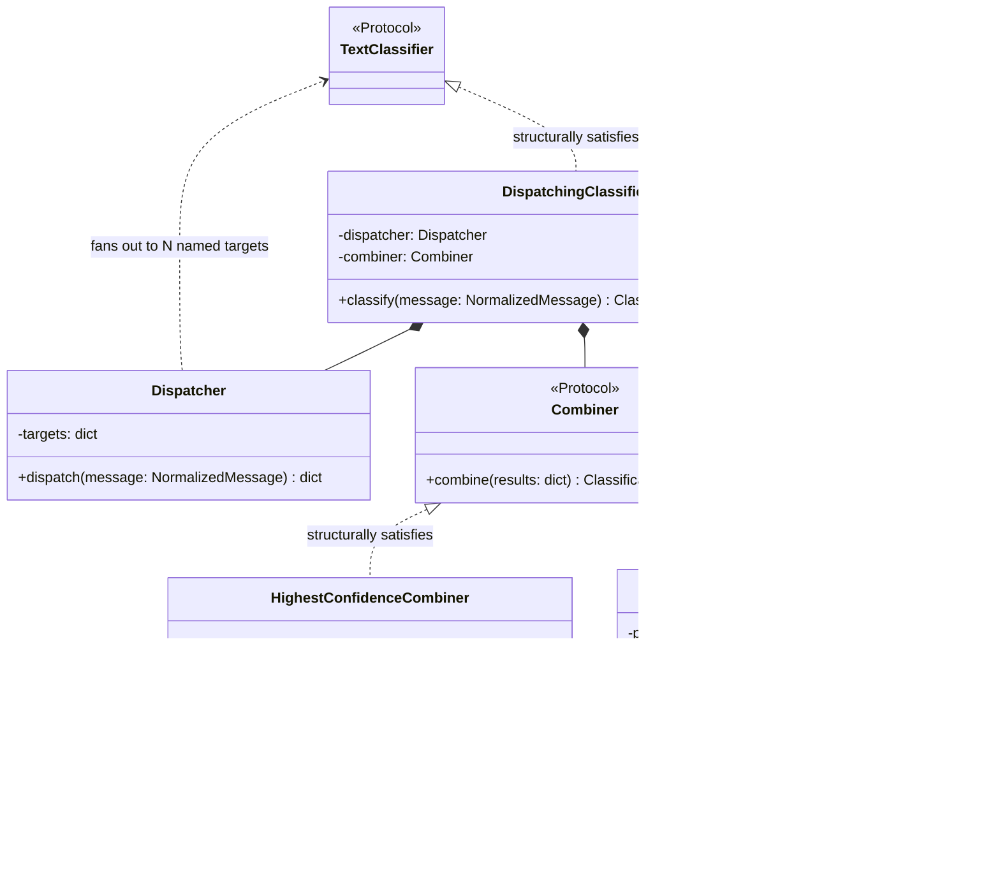
```mermaid
classDiagram
    class TextClassifier { <<Protocol>> }
    class Dispatcher {
        -targets: dict
        +dispatch(message: NormalizedMessage) dict
    }
    class Combiner {
        <<Protocol>>
        +combine(results: dict) ClassificationResult
    }
    class CombineError { <<Exception>> }
    class PrimaryCombiner {
        -primary_name: str
        +combine(results: dict) ClassificationResult
    }
    class HighestConfidenceCombiner {
        +combine(results: dict) ClassificationResult
    }
    class DispatchingClassifier {
        -dispatcher: Dispatcher
        -combiner: Combiner
        +classify(message: NormalizedMessage) ClassificationResult
    }

    Combiner <|.. PrimaryCombiner : structurally satisfies
    Combiner <|.. HighestConfidenceCombiner : structurally satisfies
    TextClassifier <|.. DispatchingClassifier : structurally satisfies
    DispatchingClassifier *-- Dispatcher
    DispatchingClassifier *-- Combiner
    Dispatcher ..> TextClassifier : fans out to N named targets
    PrimaryCombiner ..> CombineError : raises
    HighestConfidenceCombiner ..> CombineError : raises
```

#### `spork.core.llm.base`

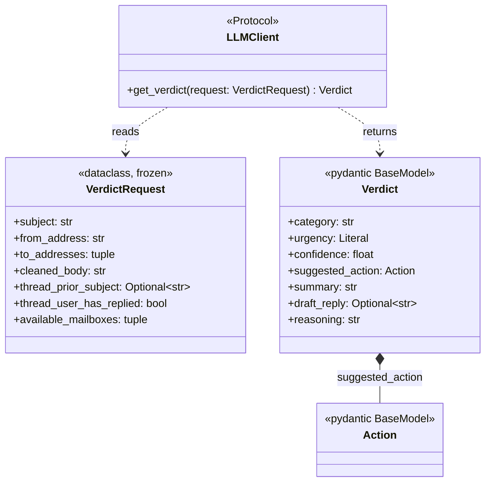
```mermaid
classDiagram
    class Action { <<pydantic BaseModel>> }
    class VerdictRequest {
        <<dataclass, frozen>>
        +subject: str
        +from_address: str
        +to_addresses: tuple
        +cleaned_body: str
        +thread_prior_subject: Optional~str~
        +thread_user_has_replied: bool
        +available_mailboxes: tuple
    }
    class Verdict {
        <<pydantic BaseModel>>
        +category: str
        +urgency: Literal
        +confidence: float
        +suggested_action: Action
        +summary: str
        +draft_reply: Optional~str~
        +reasoning: str
    }
    class LLMClient {
        <<Protocol>>
        +get_verdict(request: VerdictRequest) Verdict
    }

    Verdict *-- Action : suggested_action
    LLMClient ..> VerdictRequest : reads
    LLMClient ..> Verdict : returns
```

`Action` is fully defined in `spork.core.rules`'s own diagram — reused
here, not redefined, so a Tier 2 verdict and a Tier 1 rule produce the
exact same terminal-action shape.

#### `spork.core.llm.validate`

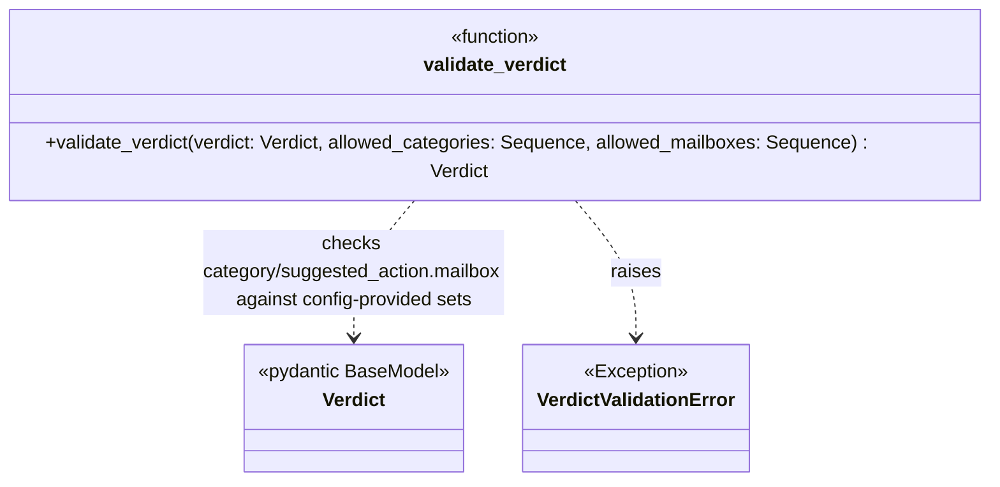
```mermaid
classDiagram
    class Verdict { <<pydantic BaseModel>> }
    class VerdictValidationError { <<Exception>> }
    class validate_verdict {
        <<function>>
        +validate_verdict(verdict: Verdict, allowed_categories: Sequence, allowed_mailboxes: Sequence) Verdict
    }

    validate_verdict ..> Verdict : checks category/suggested_action.mailbox against config-provided sets
    validate_verdict ..> VerdictValidationError : raises
```

#### `spork.core.llm.confidence`

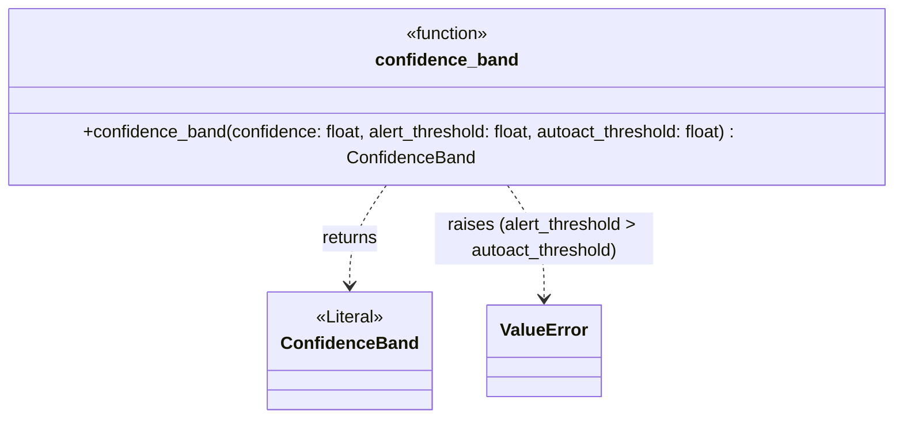
```mermaid
classDiagram
    class ConfidenceBand { <<Literal>> }
    class confidence_band {
        <<function>>
        +confidence_band(confidence: float, alert_threshold: float, autoact_threshold: float) ConfidenceBand
    }

    confidence_band ..> ConfidenceBand : returns
    confidence_band ..> ValueError : raises (alert_threshold > autoact_threshold)
```

#### `spork.core.llm.budget`

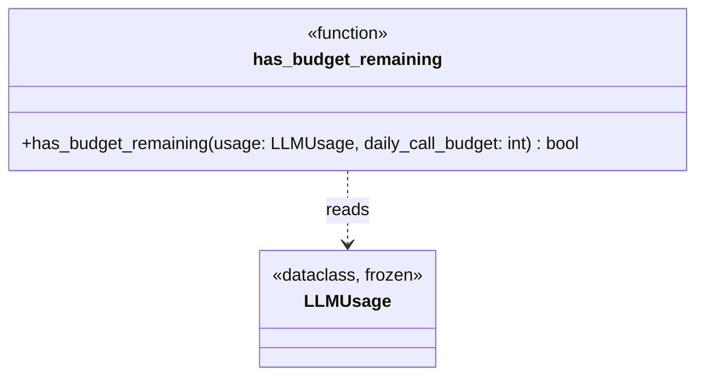
```mermaid
classDiagram
    class LLMUsage { <<dataclass, frozen>> }
    class has_budget_remaining {
        <<function>>
        +has_budget_remaining(usage: LLMUsage, daily_call_budget: int) bool
    }

    has_budget_remaining ..> LLMUsage : reads
```

`LLMUsage` is fully defined in `spork.core.state`'s own diagram below
— `StateDB.get_llm_usage()` produces it, this module only consumes it.

#### `spork.core.llm.loader`

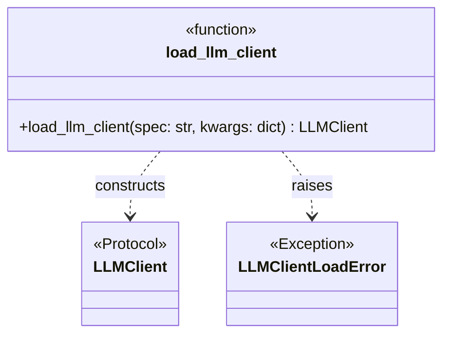
```mermaid
classDiagram
    class LLMClientLoadError { <<Exception>> }
    class load_llm_client {
        <<function>>
        +load_llm_client(spec: str, kwargs: dict) LLMClient
    }
    class LLMClient { <<Protocol>> }

    load_llm_client ..> LLMClient : constructs
    load_llm_client ..> LLMClientLoadError : raises
```

#### `spork.core.llm.clients.anthropic`

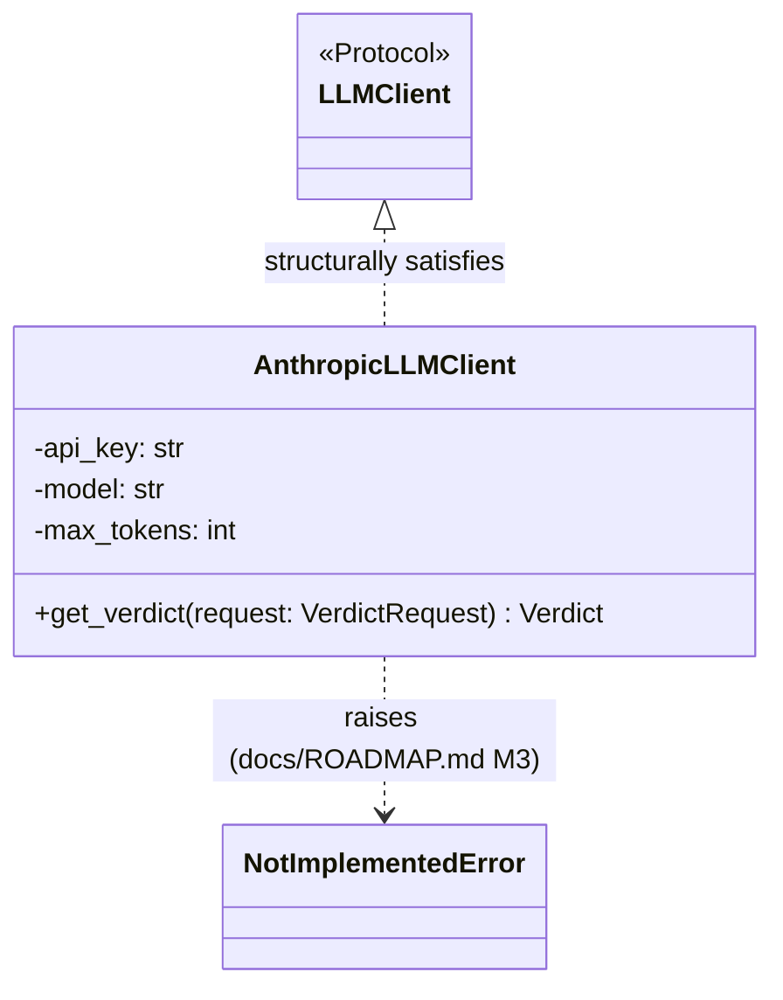
```mermaid
classDiagram
    class LLMClient { <<Protocol>> }
    class AnthropicLLMClient {
        -api_key: str
        -model: str
        -max_tokens: int
        +get_verdict(request: VerdictRequest) Verdict
    }

    LLMClient <|.. AnthropicLLMClient : structurally satisfies
    AnthropicLLMClient ..> NotImplementedError : raises (docs/ROADMAP.md M3)
```

`get_verdict()` requires a live Anthropic API call — same
settled-shape-stub reasoning as `JmapClient` (§9.3): constructor args
and the method signature are real, the call itself isn't yet.

#### `spork.core.llm.clients.recorded`

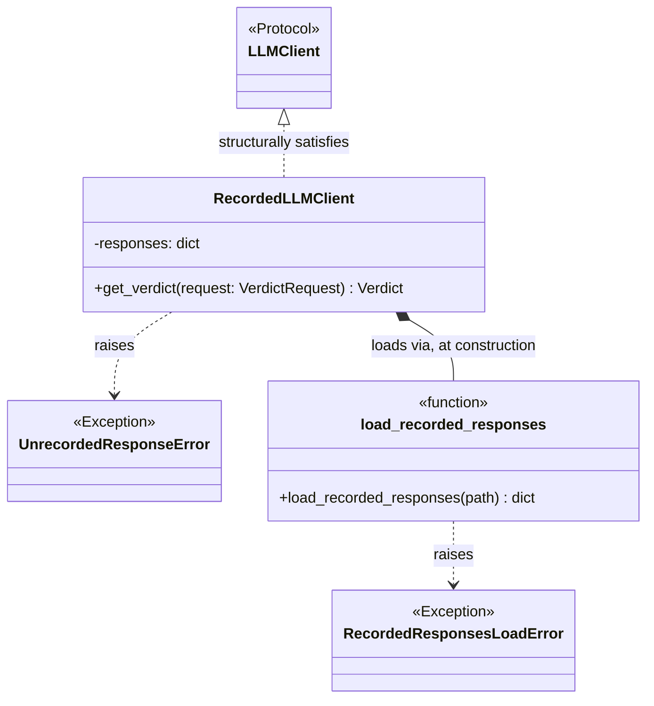
```mermaid
classDiagram
    class LLMClient { <<Protocol>> }
    class RecordedResponsesLoadError { <<Exception>> }
    class UnrecordedResponseError { <<Exception>> }
    class load_recorded_responses {
        <<function>>
        +load_recorded_responses(path) dict
    }
    class RecordedLLMClient {
        -responses: dict
        +get_verdict(request: VerdictRequest) Verdict
    }

    LLMClient <|.. RecordedLLMClient : structurally satisfies
    RecordedLLMClient *-- load_recorded_responses : loads via, at construction
    load_recorded_responses ..> RecordedResponsesLoadError : raises
    RecordedLLMClient ..> UnrecordedResponseError : raises
```

The `LLMClient` equivalent of `FileProvider` (§9.3) — a second, fully
real adapter with no `NotImplementedError` anywhere, for CI/offline use
(§10.5), never a stand-in for a live verdict in production.

#### `spork.core.actions`

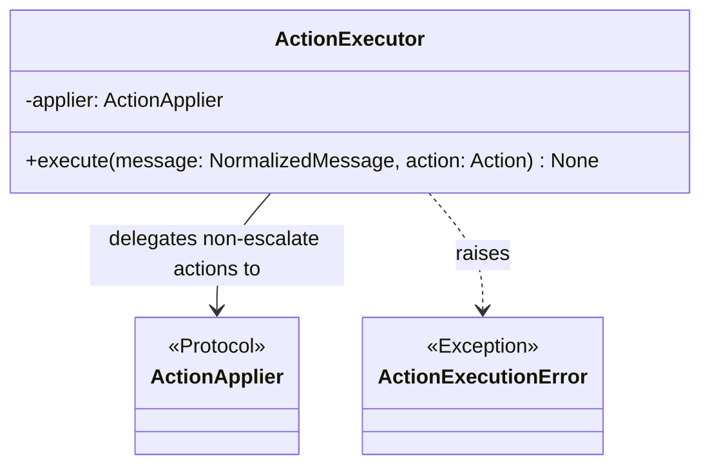
```mermaid
classDiagram
    class ActionApplier { <<Protocol>> }
    class ActionExecutionError { <<Exception>> }
    class ActionExecutor {
        -applier: ActionApplier
        +execute(message: NormalizedMessage, action: Action) None
    }

    ActionExecutor --> ActionApplier : delegates non-escalate actions to
    ActionExecutor ..> ActionExecutionError : raises
```

#### `spork.core.alerts.base`

```mermaid
classDiagram
    class AlertUrgency { <<Literal>> }
    class Alerter {
        <<Protocol>>
        +notify(title: str, body: str, url: Optional~str~, urgency: AlertUrgency) None
    }

    Alerter ..> AlertUrgency : urgency parameter
```

#### `spork.core.alerts.log`

```mermaid
classDiagram
    class Alerter { <<Protocol>> }
    class LoggingAlerter {
        +notify(title: str, body: str, url: Optional~str~, urgency: AlertUrgency) None
    }

    Alerter <|.. LoggingAlerter : structurally satisfies
```

The v1 backend: logs each alert via `logging.getLogger(__name__)`
rather than showing a GUI popup — a real, inspectable delivery
channel, not a stub. Never configures handlers itself (Python logging
best practice — that's the application's job, `docs/ROADMAP.md` M7).

#### `spork.core.alerts.loader`

```mermaid
classDiagram
    class AlerterLoadError { <<Exception>> }
    class load_alerter {
        <<function>>
        +load_alerter(spec: str, kwargs: dict) Alerter
    }
    class Alerter { <<Protocol>> }

    load_alerter ..> Alerter : constructs
    load_alerter ..> AlerterLoadError : raises
```

#### `spork.core.state`

```mermaid
classDiagram
    class AuditEntry {
        <<dataclass, frozen>>
        +id: int
        +ts: str
        +jmap_id: str
        +event: str
        +detail_json: Optional~str~
    }
    class LLMUsage {
        <<dataclass, frozen>>
        +date: str
        +calls: int
        +tokens_in: int
        +tokens_out: int
    }
    class StateDB {
        -conn: Connection
        +get_cursor(account_id: str) Optional~str~
        +set_cursor(account_id: str, state: str) None
        +has_processed(jmap_id: str) bool
        +mark_processed(jmap_id: str, ...) None
        +write_audit_entry(...) None
        +get_audit_entries(jmap_id: Optional~str~) list
        +record_llm_call(date: str, tokens_in: int, tokens_out: int) None
        +get_llm_usage(date: str) LLMUsage
        +close() None
    }

    StateDB ..> AuditEntry : returns from get_audit_entries()
    StateDB ..> LLMUsage : returns from get_llm_usage()
```

#### `spork.core.pipeline`

Four diagrams: the generic framework (`core.py`); `observer.py`'s
`PipelineObserver` (§12.2, shared by both concrete pipelines below);
then the concrete Tier 1 pipeline (`meta.py`/`modules.py`/`default.py`,
§9.4); then Tier 2's (`tier2/`, §10.7).

```mermaid
classDiagram
    class Payload~M~ {
        <<dataclass, frozen>>
        +text: str
        +meta: M
    }
    class Filter~M~ {
        <<Protocol>>
        +apply(payload: Payload~M~) Payload~M~
    }
    class Augment~M~ {
        <<Protocol>>
        +augment(payload: Payload~M~) Payload~M~
    }
    class Selector~M~ {
        <<Protocol>>
        +select(payload: Payload~M~) tuple
    }
    class UnknownBranchError { <<Exception>> }
    class Pipeline~M~ {
        -stages: list
        -selector: Optional~Selector~
        -routes: dict
        +run(payload: Payload~M~) Payload~M~
    }

    Pipeline --> Filter : runs each in order (via .apply)
    Pipeline --> Augment : runs each in order (via .augment)
    Pipeline --> Selector : follows its chosen branch
    Pipeline --> Pipeline : a route value is itself a Pipeline
    Pipeline ..> UnknownBranchError : raises
```

`core.py` knows nothing about messages, rules, or the state DB —
`Payload`/`Filter`/`Selector`/`Augment`/`Pipeline` are generic over a
metadata type `M`, provably reusable for a differently-shaped
pipeline, not just this one. `Filter` and `Selector` are conventionally
pure (no I/O); `Augment` is the type for a stage that reaches outside
the payload it was given (a database search, a contact lookup) —
`Pipeline.run` tells them apart by `isinstance`, dispatching to
`.augment()` or `.apply()` accordingly.

```mermaid
classDiagram
    class Alerter { <<Protocol>> }
    class PipelineObserver {
        -alerter: Alerter
        -logger: Logger
        +trace(correlation_id, event, fields) None
        +alert(correlation_id, title, body, url, urgency) None
    }

    PipelineObserver --> Alerter : delegates to, from alert()
```

`PipelineObserver` bundles §12.2's "combine logging and alerting"
decision into one injectable object — every alert-firing pipeline
module below takes one via constructor DI, same as `state_db`.
`trace()` always logs (a `logging.LoggerAdapter`-style correlation-ID
injection); `alert()` does that and delegates to `Alerter.notify()`
(§12.1) — `Alerter` itself is unchanged, `PipelineObserver` composes
it rather than replacing it.

```mermaid
classDiagram
    class Filter { <<Protocol>> }
    class Selector { <<Protocol>> }
    class ActionExecutor
    class StateDB
    class PipelineObserver
    class evaluate { <<function>> }

    class MessageMeta {
        <<dataclass, frozen>>
        +message: NormalizedMessage
        +rules: Sequence~Rule~
        +default_unmatched_action: Action
        +classifier: Optional~TextClassifier~
        +verdict: Optional~RuleVerdict~
        +ts: Optional~str~
        +correlation_id: Optional~str~
        +audit_event: Optional~str~
        +audit_detail_json: Optional~str~
    }
    class MissingMetaError { <<Exception>> }

    class IdempotencyGateSelector {
        -state_db: StateDB
        +select(payload) tuple
    }
    class TimestampFilter {
        -now: function
        +apply(payload) Payload
    }
    class CorrelationIdFilter {
        -new_id: function
        +apply(payload) Payload
    }
    class RuleEvaluationSelector {
        +select(payload) tuple
    }
    class ApplyActionFilter {
        -executor: ActionExecutor
        +apply(payload) Payload
    }
    class RecordEscalationFilter {
        -ops: PipelineObserver
        +apply(payload) Payload
    }
    class WriteAuditEntryFilter {
        -state_db: StateDB
        +apply(payload) Payload
    }
    class MarkProcessedFilter {
        -state_db: StateDB
        +apply(payload) Payload
    }

    Selector <|.. IdempotencyGateSelector : structurally satisfies
    Filter <|.. TimestampFilter : structurally satisfies
    Filter <|.. CorrelationIdFilter : structurally satisfies
    Selector <|.. RuleEvaluationSelector : structurally satisfies
    Filter <|.. ApplyActionFilter : structurally satisfies
    Filter <|.. RecordEscalationFilter : structurally satisfies
    Filter <|.. WriteAuditEntryFilter : structurally satisfies
    Filter <|.. MarkProcessedFilter : structurally satisfies

    ApplyActionFilter ..> MissingMetaError : raises
    WriteAuditEntryFilter ..> MissingMetaError : raises
    MarkProcessedFilter ..> MissingMetaError : raises

    RuleEvaluationSelector ..> evaluate : Tier 1 evaluation
    ApplyActionFilter --> ActionExecutor : delegates non-escalate actions to
    RecordEscalationFilter --> PipelineObserver : alerts when action.alert_immediately
    IdempotencyGateSelector --> StateDB
    WriteAuditEntryFilter --> StateDB
    MarkProcessedFilter --> StateDB

    class build_default_pipeline {
        <<function>>
        +build_default_pipeline(executor, state_db, ops, now, new_correlation_id) Pipeline
    }
    class process_message {
        <<function>>
        +process_message(message, rules, default_unmatched_action, executor, state_db, ops, classifier, now, new_correlation_id) Optional~RuleVerdict~
    }
    build_default_pipeline ..> IdempotencyGateSelector : composes
    build_default_pipeline ..> TimestampFilter : composes
    build_default_pipeline ..> CorrelationIdFilter : composes
    build_default_pipeline ..> RuleEvaluationSelector : composes
    build_default_pipeline ..> ApplyActionFilter : composes
    build_default_pipeline ..> RecordEscalationFilter : composes
    build_default_pipeline ..> WriteAuditEntryFilter : composes
    build_default_pipeline ..> MarkProcessedFilter : composes
    process_message ..> build_default_pipeline : builds, then runs
```

The orchestrator §9 describes in prose — ties idempotency, evaluation,
action execution, and audit logging into the one call a real message
goes through, now composed from these seven modules instead of one
function body. `ActionExecutor`/`StateDB`/`evaluate` are fully defined
in their own diagrams above.

A third diagram: `spork.core.pipeline.tier2` (§10.7), the Tier 2
sibling to the diagram above — reuses the same generic framework and
`MissingMetaError`, but its own `Tier2Meta` and 13 concrete modules,
never M2's.

```mermaid
classDiagram
    class Filter { <<Protocol>> }
    class Selector { <<Protocol>> }
    class Augment { <<Protocol>> }
    class MissingMetaError { <<Exception>> }
    class LLMClient { <<Protocol>> }
    class DraftCreator { <<Protocol>> }
    class ActionExecutor
    class StateDB
    class PipelineObserver
    class clean_body { <<function>> }
    class validate_verdict { <<function>> }
    class confidence_band { <<function>> }
    class has_budget_remaining { <<function>> }

    class Tier2Meta {
        <<dataclass, frozen>>
        +message: NormalizedMessage
        +to_addresses: Sequence~str~
        +thread_prior_subject: Optional~str~
        +thread_user_has_replied: bool
        +available_mailboxes: Sequence~str~
        +ts: Optional~str~
        +correlation_id: Optional~str~
        +request: Optional~VerdictRequest~
        +verdict: Optional~Verdict~
        +band: Optional~ConfidenceBand~
        +audit_event: Optional~str~
        +audit_detail_json: Optional~str~
    }

    class TimestampFilter {
        -now: function
        +apply(payload) Payload
    }
    class CorrelationIdFilter {
        -new_id: function
        +apply(payload) Payload
    }
    class BudgetGateSelector {
        -state_db: StateDB
        -daily_call_budget: int
        +select(payload) tuple
    }
    class BuildVerdictRequestFilter {
        -max_body_chars: int
        +apply(payload) Payload
    }
    class CallLLMAugment {
        -llm_client: LLMClient
        +augment(payload) Payload
    }
    class RecordLLMUsageFilter {
        -state_db: StateDB
        +apply(payload) Payload
    }
    class ValidateVerdictFilter {
        -allowed_categories: Sequence~str~
        +apply(payload) Payload
    }
    class ConfidenceBandSelector {
        -alert_threshold: float
        -autoact_threshold: float
        +select(payload) tuple
    }
    class ApplyVerdictActionFilter {
        -executor: ActionExecutor
        -ops: PipelineObserver
        +apply(payload) Payload
    }
    class RecordAlertOnlyFilter {
        -ops: PipelineObserver
        +apply(payload) Payload
    }
    class RecordBudgetExhaustedFilter {
        -ops: PipelineObserver
        +apply(payload) Payload
    }
    class CreateDraftIfWantedFilter {
        -draft_creator: DraftCreator
        +apply(payload) Payload
    }
    class WriteAuditEntryFilter {
        -state_db: StateDB
        +apply(payload) Payload
    }
    class MarkProcessedFilter {
        -state_db: StateDB
        +apply(payload) Payload
    }

    Filter <|.. TimestampFilter : structurally satisfies
    Filter <|.. CorrelationIdFilter : structurally satisfies
    Selector <|.. BudgetGateSelector : structurally satisfies
    Filter <|.. BuildVerdictRequestFilter : structurally satisfies
    Augment <|.. CallLLMAugment : structurally satisfies
    Filter <|.. RecordLLMUsageFilter : structurally satisfies
    Filter <|.. ValidateVerdictFilter : structurally satisfies
    Selector <|.. ConfidenceBandSelector : structurally satisfies
    Filter <|.. ApplyVerdictActionFilter : structurally satisfies
    Filter <|.. RecordAlertOnlyFilter : structurally satisfies
    Filter <|.. RecordBudgetExhaustedFilter : structurally satisfies
    Filter <|.. CreateDraftIfWantedFilter : structurally satisfies
    Filter <|.. WriteAuditEntryFilter : structurally satisfies
    Filter <|.. MarkProcessedFilter : structurally satisfies

    BuildVerdictRequestFilter ..> MissingMetaError : raises
    CallLLMAugment ..> MissingMetaError : raises
    RecordLLMUsageFilter ..> MissingMetaError : raises
    ValidateVerdictFilter ..> MissingMetaError : raises
    ConfidenceBandSelector ..> MissingMetaError : raises
    ApplyVerdictActionFilter ..> MissingMetaError : raises
    CreateDraftIfWantedFilter ..> MissingMetaError : raises
    WriteAuditEntryFilter ..> MissingMetaError : raises
    MarkProcessedFilter ..> MissingMetaError : raises

    BuildVerdictRequestFilter ..> clean_body : cleans body via
    CallLLMAugment --> LLMClient : the one I/O stage — external API seam
    ValidateVerdictFilter ..> validate_verdict : Tier 2 verdict validation
    ConfidenceBandSelector ..> confidence_band : Tier 2 confidence gating
    BudgetGateSelector ..> has_budget_remaining : Tier 2 budget check
    ApplyVerdictActionFilter --> ActionExecutor : applies suggested_action via
    ApplyVerdictActionFilter --> PipelineObserver : alerts when band==autoact_alert or urgency==high
    RecordAlertOnlyFilter --> PipelineObserver : always alerts
    RecordBudgetExhaustedFilter --> PipelineObserver : always alerts
    CreateDraftIfWantedFilter --> DraftCreator : creates via, when draft_reply set
    BudgetGateSelector --> StateDB
    RecordLLMUsageFilter --> StateDB
    WriteAuditEntryFilter --> StateDB
    MarkProcessedFilter --> StateDB

    class build_tier2_pipeline {
        <<function>>
        +build_tier2_pipeline(llm_client, executor, draft_creator, state_db, ops, allowed_categories, daily_call_budget, alert_threshold, autoact_threshold, max_body_chars, now, new_correlation_id) Pipeline
    }
    class process_tier2_message {
        <<function>>
        +process_tier2_message(message, to_addresses, ..., ops, ..., now, new_correlation_id) Optional~Verdict~
    }
    build_tier2_pipeline ..> TimestampFilter : composes
    build_tier2_pipeline ..> CorrelationIdFilter : composes
    build_tier2_pipeline ..> BudgetGateSelector : composes
    build_tier2_pipeline ..> BuildVerdictRequestFilter : composes
    build_tier2_pipeline ..> CallLLMAugment : composes
    build_tier2_pipeline ..> RecordLLMUsageFilter : composes
    build_tier2_pipeline ..> ValidateVerdictFilter : composes
    build_tier2_pipeline ..> ConfidenceBandSelector : composes
    build_tier2_pipeline ..> ApplyVerdictActionFilter : composes
    build_tier2_pipeline ..> RecordAlertOnlyFilter : composes
    build_tier2_pipeline ..> RecordBudgetExhaustedFilter : composes
    build_tier2_pipeline ..> CreateDraftIfWantedFilter : composes
    build_tier2_pipeline ..> WriteAuditEntryFilter : composes
    build_tier2_pipeline ..> MarkProcessedFilter : composes
    process_tier2_message ..> build_tier2_pipeline : builds, then runs
```

`"autoact"`/`"autoact_alert"` route to the same `act` `Pipeline`
instance (not drawn as two separate branches above — see §10.7's
prose for why one object under two route keys is the accurate
picture, not a diagramming simplification).

#### `spork.core.secrets`

```mermaid
classDiagram
    class SecretsError { <<Exception>> }
    class Secrets {
        <<dataclass, frozen>>
        -values: dict
        +get(name: str) str
    }
    class resolve_secrets {
        <<function>>
        +resolve_secrets(path, reason, provider, profile) Secrets
    }

    resolve_secrets ..> Secrets : produces
    resolve_secrets ..> SecretsError : raises
    Secrets ..> SecretsError : raises, on an unresolved get()
```

#### `spork.cli`

```mermaid
classDiagram
    class RulesLoadError { <<Exception>> }
    class load_rules { <<function>> }

    class app {
        <<Typer App>>
        spork
    }
    class rules_app {
        <<Typer App>>
        rules
    }
    class test {
        <<Typer command>>
        +test(rules_file: Path) None
    }
    class doctor {
        <<Typer command>>
        +doctor() None
    }

    app --> rules_app : add_typer("rules")
    app --> doctor : command("doctor")
    rules_app --> test : command("test")
    test ..> load_rules : loads/validates rules.toml
    test ..> RulesLoadError : catches, clean CLI error
    doctor ..> NotImplementedError : catches JMAP-connectivity stub, clean CLI error
```

#### `spork.daemon`

```mermaid
classDiagram
    class main {
        <<Typer command>>
        +main(version: bool) None
    }
    class run {
        <<function>>
        +run() None
    }

    run --> main : typer.run(main)
```

Still just the `--version`/`--help` handling plus a settled-shape
`NotImplementedError` for the real event loop (docs/ROADMAP.md M1) —
this diagram will grow substantially once the daemon actually wires
`spork.core`'s pieces together.

## 7. Data & configuration

### 7.1 Project layout (UV-managed)

Dashed boxes are planned, not built yet (`systemd/` lands with M6).

```mermaid
flowchart TD
    root["friendly-octo-spork/"] --> pyproject["pyproject.toml<br/>[project.scripts] sporkd + spork"]
    root --> uvlock["uv.lock"]
    root --> secretspec["secretspec.toml<br/>declared secrets, §7.3"]
    root --> claudemd["CLAUDE.md<br/>agent guidance"]
    root --> src["src/spork/...<br/>see §6.1"]
    root --> systemd["systemd/<br/>sporkd.service (M6)"]:::planned
    root --> tests["tests/<br/>mirrors src/spork/ 1:1"]
    root --> docs["docs/"]
    root --> readme["README.md"]

    docs --> design["DESIGN.md"]
    docs --> roadmap["ROADMAP.md"]
    docs --> coverage["TEST_COVERAGE.md"]

    classDef planned stroke-dasharray: 4 3,opacity:0.65
```

`uv sync` sets up the dev environment; `uv run sporkd` / `uv run spork`
during development. Packaged entry points (`sporkd`, `spork`) are what
the systemd unit and an installed `uv tool install` invoke.

### 7.2 App config (`config.toml`)

Three tiers, following real UNIX/XDG convention rather than an
invented scheme — settled by checking the [XDG Base Directory
Specification v0.8](https://specifications.freedesktop.org/basedir/latest/)
and comparable tools (`git`'s system/global scopes, Chromium/Firefox
managed policy) before designing this, not guessed:

| Tier | Path | Precedence | Who edits it |
|---|---|---|---|
| **System enforced** | `/etc/spork/enforced.toml` — fixed, hardcoded | Highest — always wins | A sysadmin, directly; never via `spork config edit` |
| **User** | `$XDG_CONFIG_HOME/spork/config.toml` (default `~/.config/spork/config.toml`) | Middle | `spork config edit` |
| **System default** | first match across `$XDG_CONFIG_DIRS` (colon-separated, preference-ordered, default `/etc/xdg`) + `/spork/config.toml` | Lowest — fills gaps only | A packager/admin, or absent entirely |

`XDG_CONFIG_HOME`/`XDG_CONFIG_DIRS` give the *default* and *user*
tiers for free — the spec itself says `XDG_CONFIG_HOME` (single-
valued) outranks every entry in `XDG_CONFIG_DIRS` (an ordered list,
first entry most important), which is exactly "user overrides
system-default." Neither variable has any concept of "enforced" —
that's deliberate on the spec's part, so the **enforced** tier
intentionally sits outside the XDG search entirely: a fixed `/etc`
path a user can't relocate by setting an environment variable (the
same reason `git`'s *system* scope is the compile-time-fixed
`/etc/gitconfig` rather than something `XDG_CONFIG_DIRS`-influenced,
and the same reason Chromium's managed policy lives at a fixed
`/etc/opt/chrome/policies/managed/`). Spork doesn't enforce filesystem
permissions on `/etc/spork/enforced.toml` itself — same trust
assumption as `/etc/gitconfig`: an admin controls it because normal
users can't write to `/etc` on a correctly-configured system, not
because Spork checks anything (§15).

**Merge semantics:** each present tier is parsed as a raw dict, then
deep-merged table-by-table in ascending precedence (system-default,
then user, then enforced — each later merge's keys overwrite the
earlier merge's at the same key, not a whole-file replace), and the
fully-merged dict is validated against `SporkConfig` exactly once. A
user's `config.toml` only needs to override the keys it actually
cares about (`[tiering] alert_threshold = 0.6`, say) without restating
`[provider]`. There's no clamping/range-enforcement logic — an
enforced value simply overwrites whatever a lower tier set. That's a
deliberate scope call: the enforced tier here is about consistency
across a shared/managed machine, not a privilege boundary within one
user's own account (the user running `sporkd` already controls their
own mailbox and secrets, so there's no real attacker being defended
against by anything fancier). `spork config show` (§13) surfaces the
fully-merged effective config with a note wherever the enforced tier
silently overrode a user-tier value, so a confused user isn't left
guessing why their own edit didn't take effect.

```toml
# ~/.config/spork/config.toml (user tier) — every key below can also
# appear in the system-default or enforced tiers; this example shows
# the full schema, not what a typical minimal user file would contain.

[provider]
spec = "spork.core.providers.jmap.provider:JmapProvider"   # "module:ClassName" — same loader
                                                              # convention as llm/alerts below (§9.3)
[provider.kwargs]
host = "api.fastmail.com"
account_email = "will@example.com"   # used to resolve the JMAP account ID
fallback_poll_interval_seconds = 300
reconnect_backoff_seconds = [2, 5, 15, 60, 300]

[llm]
spec = "spork.core.llm.clients.anthropic:AnthropicLLMClient"   # §10.1
[llm.kwargs]
model = "claude-sonnet-5"
max_tokens = 1024

[alerts]
spec = "spork.core.alerts.log:LoggingAlerter"   # v1's only real backend — §12.1
[alerts.kwargs]

[tiering]
default_unmatched_action = "escalate"     # "escalate" | "ignore"
alert_threshold = 0.55                    # below this, alert_only (Tier 3) — §10.3
autoact_threshold = 0.85                  # above this, autoact — §10.3
daily_call_budget = 200                   # hard stop; §10.4
max_body_chars = 4000                     # §10.5's clean_body() truncation limit
local_classifier = "keyword_heuristic"    # name registered in classify/registry.py — swap
                                           # to experiment with a different local text-processing
                                           # backend; see §9.1
allowed_categories = ["needs_reply", "fyi", "newsletter", "spam"]   # §10.2

db_path = "~/.local/share/spork/state.sqlite3"   # $XDG_DATA_HOME — persistent app data
rules_path = "~/.config/spork/rules.toml"

# socket_path is optional — resolve_socket_path() (§6.4) defaults to
# $XDG_RUNTIME_DIR/spork/sporkd.sock (0700, tmpfs-backed, gone on
# reboot/logout — exactly right for a control socket per the XDG
# spec's own lifetime rules for $XDG_RUNTIME_DIR) and falls back to
# /tmp/spork-$UID/sporkd.sock with a printed warning if
# $XDG_RUNTIME_DIR isn't set (a real possibility outside a systemd
# session — the spec itself declines to mandate a default and pushes
# fallback behavior onto the application).
# socket_path = "~/.local/state/spork/sporkd.sock"   # only if overriding the default
```

```toml
# /etc/spork/enforced.toml (system enforced tier) — a sysadmin-managed
# machine might ship only this, e.g. to guarantee a spend cap no user
# config can raise:

[tiering]
daily_call_budget = 200
```

### 7.3 Secrets (`secretspec.toml`)

Spork declares its secrets with [SecretSpec](https://github.com/cachix/secretspec)
rather than ad hoc `.env` files. `secretspec.toml` ships in the repo (it
declares *what* is needed, not the values); actual values live in
whatever backend the user configures (system keyring by default —
1Password or another provider is a per-user choice, not something Spork
hardcodes).

```toml
[project]
name = "spork"
revision = "1.0"

[profiles.default]
JMAP_API_TOKEN = { description = "Fastmail JMAP API token (Settings → Privacy & Security → New API token)" }
ANTHROPIC_API_KEY = { description = "Claude API key for Tier 2 classification" }
ALERT_WEBHOOK_URL = { description = "Optional webhook (e.g. ntfy/pushover) for alerts", required = false }

[profiles.development]
JMAP_API_TOKEN = { required = false, prompt = true }
ANTHROPIC_API_KEY = { required = false, prompt = true }

[providers]
default = "keyring://"
```

- `sporkd` resolves secrets once at startup via the SecretSpec Python
  SDK (not by shelling out to `secretspec run`, since it's a long-lived
  process) and holds them in memory only; they are never written to the
  state DB or logs.
- `spork doctor` runs the equivalent of `secretspec check` and reports
  missing/misconfigured secrets in plain language.
- Every secret access is covered by SecretSpec's built-in audit log
  (who/when/outcome) — Spork does not need to build its own.

### 7.4 State store (SQLite)

Single file, WAL mode, no external DB dependency. Built tables (final —
`StateDB` has real, tested methods for each):

- `processed_messages(jmap_id, thread_id, received_at, tier_reached, verdict_json, action_taken, processed_at)`
  — the dedupe/idempotency key. A message is only ever acted on once
  unless a manual `spork reclassify` forces it.
- `audit_log(id, ts, jmap_id, event, detail_json)` — human-readable
  trail for `spork logs`.
- `push_cursor(account_id, state)` — the last JMAP `state` string seen,
  so a restart resumes from where it left off instead of re-scanning the
  whole mailbox.
- `llm_usage(date, calls, tokens_in, tokens_out)` — `date` is the
  primary key (one row per day, upserted via `record_llm_call()`);
  feeds the daily budget check (§10.4) and makes actual spend visible
  via `spork status` (§7.2, M5).

Still indicative, not final — not built yet:

- `rule_stats(rule_id, matches, last_matched_at)` — powers
  `spork rules stats` so unused/over-firing rules are visible.

### 7.5 Rules (`rules.toml`)

Rules are Tier 1 only — deterministic, no network calls, fast enough to
run on every message. A rule is a condition + action, evaluated in
order; first match wins per phase (a message can still be *tagged* by
multiple rules if authored that way, but only one terminal action fires).

```toml
[[rule]]
id = "known-newsletter-senders"
description = "File known newsletters straight to Reading"
when = { from_domain_in = ["substack.com", "newsletter.example.com"] }
action = { type = "move", mailbox = "Reading" }
enabled = true

[[rule]]
id = "calendar-invites"
when = { has_header = "text/calendar" }
action = { type = "tag", mailbox = "Calendar" }

[[rule]]
id = "vip-senders"
description = "Anything from these addresses always alerts, never auto-filed"
when = { from_in = ["boss@example.com", "spouse@example.com"] }
action = { type = "escalate", reason = "vip_sender", alert_immediately = true }

[[rule]]
id = "default-escalate"
description = "Fallback: anything unmatched goes to the LLM"
when = { always = true }
action = { type = "escalate" }
enabled = true

[[rule]]
id = "locally-scored-urgent"
description = "Local classifier (§9.1) flags urgency; skip straight to alert"
when = { local_classifier_category_in = ["urgent"] }
action = { type = "escalate", reason = "local_classifier_urgent" }
enabled = true
```

`local_classifier_category_in` is resolved by calling the configured
`TextClassifier` backend (§9.1) once per message and checking its
`category` — swapping `tiering.local_classifier` in `config.toml`
changes what this condition sees without editing the rule.

`action.alert_immediately` is what makes `vip-senders` actually alert
at escalation time (§12.2), rather than the generic "just wait for
Tier 2" treatment every other `escalate` action gets — deliberately a
flag on `Action`, not a hardcoded check against `reason == "vip_sender"`
or any other string convention: any escalation rule can opt into an
immediate alert this way (a legal notice, a security alert from a
known sender), not only ones about VIP identity specifically.

`when` conditions are a closed, declarative set (sender/domain lists,
subject/header regex, mailbox membership, list-unsubscribe header
presence, thread-has-prior-reply, etc.) — deliberately **not** arbitrary
Python, so `spork rules test <file>` can safely dry-run untrusted rule
edits against sample messages without executing user code. Complex
conditions that don't fit the schema are a signal to write a Sieve rule
(Tier 0) instead, or accept the message going to Tier 2.

`action.type = "escalate"` is what hands a message to Tier 2; everything
else is a terminal Tier 1 action and never invokes the LLM.

## 8. JMAP integration

- **Client library:** [`jmapc`](https://github.com/smkent/jmapc) — has
  Email query/get/set, EventSource push, and Fastmail-specific methods
  already wrapped; no need to hand-roll the protocol.
- **Auth:** bearer API token (from secretspec), scoped to the mail
  account only where Fastmail's token scoping allows it.
- **Push:** EventSource subscription to the mail account's state
  changes. On disconnect, exponential backoff per `config.toml`, with a
  poll-based fallback so a flaky connection degrades to "slower" rather
  than "silent."
- **Fetch pattern:** a single JMAP request batches `Email/query`
  (new/changed IDs since last cursor) and `Email/get` (headers + body
  for those IDs) using JMAP result references — one HTTP round trip per
  triage cycle, not N.
- **Mailboxes as tags:** Fastmail/JMAP allows a message to belong to
  multiple mailboxes. Spork uses this natively for triage buckets
  (`Urgent`, `Needs-Reply`, `FYI`, `Reading`, `Needs-Review`) via
  `Email/set` `mailboxIds` updates — no separate tag store.
  `Needs-Review` is the Tier 3 holding pen: Tier 2 verdicts below the
  autoact threshold land there in addition to alerting, so the human has
  a single place to work through them even if they miss the alert.
- **Drafts:** an LLM-suggested reply is written into the account's
  Drafts mailbox via `Email/set` (`keywords: {"$draft": true}`,
  correct `mailboxIds`, in-reply-to headers set for threading). Spork
  **never** calls `EmailSubmission/set`. Sending is always a human action
  from their normal mail client.
- **Sieve (Tier 0):** for the genuinely deterministic cases (known
  mailing lists, obvious auto-filing), push a Sieve script server-side
  via the Sieve JMAP extension (RFC 9661) / ManageSieve, so those
  messages are filed before Spork ever sees them and cost nothing. No
  Python library wraps the Sieve JMAP methods yet, so this is a small
  hand-rolled `SieveScript/get|set` client — tracked as its own
  roadmap item, not a blocker for v1.
- **Rate limits:** batch fetches, prefer push over polling, and back off
  on 429s using Fastmail's documented limits; the daemon logs (not
  crashes on) rate-limit responses.

## 9. Triage pipeline

```mermaid
flowchart TD
    newmsg(["new message"]) --> tier1{"Tier 1 rule engine<br/>(rules.toml, first match wins)"}
    tier1 -->|"terminal action<br/>(move / tag / ignore)"| done["apply, log, done"]
    tier1 -->|"escalate<br/>(explicit rule, or default-unmatched policy)"| tier2["Tier 2: Claude classification<br/>(see §10 for schema)"]
    tier2 --> conf{confidence}
    conf -->|"≥ autoact threshold"| act1["apply verdict's action, log<br/>(no alert unless verdict.urgent)"]
    conf -->|"< alert threshold"| act2["file to Needs-Review + alert (Tier 3)<br/>no auto-action"]
    conf -->|"between thresholds"| act3["apply action AND alert<br/>(acted on, but flagged for the human<br/>to sanity-check)"]
```

Rule *conditions* in the diagram above are plain deterministic matching
(sender, headers, regex — §7.5). Rules may additionally reference the
output of a **local classifier** (§9.1) as one more condition input, so
a rule can read e.g. "if the local classifier scores this `urgent` and
the sender isn't a known list, escalate" without that scoring logic
living in the rule engine itself.

**Orchestration: `spork.core.pipeline`** ties the idempotency check
(`StateDB.has_processed`), the rule engine, the action executor, and
the audit log into the single call a real message goes through: skip
if already processed; otherwise evaluate, act (or not), record. A
message is only ever marked processed *after* its action successfully
applies — if the executor raises, nothing is recorded, so a retry (the
next poll/push cycle) picks the same message up again rather than
silently losing it. `process_message()` (the public entry point M2
shipped, and every existing caller/test's contract) is a thin wrapper
over a pipeline **composed from independently testable/benchmarkable
Filter and Selector modules** — see §9.4.

**Interim policy for `escalate` before Tier 2 exists (M3).** A verdict
that resolves to `escalate` has nowhere to actually go until M3 builds
the Claude call — `process_message()` doesn't call the action executor
for it (which would reject `escalate` anyway, §9.3), writes an audit
entry noting the message is escalated-pending-Tier-2, and marks it
processed regardless, so the daemon doesn't re-evaluate (and re-pay any
classifier cost for) the same message every cycle while Tier 2 remains
unbuilt. This is a deliberate, temporary trade-off — once M3 lands,
this policy is revisited so escalated messages actually get a Tier 2
verdict instead of being marked done. Reprocessing an already-escalated
message once Tier 2 exists is what `spork reclassify` (M5) is for.

### 9.1 Modularity: pluggable local classifiers

Tier 2 (Claude) is the expensive, capable tier; Tier 1 rules (§7.5) are
free but purely deterministic. There's a useful middle tier — cheap,
local, *non*-LLM text processing (keyword/regex scoring today; nothing
rules out a small local model, spaCy pipeline, fastText classifier, or a
scikit-learn bag-of-words model later) that can produce signals like
"looks urgent" or "looks like a newsletter" for rules to key off, without
spending an API call. This is explicitly designed as a swap point, not a
fixed implementation, because the right technique here is genuinely an
open experiment — what scores well on one person's mail may not on
another's.

The contract is a small `Protocol` (`spork.core.classify.base.TextClassifier`):

```python
class TextClassifier(Protocol):
    def classify(self, message: NormalizedMessage) -> ClassificationResult:
        """Score/label a message. Must be local and fast — no network
        calls, no LLM. Implementations decide their own labels/scores;
        rules opt into whichever ones they care about by name."""
        ...
```

- **`ClassificationResult`** is deliberately loose (a category label plus
  an open `scores: dict[str, float]` bag) rather than a fixed enum, so a
  new backend isn't forced into categories designed for a different
  technique.
- **Registry, not inheritance.** Backends self-register under a string
  name (`spork.core.classify.registry`); `config.toml`'s
  `tiering.local_classifier` picks one by name. Swapping techniques is a
  one-line config change, never a code change to the rule engine or the
  daemon pipeline.
- **Default backend ships dependency-free**: a keyword/regex heuristic
  (`classify/keyword.py`) so the tool works out of the box with zero
  extra installs. Anything heavier (spaCy, a local embedding model, a
  small fine-tuned classifier) is an additional backend module behind
  the same `Protocol` — added, not swapped in by editing existing code.
- **No implicit fallback.** An unresolvable/misconfigured classifier name
  is a startup-time config error (`spork doctor` catches it), not a
  silent no-op — a rule that references classifier output should never
  quietly stop firing because a backend failed to load.
- This tier is optional: rules that don't reference classifier output
  never invoke it, so it costs nothing for a config that doesn't use it.

### 9.2 Modularity: message sources and multi-target dispatch

§9.1 makes *which classifier* swappable. This section makes *where
messages come from* and *how many classifiers see each one* swappable
too, using the same "protocol + small composable pieces" approach
rather than one bespoke pipeline hardcoded to JMAP.

**Sources: decoupling *when* from *what*.** Every way spork receives
mail decomposes into two independent concerns:

```python
class Trigger(Protocol):
    """Decides *when* to fetch — knows nothing about content."""

    def wait(self) -> None:
        """Block until it's time to fetch again."""
        ...


class ContentFetcher(Protocol):
    """Decides *what* to fetch, once triggered — knows nothing about timing."""

    def fetch(self) -> Sequence[NormalizedMessage]: ...


class Source(Protocol):
    """What the pipeline actually pulls from."""

    def poll(self) -> Sequence[NormalizedMessage]: ...
```

A generic `TriggeredSource(trigger, fetcher)` composes any `Trigger` +
any `ContentFetcher` into a `Source` by calling `trigger.wait()` then
`fetcher.fetch()`. Three concrete shapes this takes:

| Trigger | ContentFetcher | Notes |
|---|---|---|
| JMAP `EventSource` push | `Email/query`+`Email/get` batch | In practice implemented as one `Source`, not composed — the push payload's state token *is* the fetch call's argument, so splitting them buys nothing here. |
| Interval timer | IMAP `FETCH` | A real case for composing two independently-testable, independently-swappable pieces via `TriggeredSource`. |
| `ImmediateTrigger` (no-op wait) | `SequenceContentFetcher` (pre-loaded list) | The "replay a test/demo file through a for-loop" debug source — gets built for free from two small, otherwise-reusable pieces, no bespoke class needed. |

Only the third row exists yet (docs/ROADMAP.md); JMAP push and
IMAP-polling `Source`/`Trigger`/`ContentFetcher` implementations are
real-I/O work that lands with M1's remainder. The point of settling the
protocol now is that the rest of the pipeline (dispatch, rule engine)
never needs to know which row produced a given `NormalizedMessage`.

**Dispatch: one message, one or many classifier targets.** A
`Dispatcher` fans a single message out to any number of named
`TextClassifier` backends (§9.1) — "one" is just the N=1 case, no
special-cased path:

```python
class Dispatcher:
    def __init__(self, targets: Mapping[str, TextClassifier]) -> None: ...
    def dispatch(self, message: NormalizedMessage) -> dict[str, ClassificationResult | Exception]:
        """Run every target; a target that raises is captured as its
        own result entry rather than aborting the others — one broken
        experimental backend must never take production classification
        down with it."""
```

Failure isolation is deliberate: the whole reason to dispatch to
multiple targets is to run a *candidate* classifier alongside a
*production* one, and a candidate is allowed to be half-finished or
flaky.

That one primitive supports two different things people mean by
"running classifiers in parallel," without needing two different
mechanisms:

1. **Evaluation / shadow mode.** Call `dispatcher.dispatch()` directly
   and log/compare all N results. The actual triage decision is
   unaffected — a candidate classifier gets to prove itself on live
   traffic before anyone trusts its output.
2. **Ensemble feeding one decision.** Wrap the `Dispatcher` and a
   `Combiner` (reduces N results to 1) in a `DispatchingClassifier`:

   ```python
   class Combiner(Protocol):
       def combine(
           self, results: Mapping[str, ClassificationResult | Exception]
       ) -> ClassificationResult: ...


   class DispatchingClassifier:
       """A TextClassifier whose classify() dispatches to N targets and
       combines their results — from the rule engine's point of view,
       indistinguishable from a single classifier."""

       def __init__(self, dispatcher: Dispatcher, combiner: Combiner) -> None: ...
       def classify(self, message: NormalizedMessage) -> ClassificationResult: ...
   ```

   Because `DispatchingClassifier` satisfies the same `TextClassifier`
   protocol as any single backend, `spork.core.rules.engine.evaluate()`
   (§9) needs **zero changes** to consume an ensemble instead of one
   classifier — it was already decoupled from "how many techniques
   produced this answer" by §9.1's design.

Two built-in combiners cover the common cases: one that always defers
to a named primary target (shadow-mode-as-a-classifier: the others ran
and are inspectable, but only the primary's opinion is the decision),
and one that picks whichever successful result reports the highest
confidence score. Both are swappable the same way classifier backends
are — a `Combiner` is a small enough contract that a bespoke one
(majority vote, "escalate if any target says urgent") is cheap to add
later without touching `Dispatcher` or `DispatchingClassifier`.

### 9.3 Modularity: pluggable mail-backend providers

§9.2 settled *how a message gets acquired* (`Trigger`+`ContentFetcher`
→ `Source`) as a transport-agnostic shape. This section settles the
layer above it: JMAP is the only backend spork talks to today, but
it's built as one **provider** behind a common adapter, not baked into
the daemon, so a second backend (IMAP was the running example back in
§9.2) is an addition, not a rewrite.

```python
class ActionApplier(Protocol):
    """Applies one rule/verdict Action to a message on the remote backend."""

    def apply(self, message: NormalizedMessage, action: Action) -> None: ...


class DraftCreator(Protocol):
    """Creates a draft reply in the account's Drafts mailbox — never sent."""

    def create_draft(self, in_reply_to: NormalizedMessage, body: str) -> None: ...


class Provider(Protocol):
    """What every mail-backend integration adapts to.

    A provider is the daemon's *entire* relationship to one remote
    source of truth — reading from it (`build_source`), writing an
    action to it (`build_action_applier`), and writing a draft to it
    (`build_draft_creator`) are three operations against the same
    backend, not separate concerns that happen to share one. Mailbox
    role resolution and anything else backend-specific is reached
    through whatever a provider hands back, not through this Protocol
    — but every kind of read/write belongs here.
    """

    def build_source(self) -> Source: ...
    def build_action_applier(self) -> ActionApplier: ...
    def build_draft_creator(self) -> DraftCreator: ...
```

`spork.core.actions.executor.ActionExecutor` (M2) is the one consumer
of `ActionApplier` — it takes whatever a provider's
`build_action_applier()` returns, applies `move`/`tag`/`ignore`
actions, and rejects `escalate` outright (reaching the executor with
one means something upstream routed a Tier-2-only action to the
terminal step by mistake). `ActionApplier` lives in
`spork.core.providers.base` alongside `Provider`, not in
`spork.core.actions` — it's provider-owned I/O; `ActionExecutor` is
generic business logic that depends on it, not the reverse. `DraftCreator`
is the M3 counterpart for `Verdict.draft_reply` (§10.1, §10.6) —
provider-owned I/O the same way `ActionApplier` is, for the same
reason: creating a draft is backend-specific work, not something a
generic caller should know how to do itself.

- **Package layout: `spork.core.providers.<name>`.** JMAP's
  client/push/mailbox/backoff modules move from
  `spork.core.jmap` to `spork.core.providers.jmap` — a future IMAP
  backend lands as a sibling package (`spork.core.providers.imap`),
  not a special case bolted onto the JMAP one.
- **The Adapter: `JmapProvider`.** Wraps `JmapClient` +
  `JmapPushTrigger` (§8) into a `Source` via the existing
  `TriggeredSource` (§9.2) for `build_source()`, and wraps
  `JmapClient.apply_action()` (one of four `NotImplementedError` stubs
  alongside `connect()`/`fetch_new_messages()`/`create_draft()`, same
  reason — a live session is real-network work) for
  `build_action_applier()`/`build_draft_creator()`. `JmapProvider`
  doesn't reimplement fetch/push/mutate logic, it composes pieces that
  already exist into the shape `Provider` promises.
- **Loadable at runtime: `spork.core.providers.loader`.** A provider is
  named in config as a `"module.path:ClassName"` spec (e.g.
  `"spork.core.providers.jmap.provider:JmapProvider"`) and resolved via
  `importlib` at startup, the same way `tiering.local_classifier`
  names a classifier backend (§9.1) — except here the payoff is bigger:
  spork never imports a provider's dependencies (`jmapc`, an eventual
  IMAP library) unless that provider is the one actually configured.
  Swapping providers, or adding a third-party one, is a config change
  plus an installed package — never an edit to `spork.core.providers`
  itself.
- **Fails loud on a bad spec.** A malformed spec, an unimportable
  module, a missing class, or a constructor that rejects the given
  config all raise a single `ProviderLoadError` — `spork doctor` (M5)
  catches this the same way it catches an unknown classifier name
  (§9.1).
- **A second, fully real Adapter: `FileProvider`.** `JmapProvider` is
  the only provider spork ships that talks to a live backend, and it's
  still mid-M1 (`connect()`/`fetch_new_messages()`/`apply_action()`/
  `create_draft()` are settled-shape `NotImplementedError` stubs) —
  which means until a live Fastmail session exists, nothing has ever
  actually exercised `Provider` as an *abstraction* end to end, only as
  one half-implemented instance of it. `spork.core.providers.file.FileProvider`
  closes that gap: it adapts a literal, explicitly-supplied JSON file
  of messages to `Provider`, with no NotImplementedError anywhere.
  `build_source()` replays the file's messages once via
  `ImmediateTrigger` + `SequenceContentFetcher` (§9.2); `build_action_applier()`
  appends every applied action to a JSON-lines log instead of mutating
  anything, since there's no real mailbox underneath to mutate;
  `build_draft_creator()` (§10.6) does the same for drafts — a second
  JSON-lines log, distinct from the actions one, since a draft isn't an
  action. It is **not** a way to fake "recent mail" for `JmapProvider`
  or for `spork rules test` (§13) — spork has no local mail store to
  substitute for one, and `FileProvider` doesn't pretend to be JMAP or
  claim to be live mail at all. Its purpose is narrower and more
  useful: proving, with a real second implementation, that `Provider`'s
  read/write split actually holds for a backend other than JMAP — plus
  a genuinely handy building block for local dev/demo/CI work that
  wants a Provider without any network dependency.

### 9.4 Modularity: Filter/Selector/Augment pipeline modules

Message processing is a fixed sequence today, but M3 adds a real fork:
an escalated verdict needs to go somewhere — a Tier 2 LLM call —
before anything is applied, and building that LLM call's prompt is
going to need context a message doesn't carry on its own (a thread's
prior messages, a sender's contact record). Rather than growing
`process_message()`'s body with another
`if verdict.action.type == "escalate":` branch (the pattern that would
keep recurring at every future tier), `spork.core.pipeline` is built
from three structural kinds of module, generic over a metadata type
`M` (`spork.core.pipeline.core`):

```python
@dataclass(frozen=True, slots=True)
class Payload(Generic[M]):
    """The (text, metadata) unit every module reads and returns.

    `text` is whatever content payload is currently in flight — a
    message body for a cleaning/prompt-building chain, unused (left
    alone) by a module that only cares about `meta`. `meta` is a
    concrete, typed value per pipeline (never a loose dict — see
    MessageMeta below) so mypy --strict still catches a module reading
    a field another module never set.
    """

    text: str
    meta: M


class Filter(Protocol[M]):
    """A module that transforms one Payload into another. Always
    produces exactly one output — no branching, no routing.
    Conventionally *pure*: no I/O, deterministic given its input — see
    `Augment` for the type that's expected to reach outside the
    payload."""

    def apply(self, payload: Payload[M]) -> Payload[M]: ...


class Selector(Protocol[M]):
    """A module that reads one Payload and routes it to exactly one of
    its named branches, chosen per-payload — the sole place branching
    logic lives, so no Filter ever needs an if/else about what happens
    next. Conventionally pure like `Filter` — routing decisions read
    `meta`, they don't fetch anything to make one."""

    def select(self, payload: Payload[M]) -> tuple[str, Payload[M]]: ...


class Augment(Protocol[M]):
    """A module that enriches a Payload with additional context before
    passing it on — the type for I/O: a database search for a
    message's thread history, a contact-details lookup, anything that
    reaches outside the payload it was given.

    Same one-in-one-out shape as `Filter` and interchangeable with it
    inside a `Pipeline`'s stage list — the split is not about output
    shape, it's a signal to the reader (and to `Pipeline.run`, which
    dispatches on it via `isinstance`) that this stage is expected to
    talk to something external. Nothing in the type system stops a
    `Filter` from doing I/O; the split exists so a module's declared
    type alone tells a reader — and its own tests — whether to expect
    a real dependency.
    """

    def augment(self, payload: Payload[M]) -> Payload[M]: ...


Stage = Filter[M] | Augment[M]


class Pipeline(Generic[M]):
    """Composes modules: a straight-line chain of Filters/Augments,
    optionally ending in a Selector whose branches are themselves
    Pipelines.

    Recursive by construction — a `routes` value is just another
    Pipeline, so an arbitrarily deep branching tree is built by nesting
    Pipeline(...) calls, never by teaching this class about a specific
    branch's meaning. An empty Pipeline() (no stages, no selector) is
    the identity — the natural "this branch stops here." Filters and
    Augments interleave freely in one `stages` list — dispatched via
    `isinstance(stage, Augment)` (`.augment()`) or otherwise (`.apply()`)
    — so an Augment (fetch contact) can sit between two Filters
    (clean, then compose) with no separate list to keep in sync.
    """

    def __init__(
        self,
        stages: Sequence[Stage[M]] = (),
        *,
        selector: Selector[M] | None = None,
        routes: Mapping[str, "Pipeline[M]"] | None = None,
    ) -> None: ...
    def run(self, payload: Payload[M]) -> Payload[M]: ...
```

`spork.core.pipeline`'s three existing state-DB-touching modules
(`IdempotencyGateSelector`'s read, `WriteAuditEntryFilter`'s and
`MarkProcessedFilter`'s writes) predate the Filter/Selector purity
convention above and stay `Selector`/`Filter` rather than becoming
`Augment` — they're the pipeline's own bookkeeping (idempotency,
audit), not context fetched *for* a message, which is what `Augment`
is for. No concrete `Augment` ships yet: there's no live thread-search
or contact-lookup backend in this codebase to call (JMAP search is
still behind `NotImplementedError` — see §8), and stubbing one against
fake data would be exactly the thing CLAUDE.md's TDD rules forbid
faking. This section adds the framework-level `Augment` Protocol and
`Pipeline` support only; a concrete Augment lands when M3's
prompt-building chain actually needs one and can call something real.

`spork.core.pipeline.meta.MessageMeta` is the concrete metadata type
the M2/M3 message pipeline uses — `message`, `rules`,
`default_unmatched_action`, `classifier`, `verdict`, `ts`,
`audit_event`, `audit_detail_json`, all `Optional` until the module
responsible for that field has run. `spork.core.pipeline.modules`
implements the seven concrete Filters/Selectors that reproduce M2's
`process_message()` behavior exactly:

- **`IdempotencyGateSelector`** — branches `"skip"` (already processed)
  or `"continue"`.
- **`TimestampFilter`** — calls the injected clock exactly once; every
  later module reads the shared `meta.ts` rather than each calling its
  own clock (a real M2 behavior gap this refactor closes: the old
  `process_message()` called `now()` twice, once for the audit
  entry and once for `processed_at`, which could record two
  microseconds-apart timestamps for what's really one event).
- **`RuleEvaluationSelector`** — runs `rules.engine.evaluate()`, sets
  `meta.verdict`, branches `"terminal"` or `"escalate"`.
- **`ApplyActionFilter`** — calls `ActionExecutor.execute()` for a
  terminal verdict; sets `meta.audit_event`/`audit_detail_json`.
- **`RecordEscalationFilter`** — the `"escalate"` branch's counterpart:
  no action to apply, just sets `meta.audit_event =
  "escalated_pending_tier2"`.
- **`WriteAuditEntryFilter`** — writes whatever `meta.audit_event`/
  `audit_detail_json` describe via `state_db.write_audit_entry()`.
  Generic across both branches — it doesn't know or care which one set
  those fields.
- **`MarkProcessedFilter`** — writes `state_db.mark_processed()`.

`spork.core.pipeline.default.build_default_pipeline(...)` wires these
into the nested `Pipeline` `process_message()` runs — the same
construction M2's `process_message()` did inline, now named and
reusable on its own, and the exact seam M3's Tier 2 escalation work
slots into: the `"escalate"` route is a `Pipeline[MessageMeta]` like
any other, so replacing it with one that calls Claude first is a
change to *what pipeline that route points at*, never a rewrite of
`Pipeline`, `RuleEvaluationSelector`, or the `"terminal"` branch.

- **Independently validated.** A module's acceptance tests construct a
  bare `Payload` and assert what `.apply()`/`.select()`/`.augment()`
  returns — no `Pipeline`, no other module, no full `process_message()`
  call needed to test that `WriteAuditEntryFilter` writes the right
  entry, and (once one exists) a future `Augment`'s tests are free to
  mock exactly the one dependency it calls, nothing else in the chain.
- **Independently benchmarked.** `benchmarks/core/pipeline/` (outside
  `testpaths`, so it never runs as part of `uv run pytest` — a
  `pytest-benchmark` repeated-call timing run is a different kind of
  test than the correctness suite and shouldn't slow every push) times
  each module's `.apply()`/`.select()` in isolation via
  `pytest-benchmark`'s `benchmark` fixture. Run with
  `uv run pytest benchmarks/` — this is the seam that matters most for
  a future `Augment`: an I/O-bound lookup is exactly the kind of stage
  worth timing on its own, separate from the pure stages around it.
- **Composed.** `Pipeline` and `Payload`/`Filter`/`Selector`/`Augment`
  know nothing about messages, rules, or audit logs — `MessageMeta` and
  `spork.core.pipeline.modules` are one concrete use of a generic
  framework, provably reusable for a differently-shaped pipeline (M3's
  Tier 2 prompt-building chain — clean the body, look up thread/contact
  context, build the prompt, call Claude, parse the verdict — is a
  `Filter`/`Augment` chain over the same `Payload`/`Pipeline` machinery,
  not a new abstraction).

## 10. LLM integration (Claude API)

- **Model:** configurable, default `claude-sonnet-5` — cheap enough for
  per-message classification, capable enough for summarize/draft.
- **Input:** subject, from/to, a truncated/cleaned plaintext body
  (HTML stripped, quoted-reply chains collapsed), thread context (prior
  subject + whether the user has replied on this thread before), and
  the list of mailbox/tag names available so the model picks from a
  closed set rather than inventing categories.
- **Output:** structured (tool use / JSON schema) verdict:

```json
{
  "category": "needs_reply",
  "urgency": "high",
  "confidence": 0.78,
  "suggested_action": { "type": "tag", "mailbox": "Needs-Reply" },
  "summary": "Client is asking to move Thursday's call to Friday 2pm.",
  "draft_reply": "Hi ..., Friday 2pm works ...",
  "reasoning": "short justification, logged for audit, not shown in alerts"
}
```

- `category`/`suggested_action.mailbox` are validated against the closed
  set of configured mailboxes — an out-of-set value from the model is
  treated as a schema failure, not silently applied.
- `draft_reply` is optional and only populated for categories where a
  draft is configured as wanted (`config.toml` per-category toggle);
  when present it always goes through §7's draft-not-send path.
- **Cost control:**
  - Tier 1 already filters most volume out before any LLM call.
  - `daily_call_budget` hard-stops Tier 2 calls per day; once hit,
    everything that would've escalated instead goes straight to
    Needs-Review + alert ("LLM budget exhausted") so nothing is silently
    dropped.
  - Prompt kept short (truncated body, no full quoted history) to bound
    tokens per call; `llm_usage` table makes actual spend visible via
    `spork status`.

### 10.1 Modularity: the `LLMClient` adapter

Claude is the only Tier 2 backend spork talks to today, but — same
reasoning as §9.3's mail-backend `Provider` — it's built as one
**client** behind a common adapter, not called directly from the
pipeline, so a second backend (a different model provider entirely) is
an addition, not a rewrite.

```python
@dataclass(frozen=True, slots=True)
class VerdictRequest:
    """Everything an LLMClient needs to produce one Verdict — already
    assembled by the (not-yet-built) prompt-building step, so an
    LLMClient implementation never touches NormalizedMessage or the
    rule engine directly."""

    subject: str
    from_address: str
    to_addresses: tuple[str, ...]
    cleaned_body: str
    thread_prior_subject: str | None
    thread_user_has_replied: bool
    available_mailboxes: tuple[str, ...]


class Verdict(BaseModel):
    """One Tier 2 verdict — the parsed, schema-validated form of this
    section's JSON output. A pydantic model, not a dataclass (unlike
    VerdictRequest): this is the one place spork parses untrusted
    external structured output, same reasoning as `rules.schema`
    validating a hand-edited rules.toml."""

    model_config = ConfigDict(extra="forbid")

    category: str
    urgency: Literal["low", "medium", "high"]
    confidence: float  # Field(ge=0.0, le=1.0)
    suggested_action: Action  # reuses rules.schema.Action
    summary: str
    draft_reply: str | None = None
    reasoning: str


class LLMClient(Protocol):
    """What every Tier 2 backend adapts to: given one VerdictRequest,
    return one schema-validated Verdict."""

    def get_verdict(self, request: VerdictRequest) -> Verdict: ...
```

- **`Verdict` reuses `rules.schema.Action`** for `suggested_action` —
  the same terminal-action shape a Tier 1 rule produces, so
  `ActionExecutor` (M2) can consume either without knowing which tier
  produced it. `extra="forbid"` plus a `field_validator` rejecting
  `suggested_action.type == "escalate"` (a schema-level contradiction —
  a verdict already *is* Tier 2's output, there's nowhere further to
  escalate to) mean a malformed or hallucinated field is a validation
  failure at the client boundary, not something that reaches the
  executor. Validating `category`/`suggested_action.mailbox` against
  *this deployment's* configured set is deliberately a separate, later
  step (`docs/ROADMAP.md`'s "Verdict validation against configured
  mailbox/category set") — `Verdict` only enforces shape, not
  deployment-specific vocabulary.
- **Package layout: `spork.core.llm.clients.<name>`** — mirrors
  `spork.core.providers.<name>`. `AnthropicLLMClient` is the first (and
  today, only) implementation.
- **Loadable at runtime: `spork.core.llm.loader`** — a client is named
  in config (e.g.
  `[llm] client = "spork.core.llm.clients.anthropic:AnthropicLLMClient"`)
  and resolved via `importlib` at startup, identical mechanics to
  `spork.core.providers.loader.load_provider` (down to the error type's
  shape, `LLMClientLoadError`) — spork never imports the `anthropic`
  SDK unless an Anthropic client is the one actually configured.
- **`AnthropicLLMClient` is a settled-shape stub, like `JmapClient`.**
  `get_verdict()` requires a live Anthropic API call, which this
  environment can't exercise honestly — constructor args (`api_key`,
  `model`, `max_tokens`) and the method signature are settled now,
  `get_verdict()` raises `NotImplementedError` pointing at
  `docs/ROADMAP.md`'s M3 until a real call (and the recorded-response
  CI fixtures M3's last item calls for) lands. No `anthropic` import
  anywhere yet — same reason `jmapc` isn't imported by `JmapClient`
  (§9.3): the SDK isn't a dependency until there's a real call to make
  with it.

### 10.2 Verdict validation against configured mailbox/category set

A `Verdict` (§10.1) only proves its own shape — pydantic can't know
*this deployment's* configured categories or mailbox names, since
those live in `config.toml`/JMAP mailbox state, not in the schema.
`spork.core.llm.validate` closes that gap as one pure function:

```python
class VerdictValidationError(Exception):
    """Raised when a Verdict's category or suggested_action.mailbox
    falls outside this deployment's configured closed set — an
    out-of-set value from the model is treated as a schema failure
    (§10), not silently applied."""


def validate_verdict(
    verdict: Verdict,
    *,
    allowed_categories: Sequence[str],
    allowed_mailboxes: Sequence[str],
) -> Verdict: ...
```

No I/O, no dependency on `Provider`/JMAP — `allowed_categories`/
`allowed_mailboxes` are passed in already resolved (from
`config.toml`'s category list and a provider's mailbox listing),
keeping this function trivially unit-testable. Returns `verdict`
unchanged on success (never coerces/truncates a bad value into a valid
one — a deployment-specific mismatch is exactly the kind of thing that
should stop the pipeline, not get silently rewritten);
`suggested_action.mailbox` is only checked when set (`None` for
`ignore`, per `rules.schema.Action`'s docstring).

### 10.3 Confidence-band logic

§11's three bands — autoact silently, autoact + alert, alert-only (no
action) — as one pure function of a verdict's confidence and the two
`config.toml` thresholds (§7.2):

```python
ConfidenceBand = Literal["autoact", "autoact_alert", "alert_only"]


def confidence_band(
    confidence: float,
    *,
    alert_threshold: float,
    autoact_threshold: float,
) -> ConfidenceBand: ...
```

`confidence >= autoact_threshold` → `"autoact"`;
`alert_threshold <= confidence < autoact_threshold` → `"autoact_alert"`;
`confidence < alert_threshold` → `"alert_only"`. Both thresholds are
config values, not verdict fields, so `spork.core.llm.confidence`
guards the one invariant config could get backwards —
`alert_threshold > autoact_threshold` (a misconfigured `config.toml`
where the "always alert" line is set higher than the "never alert"
line) — by raising `ValueError` eagerly rather than silently producing
whichever band the broken comparison happens to fall into.

### 10.4 `daily_call_budget` enforcement + `llm_usage` tracking

Two pieces, both real today (no live API call needed to build or test
either): `StateDB` (§7.4) gains an `llm_usage` table plus the methods
to read/write it, and `spork.core.llm.budget` gains the pure
enforcement check.

```python
@dataclass(frozen=True, slots=True)
class LLMUsage:
    date: str
    calls: int
    tokens_in: int
    tokens_out: int


class StateDB:
    def record_llm_call(self, date: str, *, tokens_in: int, tokens_out: int) -> None: ...
    def get_llm_usage(self, date: str) -> LLMUsage: ...


def has_budget_remaining(usage: LLMUsage, *, daily_call_budget: int) -> bool: ...
```

`get_llm_usage()` never returns `None` — a date with no recorded calls
is `LLMUsage(date, calls=0, tokens_in=0, tokens_out=0)`, so a caller
never special-cases "never called today" separately from "called zero
times today." `record_llm_call()` upserts (accumulates onto an
existing day's row, doesn't overwrite it) — the same
`INSERT ... ON CONFLICT DO UPDATE` pattern `set_cursor()`/
`mark_processed()` already use.

`has_budget_remaining()` is deliberately decoupled from `StateDB` —
`usage.calls < daily_call_budget`, nothing else — the same way
`confidence_band()` is decoupled from `Verdict`. A future
`BudgetGateSelector` (the escalate branch's actual gate, once the
Tier 2 pipeline is wired end to end) calls `get_llm_usage()` then this
function: the same two-step shape `IdempotencyGateSelector` already
uses for `has_processed()` (docs/DESIGN.md §9.4). Once budget is
exhausted, §10's policy applies: everything that would've escalated
instead goes straight to Needs-Review + alert, never a silently
dropped message.

### 10.5 Recorded-response fixtures for CI

`AnthropicLLMClient` can't be exercised in CI — no live API key, and
even with one, a real call is slow, costs money, and isn't
deterministic. `spork.core.llm.clients.recorded.RecordedLLMClient` is
the `LLMClient` equivalent of `FileProvider` (§9.3): a second, *fully
real* adapter with no `NotImplementedError` anywhere, that replays
pre-recorded `Verdict`s instead of calling a live API.

```python
class RecordedResponsesLoadError(ValueError):
    """Raised when a recorded-responses JSON file can't be parsed into Verdicts."""


class UnrecordedResponseError(KeyError):
    """Raised when a request has no matching recorded response."""


def load_recorded_responses(path: str | Path) -> dict[str, Verdict]: ...


class RecordedLLMClient:
    def __init__(self, responses_path: str | Path) -> None: ...
    def get_verdict(self, request: VerdictRequest) -> Verdict: ...
```

- **Fixture shape:** a JSON object keyed by `request.subject` —
  `{"Re: Thursday call": {"category": "needs_reply", ...}}` — loaded
  once at construction (fail fast on a malformed fixture file, not on
  the first `get_verdict()` call). Keyed by subject rather than a hash
  of the full request for one reason: a human reading the fixture file
  can immediately tell which recorded email each entry is for. A
  request whose subject has no matching entry raises
  `UnrecordedResponseError` naming the subjects that *were* recorded —
  same "name what's available" shape as `UnknownBranchError` (§9.4).
- **Not a way to fake a live verdict for production use** — same
  caveat `FileProvider`'s docstring states for messages: this is
  explicitly a recording/replay backend for CI and offline dry-runs,
  documented as exactly that, never a stand-in for `AnthropicLLMClient`
  in a real deployment.
- **Loadable the same way `AnthropicLLMClient` is** —
  `spork.core.llm.loader.load_llm_client()` works on any `LLMClient`
  spec, so
  `"spork.core.llm.clients.recorded:RecordedLLMClient"` with a
  `responses_path=` kwarg is a config change, not special-cased code.

### 10.6 Draft creation path

A `Verdict.draft_reply` (§10.1) needs somewhere real to land: §11's
hard invariant is "draft, never send" — no code path calls
`Email/set` into `EmailSubmission`, only into the account's Drafts
mailbox. `DraftCreator` (§9.3) is that write, alongside `ActionApplier`
on the same `Provider` contract every backend already adapts to — a
verdict's draft doesn't need a parallel abstraction, it needs one more
method on the one that already exists.

- **`JmapClient.create_draft()` is a fourth settled-shape stub**,
  alongside `connect()`/`fetch_new_messages()`/`apply_action()`:
  creating a real draft means a real `Email/set` call against a live
  Fastmail session, which this environment can't exercise honestly.
  Signature settled now (`create_draft(message, body) -> None`),
  raises `NotImplementedError` pointing at `docs/ROADMAP.md`'s M3 in
  the meantime. `_JmapDraftCreator` (in `spork.core.providers.jmap.provider`,
  alongside `_JmapContentFetcher`/`_JmapActionApplier`) is a pure
  delegation to it, same shape as the other two.
- **`FileProvider.build_draft_creator()` is real**, same reasoning as
  its `build_action_applier()`: `_FileDraftCreator` appends every
  created draft to a second JSON-lines log (`drafts_log_path`,
  distinct from `actions_log_path` — a draft isn't an action, and
  keeping them in separate files means either can be inspected without
  filtering the other out). Defaults to a `drafts.jsonl` next to
  `actions_log_path` when not given explicitly, so existing
  `FileProvider(messages_path, actions_log_path)` call sites keep
  working unchanged.
- **Never wired to `EmailSubmission` anywhere in this design** — the
  hard invariant is enforced by omission: no `Provider` method, no
  `DraftCreator` implementation, and no future pipeline module has any
  path to it, consistent with §11's "draft, never send" and §15's "no
  outbound send capability at all in v1."

### 10.7 The Tier 2 pipeline, wired end to end

§9.4 promised this: "M3's Tier 2 prompt-building chain ... is a
`Filter`/`Augment` chain over the same `Payload`/`Pipeline` machinery,
not a new abstraction." This section cashes that promise in —
`spork.core.pipeline.tier2` composes every piece §10.1–§10.6 built into
one runnable pipeline, the same way `spork.core.pipeline.default`
composes M2's seven modules. It reuses the *generic* framework
(`Payload`/`Filter`/`Selector`/`Augment`/`Pipeline`, `MissingMetaError`)
verbatim; it does **not** reuse M2's *concrete* `MessageMeta`/modules —
`RuleVerdict` and `llm.base.Verdict` are different shapes (the latter's
action field is `suggested_action`, not `action`), so a Tier 2
`MarkProcessedFilter` reusing M2's would read the wrong attribute and
fail at runtime, and even the shape-compatible ones (`WriteAuditEntryFilter`)
would fail `mypy --strict` reused against a different concrete meta
type. `Tier2Meta` and its own module set are the honest way to keep
both pipelines correctly typed.

```python
@dataclass(frozen=True, slots=True)
class Tier2Meta:
    message: NormalizedMessage
    to_addresses: Sequence[str]
    thread_prior_subject: Optional[str]
    thread_user_has_replied: bool
    available_mailboxes: Sequence[str]
    ts: Optional[str] = None
    request: Optional[VerdictRequest] = None
    verdict: Optional[Verdict] = None
    band: Optional[ConfidenceBand] = None
    audit_event: Optional[str] = None
    audit_detail_json: Optional[str] = None
```

`to_addresses`/`thread_prior_subject`/`thread_user_has_replied`/
`available_mailboxes` are caller-supplied, exactly like `MessageMeta.rules`
— this pipeline doesn't parse `NormalizedMessage.headers` itself
(`NormalizedMessage` has no structured "to" field yet); assembling
those from a real message is real-fetch-adjacent work for whatever
eventually decides a message needs Tier 2 processing, not this
pipeline's job.

**Modules** (`spork.core.pipeline.tier2.modules`), in the order they
run:

1. **`TimestampFilter(now)`** — calls the clock once, same role as M2's.
2. **`BudgetGateSelector(state_db, daily_call_budget)`** — reads
   `meta.ts`'s date, calls `StateDB.get_llm_usage()` then
   `has_budget_remaining()` (§10.4); routes `"budget_ok"` or
   `"budget_exhausted"`.
3. **`BuildVerdictRequestFilter(max_body_chars)`** — cleans
   `payload.text` via `clean_body()` (§10, body cleaning), assembles a
   `VerdictRequest` from it plus `meta`'s caller-supplied fields.
4. **`CallLLMAugment(llm_client)`** — the one `Augment` in this
   pipeline, and the only stage that reaches outside the payload:
   calls `llm_client.get_verdict(meta.request)`, sets `meta.verdict`.
   **This is the seam the external API sits behind** — with
   `RecordedLLMClient` (§10.5) it runs today, no live account needed;
   swap in a real `AnthropicLLMClient` once M3's live-call blocker
   clears and nothing else in this pipeline changes.
5. **`RecordLLMUsageFilter(state_db)`** — records that a call was made
   (§10.4) immediately after it happens, before validation — the call
   cost budget/tokens regardless of whether spork ends up liking the
   response's shape. **Known limitation:** recorded with
   `tokens_in=tokens_out=0` — `LLMClient.get_verdict()` returns a
   `Verdict`, not a token-usage figure, so real counts aren't
   available until a live client's real implementation reports them;
   call-count enforcement (the part `daily_call_budget` actually
   gates on) doesn't need them, so this isn't blocking, but `spork
   status`'s token-spend display will read zeros until that's wired.
6. **`ValidateVerdictFilter(allowed_categories)`** — calls
   `validate_verdict()` (§10.2) against the configured category set
   and `meta.available_mailboxes`; raises on failure. Same policy as
   M2's `ApplyActionFilter`/`ActionExecutionError`: a raise here aborts
   the run without marking the message processed, so it's retried next
   cycle — an accepted tradeoff already in production for Tier 1, not
   a new one introduced here.
7. **`ConfidenceBandSelector(alert_threshold, autoact_threshold)`** —
   calls `confidence_band()` (§10.3), sets `meta.band`, routes
   `"autoact"` / `"autoact_alert"` / `"alert_only"`.
8. **`ApplyVerdictActionFilter(executor)`** — applies
   `verdict.suggested_action` via the same `ActionExecutor` (M2) a
   Tier 1 terminal action uses; sets `audit_event`/`audit_detail_json`
   naming `meta.band` so the entry records *which* band triggered it.
9. **`RecordAlertOnlyFilter()`** — the `"alert_only"` branch's
   counterpart to 8: no action applied, just records why.
10. **`RecordBudgetExhaustedFilter()`** — the `"budget_exhausted"`
    branch's counterpart: records that Tier 2 was skipped for budget,
    matching §10's cost-control policy ("everything that would've
    escalated instead goes straight to Needs-Review + alert").
11. **`CreateDraftIfWantedFilter(draft_creator)`** — if
    `meta.verdict.draft_reply` is set, creates it via `DraftCreator`
    (§10.6). Runs on every non-budget-exhausted branch (`autoact`,
    `autoact_alert`, *and* `alert_only`) — a draft is never sent, so
    there's no reason to withhold one from a message a human still has
    to review.
12. **`WriteAuditEntryFilter(state_db)`** — writes whatever
    `audit_event`/`audit_detail_json` describe, generic across all four
    outcome branches, same role as M2's.
13. **`MarkProcessedFilter(state_db)`** — marks the message processed.
    Unlike M2's, doesn't require `meta.verdict` (the
    `"budget_exhausted"` branch never sets one) — `tier_reached` is
    always `"tier2"`, `action_taken` is the verdict's action type when
    there is one, `None` otherwise.

`MissingMetaError` (defined in `spork.core.pipeline.meta`, reused here
rather than duplicated — it's a generic "module ran before its
dependency" signal, never actually specific to `MessageMeta`) is what
each of these raises when an earlier module it depends on hasn't run.

**Composition** (`spork.core.pipeline.tier2.default.build_tier2_pipeline()`):

```python
act = Pipeline(
    [
        ApplyVerdictActionFilter(executor),
        CreateDraftIfWantedFilter(draft_creator),
        WriteAuditEntryFilter(state_db),
        MarkProcessedFilter(state_db),
    ]
)
alert_only = Pipeline(
    [
        RecordAlertOnlyFilter(),
        CreateDraftIfWantedFilter(draft_creator),
        WriteAuditEntryFilter(state_db),
        MarkProcessedFilter(state_db),
    ]
)
budget_ok = Pipeline(
    [
        BuildVerdictRequestFilter(max_body_chars),
        CallLLMAugment(llm_client),
        RecordLLMUsageFilter(state_db),
        ValidateVerdictFilter(allowed_categories),
    ],
    selector=ConfidenceBandSelector(alert_threshold, autoact_threshold),
    routes={"autoact": act, "autoact_alert": act, "alert_only": alert_only},
)
budget_exhausted = Pipeline(
    [RecordBudgetExhaustedFilter(), WriteAuditEntryFilter(state_db), MarkProcessedFilter(state_db)]
)
return Pipeline(
    [TimestampFilter(now)],
    selector=BudgetGateSelector(state_db, daily_call_budget),
    routes={"budget_ok": budget_ok, "budget_exhausted": budget_exhausted},
)
```

`"autoact"` and `"autoact_alert"` deliberately route to the *same*
`act` `Pipeline` object — nothing in `Pipeline.routes` requires distinct
values per key, and the only difference between the two bands
(whether a human gets alerted) is a fact `meta.band` already records
for a future M4 `Alerter` to query, not a difference in what this
pipeline does. A small, real demonstration of routes being "just
another `Pipeline` value," not a special-cased branch table.

`process_tier2_message(message, *, to_addresses, thread_prior_subject,
thread_user_has_replied, available_mailboxes, llm_client, executor,
draft_creator, state_db, allowed_categories, daily_call_budget,
alert_threshold, autoact_threshold, max_body_chars=4000, now=...) ->
Verdict | None` is the entry point, mirroring `process_message()`'s
shape: builds the pipeline, seeds `Payload(text=message.body_text,
meta=Tier2Meta(...))`, runs it, returns `result.meta.verdict` (`None`
on the budget-exhausted branch).

**Deliberately not built here: deciding *which* escalated message to
run this on.** This pipeline doesn't duplicate Tier 1's
`IdempotencyGateSelector`/`has_processed()` check — Tier 1's escalate
branch already calls `mark_processed()` for an escalated message (the
interim M2 policy, §9), so `has_processed()` would already read `True`
before Tier 2 ever runs; a naive reuse would skip every message it's
supposed to process. `MarkProcessedFilter`'s upsert (`StateDB.mark_processed()`'s
existing `ON CONFLICT DO UPDATE`, built for `spork reclassify`) means a
Tier 2 run simply overwrites Tier 1's row with `tier_reached="tier2"`
and the real outcome — correct once *something* calls
`process_tier2_message()` for the right message. That *something* —
`sporkd`'s main loop deciding "this message escalated and hasn't had
its Tier 2 run yet" — needs a live JMAP session to know what's
actually pending, same blocker M1's daemon loop already has (M5). This
pipeline is the part of "wire Tier 2 up" that's honestly buildable
without one; the scheduling half isn't faked here.

## 11. Safety & human-in-the-loop

- **Draft, never send.** No code path calls `EmailSubmission/set`. This
  is a hard invariant, not a config toggle, for v1.
- **Confidence gating.** Two thresholds (§7.2) create three bands:
  auto-act silently, auto-act + alert, alert-only-no-action. Defaults
  are conservative; tightening/loosening is a config change, not a code
  change.
- **Idempotency.** `processed_messages` ensures a message is only acted
  on once; reprocessing requires an explicit `spork reclassify <id>`.
- **Reversibility bias.** Default rule actions are mailbox
  moves/tags (reversible — move it back) rather than deletion. Deletion
  as an action type is deliberately out of scope for v1 rules.
- **Rule dry-run.** `spork rules test` evaluates a rule file against a
  sample of recent messages (fetched read-only) and prints what *would*
  happen, before it's enabled live.
- **Audit trail.** Every action taken (or alert raised) is logged with
  enough detail (`spork logs`) to answer "why did this happen to this
  email" after the fact.

## 12. Alerting

Alerts fire for: Tier 3 (below `alert_threshold`), `urgency: high`
verdicts regardless of confidence band, VIP-sender escalations, and
daemon-health events (JMAP push disconnected > N minutes, LLM budget
exhausted, daemon crash-looping). §12.1 settles the adapter every
backend implements; §12.2 settles what actually triggers a `notify()`
call.

**v1 scope: Linux desktop notifications only** (docs/ROADMAP.md M4) —
a webhook backend (ntfy/Pushover/Slack-incoming-webhook-style, URL
from a secretspec-managed secret since it's a bearer credential, not
plain config) is real and useful but deliberately deferred to
post-v1: `Alerter` is built as an adapter specifically so adding one
later is a config change plus a new backend class, never a redesign
(same reasoning as §9.3's `Provider`/§10.1's `LLMClient`).

### 12.1 The `Alerter` adapter

```python
AlertUrgency = Literal["low", "normal", "critical"]


class Alerter(Protocol):
    """Delivers one alert through some channel — swappable via config
    without touching whatever decided an alert was needed."""

    def notify(
        self, title: str, body: str, *, url: str | None = None, urgency: AlertUrgency = "normal"
    ) -> None: ...
```

`AlertUrgency`'s three levels match the [Desktop Notifications
Specification](https://specifications.freedesktop.org/notification/1.2/urgency-levels.html)'s
own urgency vocabulary exactly — confirmed against the spec (and
`notify-send(1)`'s identical `-u low|normal|critical` flag) before
settling this shape, not guessed: low/normal don't need to interrupt,
critical notifications shouldn't auto-expire. A future desktop backend
needs no translation layer; a future non-desktop backend maps its own
scheme onto the same three rather than inventing a fourth.

- **`spork.core.alerts.log.LoggingAlerter`** — the v1 backend. Logs
  each alert (`logging.getLogger(__name__)`, urgency mapped to a log
  level — `low`→`INFO`, `normal`→`WARNING`, `critical`→`ERROR`) rather
  than showing a GUI popup. This is a real, working delivery channel
  (structured, inspectable, greppable output), not a stub standing in
  for one — the same "genuinely real, not fake" bar `FileProvider`
  (§9.3) and `RecordedLLMClient` (§10.5) hold, just a different valid
  channel, not a placeholder for the channel actually promised. A real
  desktop-notification backend (`notify-send -u {urgency} title body`,
  wrapping `org.freedesktop.Notifications` over the session D-Bus —
  confirmed via `notify-send(1)`, no new DBus library dependency
  needed) is a deliberate near-term follow-up behind the same
  `Alerter` Protocol, not built this round; per Python logging best
  practice, `LoggingAlerter` never configures handlers itself
  (`logging.basicConfig()` etc.) — that's the application's job
  (`docs/ROADMAP.md` M7's structured-logging item), library code only
  emits.
- **`spork.core.alerts.loader.load_alerter()`/`AlerterLoadError`** —
  identical "module.path:ClassName" mechanics to
  `providers.loader.load_provider()`/`llm.loader.load_llm_client()`,
  so `[alerts] backend = "spork.core.alerts.log:LoggingAlerter"` in
  `config.toml` is how a deployment picks one, not a hardcoded import
  — and swapping in a real desktop backend later is the same one-line
  config change, no code change anywhere that calls `notify()`.

### 12.2 Alert triggers

Four of the trigger dimensions listed at the top of §12 are visible to
`spork.core.pipeline` — they're outcomes of running one message
through Tier 1 or Tier 2 and can be wired in as pipeline modules.
Daemon-health events (JMAP push disconnected, LLM budget exhausted at
the *daemon* level, crash-looping) are **not** — they're about
`sporkd`'s own lifecycle, not a `Payload`/`Pipeline.run()` for any one
message, so they get no module here; they belong to the M5 daemon
loop once it exists, tracked as their own M4 exit-criterion item, not
invented in this section.

**`spork.core.pipeline.observer.PipelineObserver`** is the "combine
logging and alerting" object: every alert-worthy pipeline outcome
below is *also* a trace-worthy one (an alert is never sent without an
audit-log-adjacent record of why), so one call site handles both
instead of every alerting module separately remembering to log and
then alert.

```python
class PipelineObserver:
    """Bundles per-message correlation-ID tracing with alert delegation.

    Constructed once per build_default_pipeline()/build_tier2_pipeline()
    call, the same way state_db is (§9.4/§10.7) — a service, injected
    into whichever modules need it, never carried in
    MessageMeta/Tier2Meta (data, not services).
    """

    def __init__(self, alerter: Alerter, logger: logging.Logger | None = None) -> None:
        self._alerter = alerter
        self._logger = logger or logging.getLogger("spork.pipeline")

    def trace(self, correlation_id: str, event: str, **fields: object) -> None:
        """Always logs — a logging.LoggerAdapter wrapping self._logger
        with {"correlation_id": correlation_id} as its extra dict (the
        Python Logging Cookbook's documented pattern for contextual
        log data), so every trace() call for one message's pipeline
        run shares one correlation ID in its log record, without a
        module-global contextvars.ContextVar."""
        ...

    def alert(
        self,
        correlation_id: str,
        title: str,
        body: str,
        *,
        url: str | None = None,
        urgency: AlertUrgency = "normal",
    ) -> None:
        """trace()s the same event, then delegates to Alerter.notify()
        — the one call an alert-firing module makes, replacing the
        "log this, and also remember to alert about it" duplicate call
        pattern."""
        ...
```

`trace`/`alert` take `correlation_id` as an explicit argument rather
than reading module-global state — it comes from `meta.correlation_id`
(new field on both `MessageMeta` and `Tier2Meta`), set by a new
`CorrelationIdFilter` that runs first in each pipeline's main branch,
mirroring `TimestampFilter`'s existing `now: Callable[[], str]` DI
pattern with `new_id: Callable[[], str] = lambda: uuid.uuid4().hex`.
Threading it through `meta` (not a `ContextVar`) keeps it consistent
with this codebase's existing data-flows-through-`meta`,
services-are-injected split, and avoids global mutable state that
would misattribute log lines if the daemon ever processes messages
concurrently.

**Known limitation, stated rather than papered over:** a correlation
ID is scoped to one pipeline *run*, not one message's full lifetime.
`process_message()`'s Tier 1 run and a later `process_tier2_message()`
run for the same (now-escalated) message each get their own — nothing
today threads Tier 1's ID into `Tier2Meta` the way `to_addresses` or
`thread_prior_subject` are threaded in, because nothing calls
`process_tier2_message()` yet outside tests (§10.7: *"deciding which
escalated message to call this on"* needs the M5 daemon scheduler,
which doesn't exist). Stitching the two into one cross-tier trace is
real, wanted work for whenever that scheduler exists — not invented
here against a caller that doesn't exist yet. This partially satisfies
`docs/ROADMAP.md` M7's "per-message tracing" item for the
pipeline-internal portion (the correlation ID + `LoggerAdapter`
mechanism); M7 still separately owns wiring `sporkd`'s overall
structured logging setup (handlers, level, journal output) and
audit-trail completeness beyond triage outcomes.

`Verdict.urgency` (`"low" | "medium" | "high"`, `llm.base.Verdict`) and
`AlertUrgency` (`"low" | "normal" | "critical"`, §12.1) are deliberately
different `Literal`s — one is Claude's judgment about the message,
the other is this alert's desktop-notification urgency — so firing an
alert from a `Verdict` needs an explicit translation, never an assumed
1:1:

```python
_ALERT_URGENCY_BY_VERDICT_URGENCY: dict[str, AlertUrgency] = {
    "low": "low",
    "medium": "normal",
    "high": "critical",
}
```

The four wiring points, each `PipelineObserver`-injected the same way
`state_db` is:

| Module | Tier | Fires when | Title/urgency |
|---|---|---|---|
| `RecordEscalationFilter` | 1 | `verdict.action.alert_immediately` is `True` | e.g. `"Escalated: {matched_rule_id}"`, `urgency="normal"` — VIP-style rules opt in explicitly (§7.5); the common `default-escalate` catch-all does not, so an ordinary unmatched message escalating to Tier 2 stays silent until Tier 2 has an opinion |
| `RecordAlertOnlyFilter` | 2 | always (the `alert_only` band's entire purpose is "a human must decide") | `"Needs review: {verdict.category}"`, urgency via the table above |
| `ApplyVerdictActionFilter` | 2 | `meta.band == "autoact_alert"` **or** `verdict.urgency == "high"` | the latter is the orthogonal dimension from §12's intro — a high-urgency verdict alerts even inside a plain `"autoact"` band, since this filter is the shared `act` `Pipeline` both bands route to (§10.7) |
| `RecordBudgetExhaustedFilter` | 2 | always | `"Tier 2 skipped: daily budget exhausted"`, `urgency="critical"` — §10's documented policy: budget-exhausted mail goes straight to Needs-Review + alert, never silently dropped |

None of this changes what any module *applies* (actions, drafts,
audit entries are unchanged) — `PipelineObserver` is an additional
side effect alongside the existing one, same shape as adding
`WriteAuditEntryFilter` was to the M2 pipeline: composition, not a
rewrite of `build_default_pipeline()`/`build_tier2_pipeline()`'s
existing stages.

## 13. CLI command reference (v1 surface)

```
spork status                  # daemon up/down, push connection state,
                               # queue depth, today's LLM spend vs budget
spork pause / resume          # stop/start Tier 1+2 processing without
                               # killing the daemon (push stays connected)

spork rules list              # show rules.toml, with per-rule match stats
spork rules test <file>       # dry-run a candidate rules.toml against
                               # recent mail, no side effects
spork rules edit              # open rules.toml in $EDITOR, validate on save,
                               # push a reload to sporkd if it's running
spork rules enable/disable <id>

spork config show             # effective (merged) config, secrets redacted;
                               # flags any value the enforced tier overrode
spork config edit             # open the *user* tier's config.toml in $EDITOR,
                               # validate on save, push a reload if sporkd is
                               # running — never touches the system-default or
                               # enforced tiers (§7.2); those are edited
                               # directly with real filesystem permissions

spork logs [--tail] [--since] [--message-id]
spork reclassify <message-id> # force a message back through the pipeline

spork doctor                  # secretspec check, JMAP auth check,
                               # systemd unit status, DB migration status
```

`spork rules test` genuinely requires a live JMAP connection — spork is
a pure client to JMAP as the source of truth (§9.3), with no local mail
store to substitute (beyond, potentially, a transient cache to survive
a mid-processing network drop, which is resilience, not an offline
mode). There's no fixture-file fallback for "recent mail": testing
against synthetic data isn't testing against recent mail, it's testing
against synthetic data, and the command would say something else if
that's what it did. Until M1's live JMAP fetch exists, `spork rules
test` loads and validates the given `rules.toml` (real, useful on its
own — catches a malformed file before it ever reaches the daemon) and
then fails clearly rather than pretending to dry-run anything.
`FileProvider` (§9.3) doesn't change this: it exists to prove the
`Provider` abstraction itself, not to give this command a fixture mode
it deliberately doesn't have.

## 14. systemd integration

`systemd/sporkd.service` (user unit, installed to
`~/.config/systemd/user/sporkd.service`):

```ini
[Unit]
Description=Spork JMAP email triage daemon
After=network-online.target
Wants=network-online.target

[Service]
Type=notify
ExecStart=%h/.local/bin/sporkd
Restart=on-failure
RestartSec=5
# Secrets are resolved by sporkd itself via the SecretSpec SDK at
# startup — no secret material is passed through the unit file.

[Install]
WantedBy=default.target
```

- `Type=notify` (sd_notify on successful JMAP session establishment) so
  `systemctl --user status` reflects real readiness, not just
  process-alive.
- `WantedBy=default.target` (not `graphical-session.target`) so it comes
  up on login whether or not a graphical session is present; the desktop
  alert backend degrades to "unavailable, log only" if there's no DBus
  session bus, rather than failing the whole unit.
- Install flow (`spork install-service` or documented manual steps):
  copy the unit file, `systemctl --user daemon-reload`,
  `systemctl --user enable --now sporkd`, `loginctl enable-linger
  <user>` if the user wants it running even when logged out entirely.

## 15. Security considerations

- Secrets never touch disk in Spork's own state (SQLite has no secret
  columns); SecretSpec's chosen provider (keyring by default) owns
  secret-at-rest storage.
- Local control socket is a Unix domain socket with filesystem
  permissions (0600, owned by the invoking user) — not a TCP port, so
  no network exposure and no auth scheme needed for v1.
- `/etc/spork/enforced.toml` (§7.2's system-enforced config tier) is
  trusted on the strength of normal `/etc` filesystem permissions, the
  same assumption `/etc/gitconfig` and Chromium's managed-policy
  directory make — Spork does not itself verify the file's ownership
  or mode. A machine where unprivileged users can write to `/etc` has
  a problem this config tier was never meant to solve.
- LLM prompts include email content by design (that's the point) — the
  design assumes the user is comfortable with their mail body going to
  the configured LLM provider. This is called out explicitly in the
  README, not buried.
- Rule conditions are a closed declarative schema specifically so
  `spork rules test` can be run against arbitrary/untrusted rule files
  without code execution risk.
- No outbound send capability at all in v1 — removes an entire class of
  "LLM did something embarrassing to a real recipient" risk.

## 16. Testing strategy

- **Unit:** rule engine (condition matching), verdict schema validation,
  action executor (mocked JMAP client), state DB migrations.
- **Contract/integration:** `jmapc` calls exercised against a recorded
  fixture (VCR-style cassette) of real (sanitized) JMAP responses, so
  tests don't require a live Fastmail account or network access in CI.
- **LLM:** prompt → verdict tests run against recorded Claude API
  responses for a fixed set of sample emails (not live calls in CI);
  a small manual/eval script (not CI-gated) for prompt-quality iteration
  against the live API.
- **End-to-end (manual, pre-release):** point at a real test Fastmail
  account, verify push connectivity, rule firing, draft creation, and
  systemd unit lifecycle.

## 17. Open questions / risks

- **Sieve JMAP client** (RFC 9661) has no existing Python library — needs
  to be hand-rolled. Scoping this small (get/set a single script) keeps
  it from blocking v1, which can ship with Tier 0 configured manually in
  Fastmail's UI instead.
- **Body cleaning for LLM input** (HTML stripping, quote-chain
  collapsing) is fiddly in practice; budget real iteration time here,
  it directly affects verdict quality.
- **Confidence calibration** — Claude's self-reported `confidence` is a
  starting point, not ground truth; the threshold defaults in §7.2 will
  need tuning against real usage before they're trustworthy.
- **DBus/notification availability** varies across desktop environments
  and headless setups (SSH-only login sessions) — the alert backend
  needs a clearly-communicated fallback (webhook, or log-only) rather
  than failing silently.
- **Multi-device Fastmail token** — if the user also uses Fastmail's own
  clients/rules concurrently, verify Spork's actions and Fastmail's
  native sort rules don't fight each other (e.g. both trying to move the
  same message).
